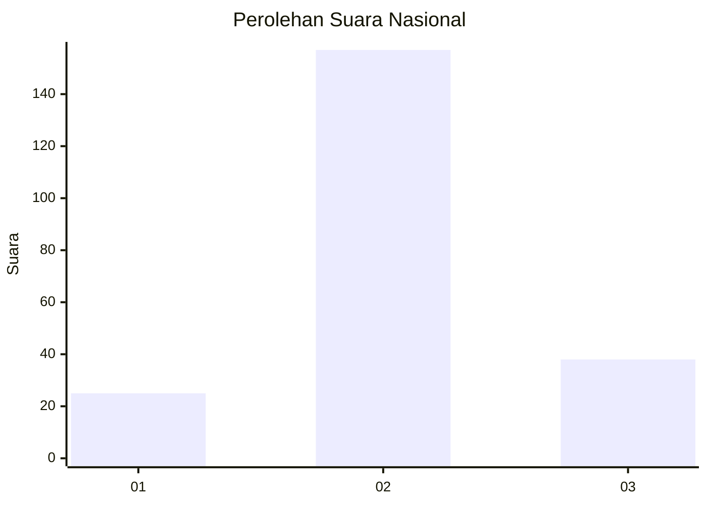
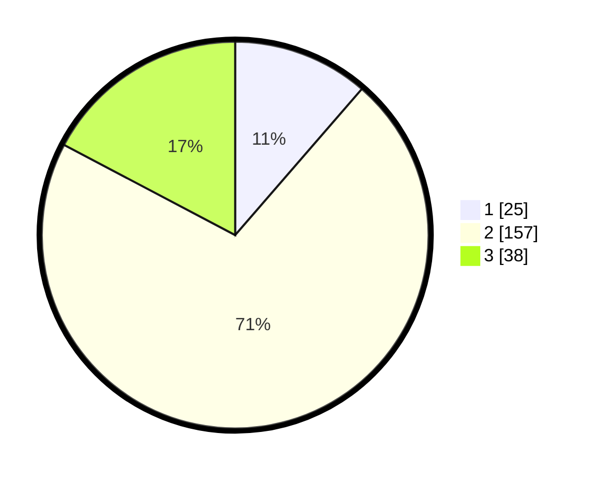

# Hasil

## Grafik

## Tabel

| No. | Nama Paslon    | Suara | Suara (raw) | Persentase |
|:--- |:-------------- | -----:| -----------:| ----------:|
| 1   | ANIES MUHAIMIN | 25    | [25][p-1]   | 11,36      |
| 2   | PRABOWO GIBRAN | 157   | [157][p-2]  | 71,36      |
| 3   | GANJAR MAHFUD  | 38    | [38][p-3]   | 17,27      |

[p-1]: https://github.com/gigit-pemilu/pemilu-2024/blob/main/pilpres/hitung-suara/sub/34-di-yogyakarta/sub/04-sleman/sub/09-prambanan/sub/2001-sumberharjo/sub/029-tps/sub/paslon-1.txt
[p-2]: https://github.com/gigit-pemilu/pemilu-2024/blob/main/pilpres/hitung-suara/sub/34-di-yogyakarta/sub/04-sleman/sub/09-prambanan/sub/2001-sumberharjo/sub/029-tps/sub/paslon-2.txt
[p-3]: https://github.com/gigit-pemilu/pemilu-2024/blob/main/pilpres/hitung-suara/sub/34-di-yogyakarta/sub/04-sleman/sub/09-prambanan/sub/2001-sumberharjo/sub/029-tps/sub/paslon-3.txt

## Foto C Plano

https://sirekap-obj-formc.kpu.go.id/ae33/pemilu/ppwp/34/04/09/20/01/3404092001029-20240214-230835--9842020b-93fb-4b7e-9ca1-921cbd332ec2.jpg

https://sirekap-obj-formc.kpu.go.id/ae33/pemilu/ppwp/34/04/09/20/01/3404092001029-20240214-231127--83f450e5-9ff0-4783-a50c-e29002fa7a48.jpg

https://sirekap-obj-formc.kpu.go.id/ae33/pemilu/ppwp/34/04/09/20/01/3404092001029-20240214-231324--fb03590d-d13a-4bc9-add0-091b9039ca25.jpg

## Metadata

| Key        | Value               |
| ---------- | ------------------- |
| Time Stamp | 2024-02-15 16:30:25 |

