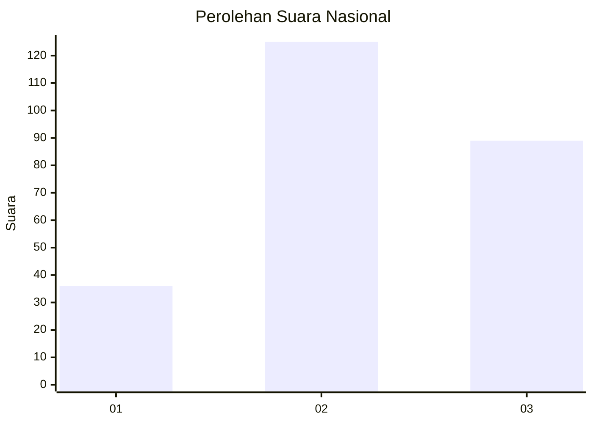
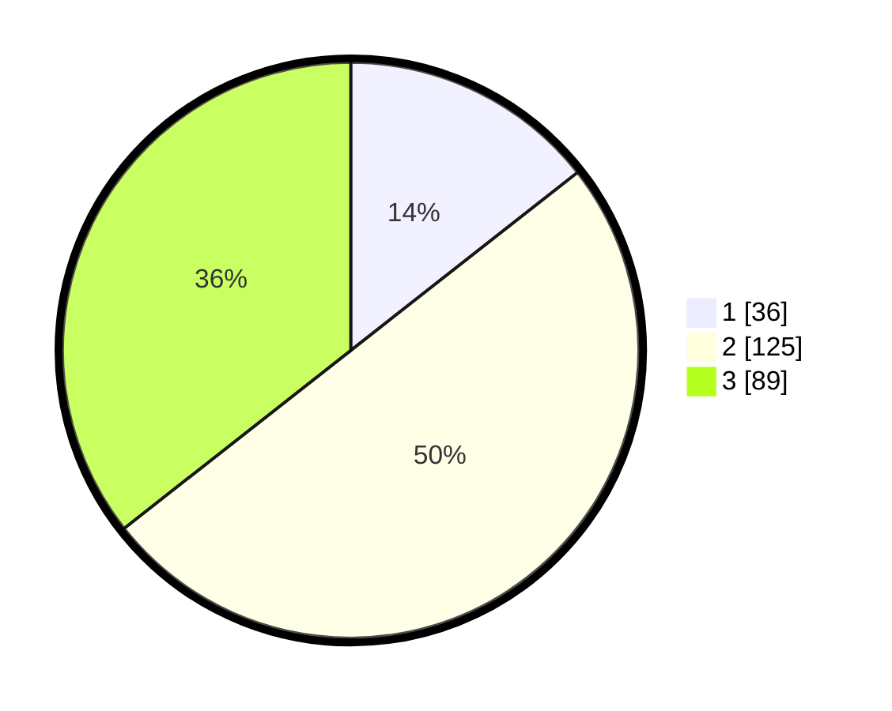

# Hasil

## Grafik

## Tabel

| No. | Nama Paslon    | Suara | Suara (raw) | Persentase |
|:--- |:-------------- | -----:| -----------:| ----------:|
| 1   | ANIES MUHAIMIN | 36    | [36][p-1]   | 14,40      |
| 2   | PRABOWO GIBRAN | 125   | [125][p-2]  | 50,00      |
| 3   | GANJAR MAHFUD  | 89    | [89][p-3]   | 35,60      |

[p-1]: https://github.com/gigit-pemilu/pemilu-2024/blob/main/pilpres/hitung-suara/sub/34-di-yogyakarta/sub/04-sleman/sub/09-prambanan/sub/2001-sumberharjo/sub/030-tps/sub/paslon-1.txt
[p-2]: https://github.com/gigit-pemilu/pemilu-2024/blob/main/pilpres/hitung-suara/sub/34-di-yogyakarta/sub/04-sleman/sub/09-prambanan/sub/2001-sumberharjo/sub/030-tps/sub/paslon-2.txt
[p-3]: https://github.com/gigit-pemilu/pemilu-2024/blob/main/pilpres/hitung-suara/sub/34-di-yogyakarta/sub/04-sleman/sub/09-prambanan/sub/2001-sumberharjo/sub/030-tps/sub/paslon-3.txt

## Foto C Plano

https://sirekap-obj-formc.kpu.go.id/b16c/pemilu/ppwp/34/04/09/20/01/3404092001030-20240214-235546--4e8f83a2-3e21-4f9e-b4da-608e62716dce.jpg

https://sirekap-obj-formc.kpu.go.id/b16c/pemilu/ppwp/34/04/09/20/01/3404092001030-20240214-235717--f391f38a-44d9-47eb-be68-1072253e547a.jpg

https://sirekap-obj-formc.kpu.go.id/b16c/pemilu/ppwp/34/04/09/20/01/3404092001030-20240214-235954--1020000d-350b-4918-a43f-0065ab8a9051.jpg

## Metadata

| Key        | Value               |
| ---------- | ------------------- |
| Time Stamp | 2024-02-15 18:30:25 |

