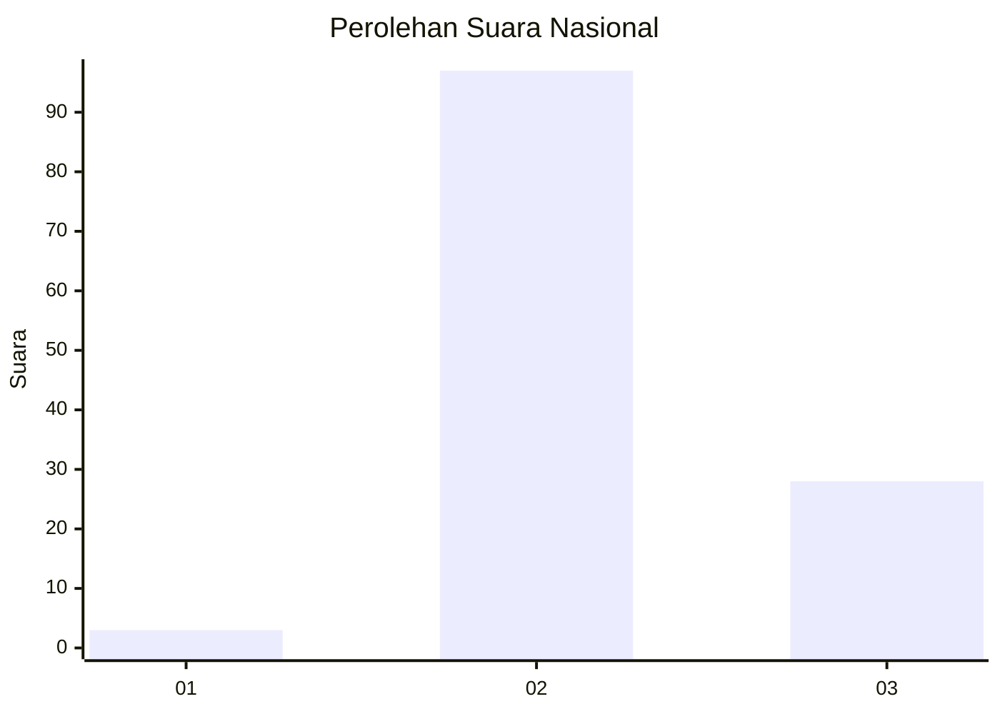
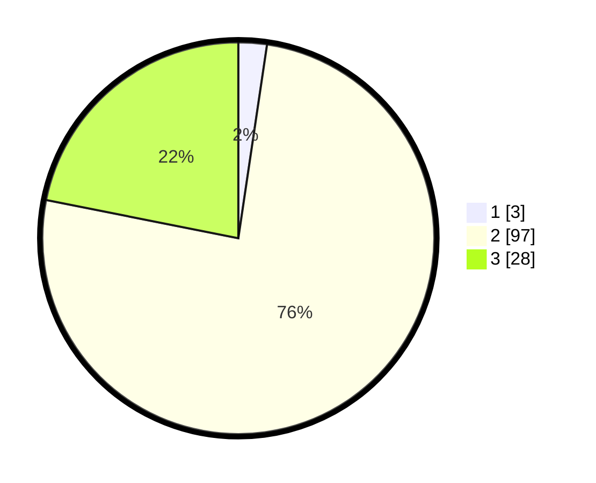

# Hasil

## Grafik

## Tabel

| No. | Nama Paslon    | Suara | Suara (raw) | Persentase |
|:--- |:-------------- | -----:| -----------:| ----------:|
| 1   | ANIES MUHAIMIN | 3     | [3][p-1]    | 2,34       |
| 2   | PRABOWO GIBRAN | 97    | [97][p-2]   | 75,78      |
| 3   | GANJAR MAHFUD  | 28    | [28][p-3]   | 21,88      |

[p-1]: https://github.com/gigit-pemilu/pemilu-2024/blob/main/pilpres/hitung-suara/sub/34-di-yogyakarta/sub/04-sleman/sub/09-prambanan/sub/2001-sumberharjo/sub/035-tps/sub/paslon-1.txt
[p-2]: https://github.com/gigit-pemilu/pemilu-2024/blob/main/pilpres/hitung-suara/sub/34-di-yogyakarta/sub/04-sleman/sub/09-prambanan/sub/2001-sumberharjo/sub/035-tps/sub/paslon-2.txt
[p-3]: https://github.com/gigit-pemilu/pemilu-2024/blob/main/pilpres/hitung-suara/sub/34-di-yogyakarta/sub/04-sleman/sub/09-prambanan/sub/2001-sumberharjo/sub/035-tps/sub/paslon-3.txt

## Foto C Plano

https://sirekap-obj-formc.kpu.go.id/307c/pemilu/ppwp/34/04/09/20/01/3404092001035-20240214-205809--f410ca78-3e02-4e7e-a77d-6c9618d8bdf4.jpg

https://sirekap-obj-formc.kpu.go.id/307c/pemilu/ppwp/34/04/09/20/01/3404092001035-20240214-232541--c7344d34-1a27-4ed4-bb1c-85d2dc6535b4.jpg

https://sirekap-obj-formc.kpu.go.id/307c/pemilu/ppwp/34/04/09/20/01/3404092001035-20240215-024939--af6be967-7eac-40eb-8a21-2c7379beb590.jpg

## Metadata

| Key        | Value               |
| ---------- | ------------------- |
| Time Stamp | 2024-02-15 15:00:29 |

