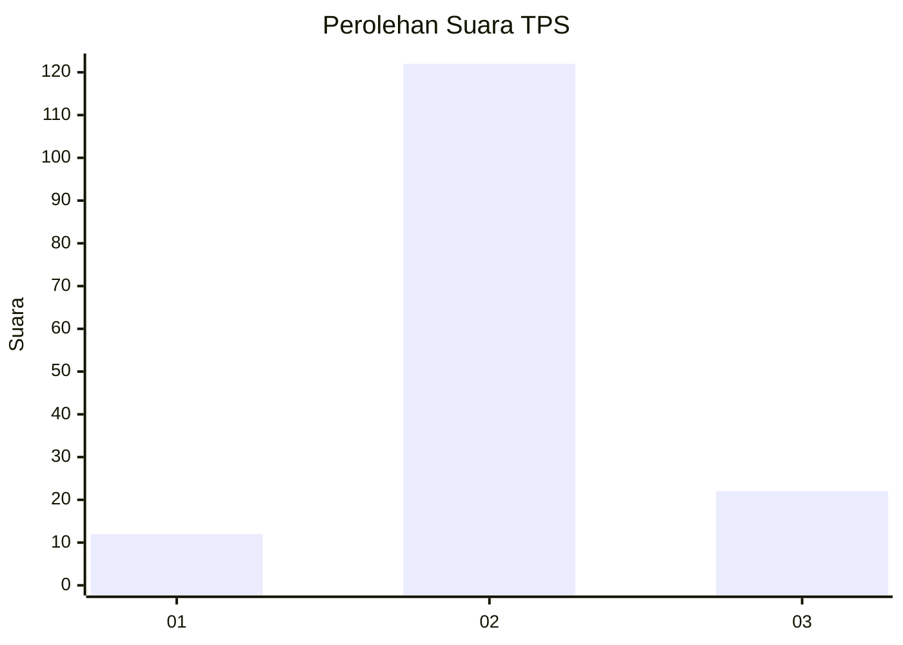
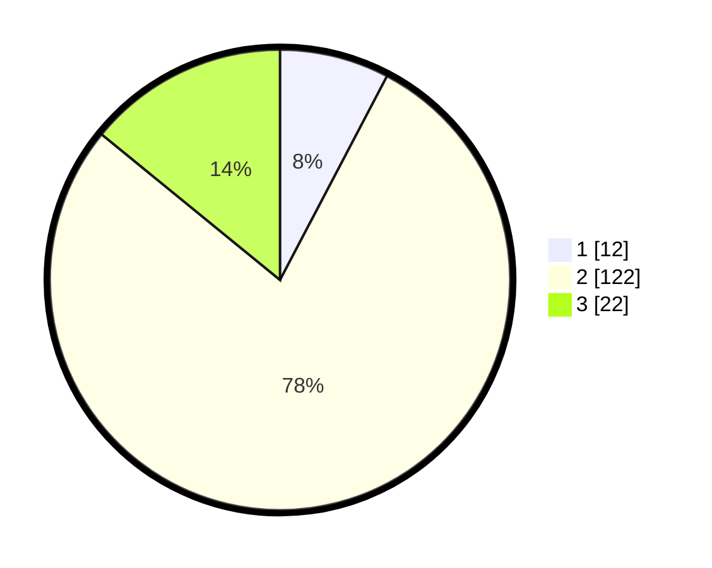

# Hasil

## Grafik

## Tabel

| No. | Nama Paslon    | Suara | Suara (raw) | Persentase |
|:--- |:-------------- | -----:| -----------:| ----------:|
| 1   | ANIES MUHAIMIN | 12    | [12][p-1]   | 7,69       |
| 2   | PRABOWO GIBRAN | 122   | [122][p-2]  | 78,21      |
| 3   | GANJAR MAHFUD  | 22    | [22][p-3]   | 14,10      |

[p-1]: https://github.com/gigit-pemilu/pemilu-2024-34-di-yogyakarta/blob/main/pilpres/hitung-suara/sub/34-di-yogyakarta/sub/04-sleman/sub/09-prambanan/sub/2001-sumberharjo/sub/045-tps/sub/paslon-1.txt
[p-2]: https://github.com/gigit-pemilu/pemilu-2024-34-di-yogyakarta/blob/main/pilpres/hitung-suara/sub/34-di-yogyakarta/sub/04-sleman/sub/09-prambanan/sub/2001-sumberharjo/sub/045-tps/sub/paslon-2.txt
[p-3]: https://github.com/gigit-pemilu/pemilu-2024-34-di-yogyakarta/blob/main/pilpres/hitung-suara/sub/34-di-yogyakarta/sub/04-sleman/sub/09-prambanan/sub/2001-sumberharjo/sub/045-tps/sub/paslon-3.txt

## Foto C Plano

https://sirekap-obj-formc.kpu.go.id/dfc6/pemilu/ppwp/34/04/09/20/01/3404092001045-20240214-210024--692cb38d-6436-44e4-8abf-a0843032f98b.jpg

https://sirekap-obj-formc.kpu.go.id/dfc6/pemilu/ppwp/34/04/09/20/01/3404092001045-20240214-210259--6f402e2f-27a8-47a6-8dcc-919972619471.jpg

https://sirekap-obj-formc.kpu.go.id/dfc6/pemilu/ppwp/34/04/09/20/01/3404092001045-20240214-210425--c4f4ec3f-1701-464d-8945-58f1bd09c4f5.jpg

## Metadata

| Key        | Value               |
| ---------- | ------------------- |
| Time Stamp | 2024-02-15 00:41:44 |

