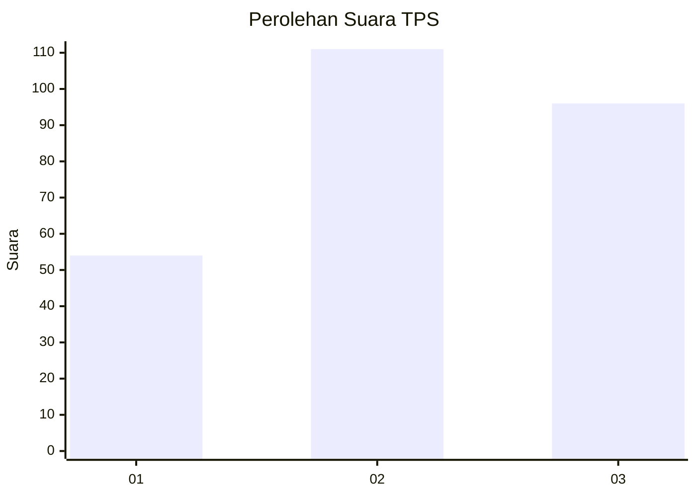
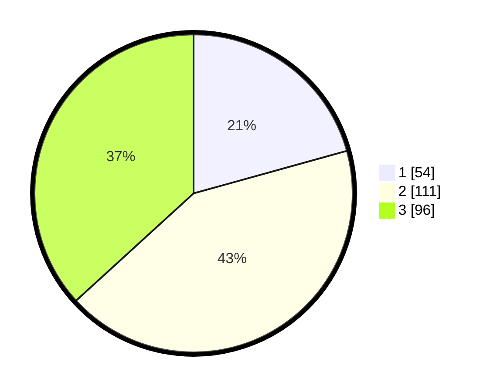

# Hasil

## Grafik

## Tabel

| No. | Nama Paslon    | Suara | Suara (raw) | Persentase |
|:--- |:-------------- | -----:| -----------:| ----------:|
| 1   | ANIES MUHAIMIN | 54    | [54][p-1]   | 20,69      |
| 2   | PRABOWO GIBRAN | 111   | [111][p-2]  | 42,53      |
| 3   | GANJAR MAHFUD  | 96    | [96][p-3]   | 36,78      |

[p-1]: https://github.com/gigit-pemilu/pemilu-2024-34-di-yogyakarta/blob/main/pilpres/hitung-suara/sub/34-di-yogyakarta/sub/04-sleman/sub/09-prambanan/sub/2003-gayamharjo/sub/002-tps/sub/paslon-1.txt
[p-2]: https://github.com/gigit-pemilu/pemilu-2024-34-di-yogyakarta/blob/main/pilpres/hitung-suara/sub/34-di-yogyakarta/sub/04-sleman/sub/09-prambanan/sub/2003-gayamharjo/sub/002-tps/sub/paslon-2.txt
[p-3]: https://github.com/gigit-pemilu/pemilu-2024-34-di-yogyakarta/blob/main/pilpres/hitung-suara/sub/34-di-yogyakarta/sub/04-sleman/sub/09-prambanan/sub/2003-gayamharjo/sub/002-tps/sub/paslon-3.txt

## Foto C Plano

https://sirekap-obj-formc.kpu.go.id/0510/pemilu/ppwp/34/04/09/20/03/3404092003002-20240216-144743--3196e04c-cd42-4490-8743-a07b73722721.jpg

https://sirekap-obj-formc.kpu.go.id/0510/pemilu/ppwp/34/04/09/20/03/3404092003002-20240216-144834--5d70aaca-39ab-457c-9dcb-a454c89238c9.jpg

https://sirekap-obj-formc.kpu.go.id/0510/pemilu/ppwp/34/04/09/20/03/3404092003002-20240216-144922--10b8afe4-6740-4679-a96d-7a16b1ad2b08.jpg

## Metadata

| Key        | Value               |
| ---------- | ------------------- |
| Time Stamp | 2024-02-17 10:00:02 |

