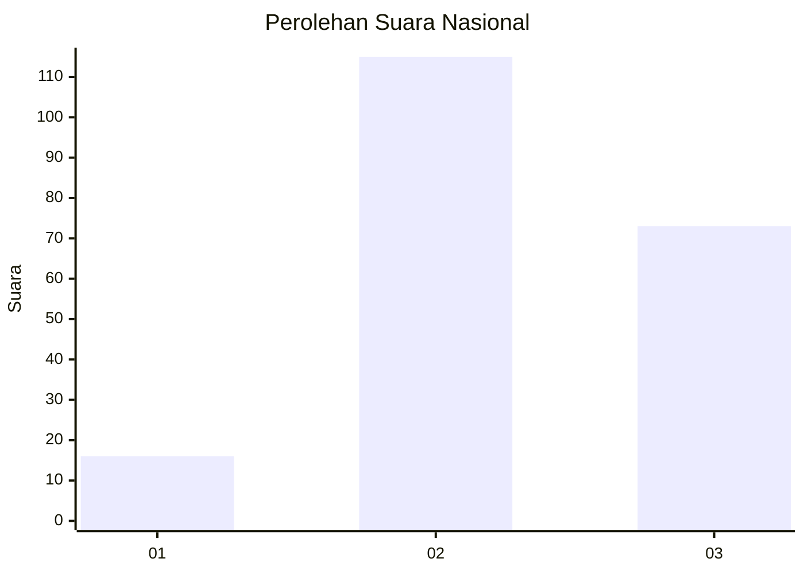
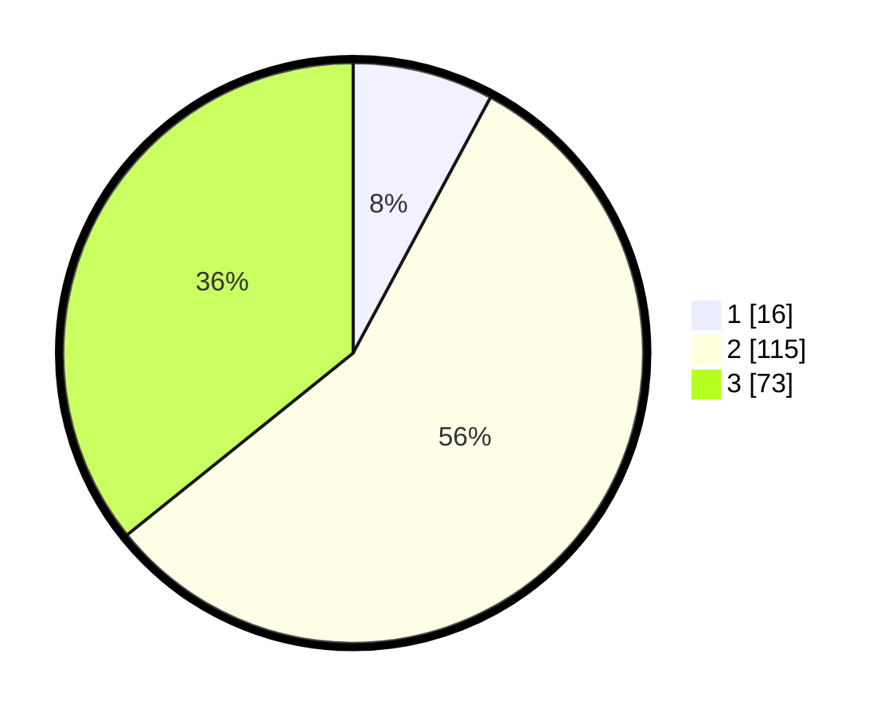

# Hasil

## Grafik

## Tabel

| No. | Nama Paslon    | Suara | Suara (raw) | Persentase |
|:--- |:-------------- | -----:| -----------:| ----------:|
| 1   | ANIES MUHAIMIN | 16    | [16][p-1]   | 7,84       |
| 2   | PRABOWO GIBRAN | 115   | [115][p-2]  | 56,37      |
| 3   | GANJAR MAHFUD  | 73    | [73][p-3]   | 35,78      |

[p-1]: https://github.com/gigit-pemilu/pemilu-2024/blob/main/pilpres/hitung-suara/sub/34-di-yogyakarta/sub/04-sleman/sub/09-prambanan/sub/2003-gayamharjo/sub/009-tps/sub/paslon-1.txt
[p-2]: https://github.com/gigit-pemilu/pemilu-2024/blob/main/pilpres/hitung-suara/sub/34-di-yogyakarta/sub/04-sleman/sub/09-prambanan/sub/2003-gayamharjo/sub/009-tps/sub/paslon-2.txt
[p-3]: https://github.com/gigit-pemilu/pemilu-2024/blob/main/pilpres/hitung-suara/sub/34-di-yogyakarta/sub/04-sleman/sub/09-prambanan/sub/2003-gayamharjo/sub/009-tps/sub/paslon-3.txt

## Foto C Plano

https://sirekap-obj-formc.kpu.go.id/2400/pemilu/ppwp/34/04/09/20/03/3404092003009-20240215-190529--6092382b-bee1-4977-bc24-f3d423fa5421.jpg

https://sirekap-obj-formc.kpu.go.id/2400/pemilu/ppwp/34/04/09/20/03/3404092003009-20240215-190733--7dfc1bcc-ed1f-4333-9c13-447c460cbfed.jpg

https://sirekap-obj-formc.kpu.go.id/2400/pemilu/ppwp/34/04/09/20/03/3404092003009-20240215-175405--b52e20bd-4b11-432e-9252-4db3721186f3.jpg

## Metadata

| Key        | Value               |
| ---------- | ------------------- |
| Time Stamp | 2024-02-16 13:30:32 |

