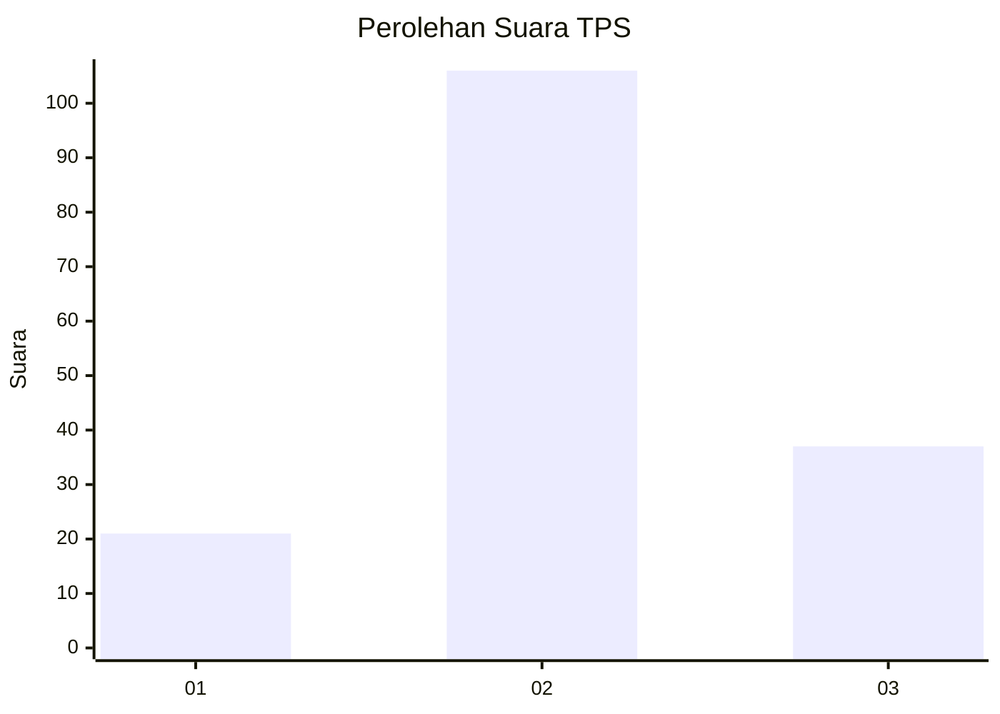
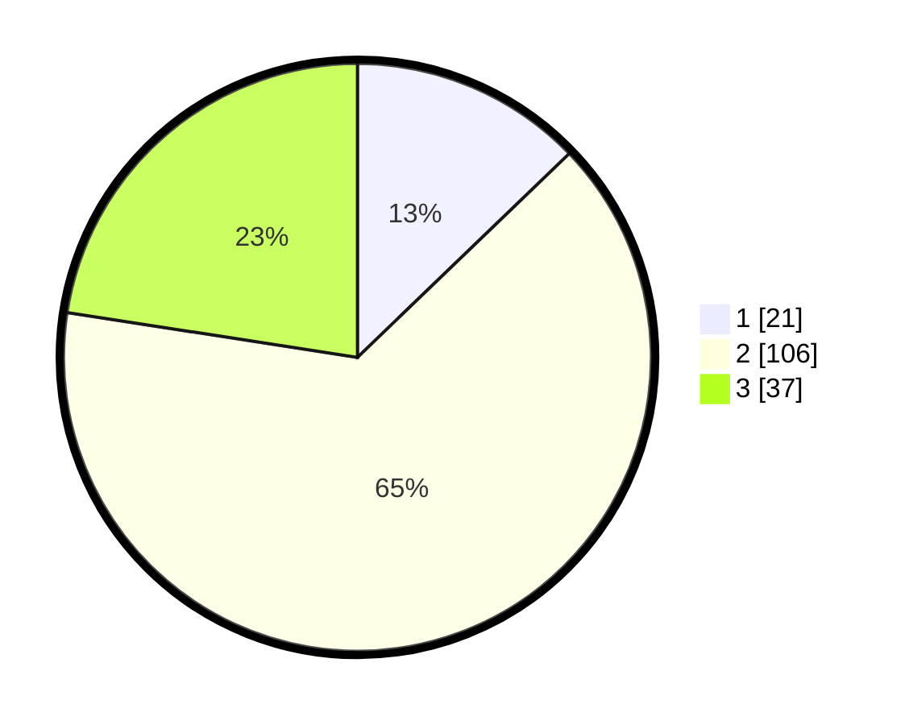

# Hasil

## Grafik

## Tabel

| No. | Nama Paslon    | Suara | Suara (raw) | Persentase |
|:--- |:-------------- | -----:| -----------:| ----------:|
| 1   | ANIES MUHAIMIN | 21    | [21][p-1]   | 12,80      |
| 2   | PRABOWO GIBRAN | 106   | [106][p-2]  | 64,63      |
| 3   | GANJAR MAHFUD  | 37    | [37][p-3]   | 22,56      |

[p-1]: https://github.com/gigit-pemilu/pemilu-2024-34-di-yogyakarta/blob/main/pilpres/hitung-suara/sub/34-di-yogyakarta/sub/04-sleman/sub/09-prambanan/sub/2003-gayamharjo/sub/011-tps/sub/paslon-1.txt
[p-2]: https://github.com/gigit-pemilu/pemilu-2024-34-di-yogyakarta/blob/main/pilpres/hitung-suara/sub/34-di-yogyakarta/sub/04-sleman/sub/09-prambanan/sub/2003-gayamharjo/sub/011-tps/sub/paslon-2.txt
[p-3]: https://github.com/gigit-pemilu/pemilu-2024-34-di-yogyakarta/blob/main/pilpres/hitung-suara/sub/34-di-yogyakarta/sub/04-sleman/sub/09-prambanan/sub/2003-gayamharjo/sub/011-tps/sub/paslon-3.txt

## Foto C Plano

https://sirekap-obj-formc.kpu.go.id/5933/pemilu/ppwp/34/04/09/20/03/3404092003011-20240216-083918--63d8f54a-b268-493f-a194-f90dea38ab63.jpg

https://sirekap-obj-formc.kpu.go.id/5933/pemilu/ppwp/34/04/09/20/03/3404092003011-20240216-085919--b55fe0ab-76ce-4223-bcaa-4ce42615bda2.jpg

https://sirekap-obj-formc.kpu.go.id/5933/pemilu/ppwp/34/04/09/20/03/3404092003011-20240216-084351--a71204b9-7409-409f-83da-b5bc9278dfad.jpg

## Metadata

| Key        | Value               |
| ---------- | ------------------- |
| Time Stamp | 2024-02-16 10:30:29 |

