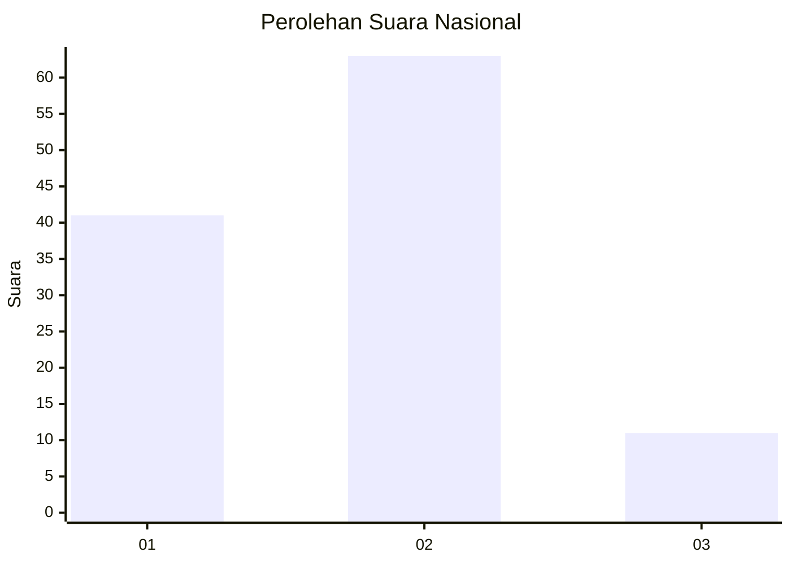
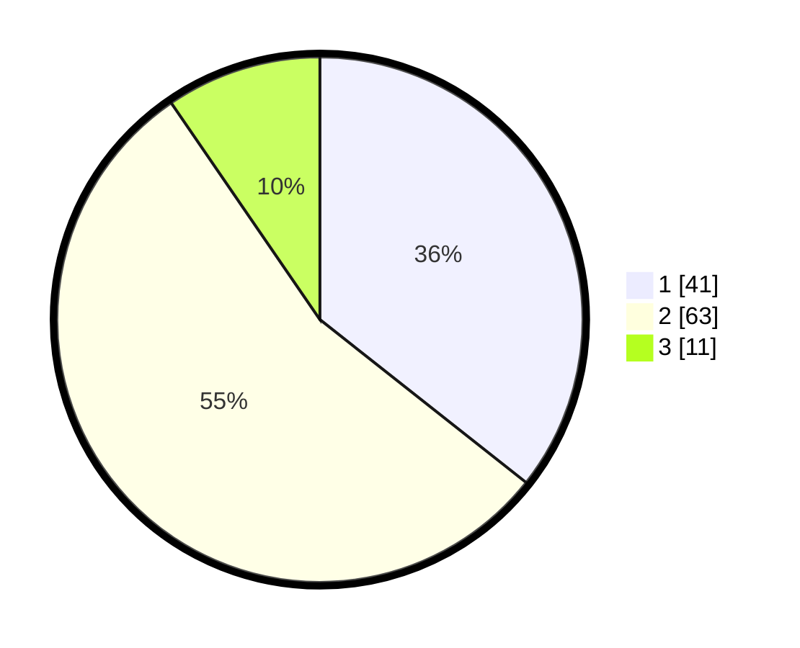

# Hasil

## Grafik

## Tabel

| No. | Nama Paslon    | Suara | Suara (raw) | Persentase |
|:--- |:-------------- | -----:| -----------:| ----------:|
| 1   | ANIES MUHAIMIN | 41    | [41][p-1]   | 35,65      |
| 2   | PRABOWO GIBRAN | 63    | [63][p-2]   | 54,78      |
| 3   | GANJAR MAHFUD  | 11    | [11][p-3]   | 9,57       |

[p-1]: https://github.com/gigit-pemilu/pemilu-2024/blob/main/pilpres/hitung-suara/sub/34-di-yogyakarta/sub/04-sleman/sub/09-prambanan/sub/2003-gayamharjo/sub/015-tps/sub/paslon-1.txt
[p-2]: https://github.com/gigit-pemilu/pemilu-2024/blob/main/pilpres/hitung-suara/sub/34-di-yogyakarta/sub/04-sleman/sub/09-prambanan/sub/2003-gayamharjo/sub/015-tps/sub/paslon-2.txt
[p-3]: https://github.com/gigit-pemilu/pemilu-2024/blob/main/pilpres/hitung-suara/sub/34-di-yogyakarta/sub/04-sleman/sub/09-prambanan/sub/2003-gayamharjo/sub/015-tps/sub/paslon-3.txt

## Foto C Plano

https://sirekap-obj-formc.kpu.go.id/3e62/pemilu/ppwp/34/04/09/20/03/3404092003015-20240216-142212--6b38ce53-1805-4fe0-b2df-e62b11903241.jpg

https://sirekap-obj-formc.kpu.go.id/3e62/pemilu/ppwp/34/04/09/20/03/3404092003015-20240216-142213--09da19e6-17bf-4fc8-ac3e-9c1d4da7af34.jpg

https://sirekap-obj-formc.kpu.go.id/3e62/pemilu/ppwp/34/04/09/20/03/3404092003015-20240216-142213--760e8786-21bf-4946-b412-cca396adf821.jpg

## Metadata

| Key        | Value               |
| ---------- | ------------------- |
| Time Stamp | 2024-02-16 22:01:00 |

## DATA PEMILIH TETAP

Jumlah pemilih dalam DPT: **125**.
 * L: **60**.
 * P: **65**.

## DATA PENGGUNA HAK PILIH

Jumlah pengguna hak pilih dalam DPT: **114**.
 * L: **55**.
 * P: **59**.

Jumlah pengguna hak pilih dalam DPTb: **1**.
 * L: **1**.
 * P: **0**.

Jumlah pengguna hak pilih dalam DPK: **0**.
 * L: **0**.
 * P: **0**.

Jumlah pengguna hak pilih: **115**.
 * L: **60**.
 * P: **55**.

## JUMLAH SUARA SAH DAN TIDAK SAH

JUMLAH SELURUH SUARA SAH: **115**.

JUMLAH SUARA TIDAK SAH: **0**.

JUMLAH SELURUH SUARA SAH DAN SUARA TIDAK SAH: **115**.

