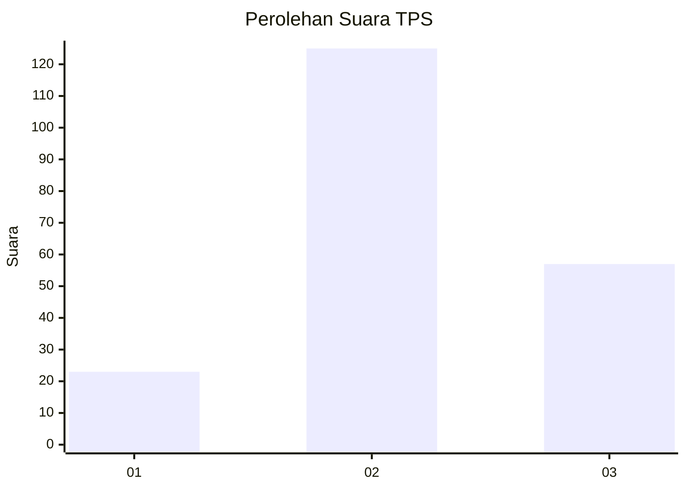
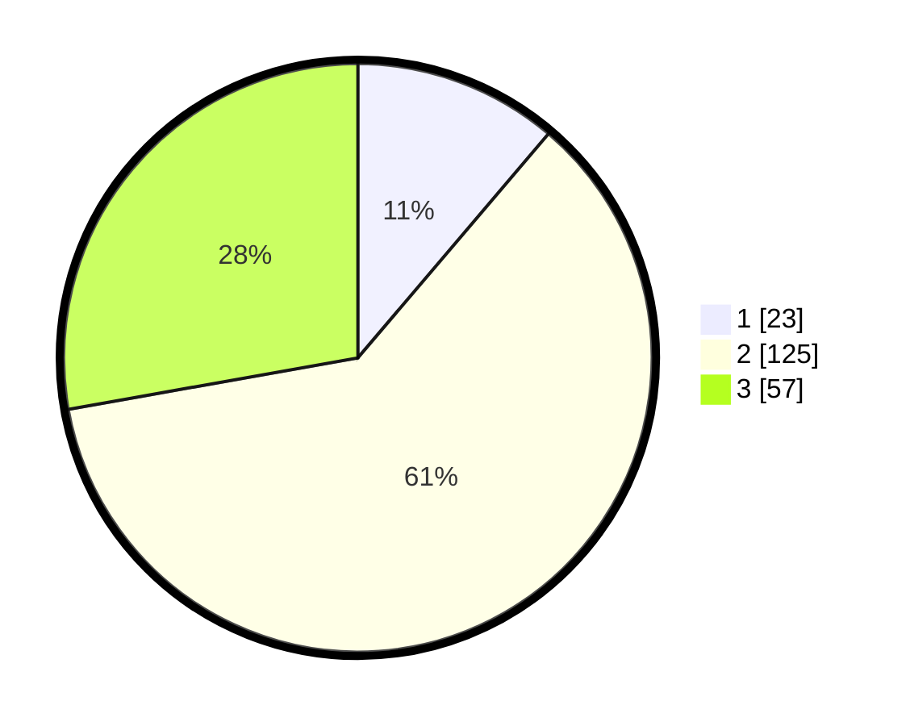

# Hasil

## Grafik

## Tabel

| No. | Nama Paslon    | Suara | Suara (raw) | Persentase |
|:--- |:-------------- | -----:| -----------:| ----------:|
| 1   | ANIES MUHAIMIN | 23    | [23][p-1]   | 11,22      |
| 2   | PRABOWO GIBRAN | 125   | [125][p-2]  | 60,98      |
| 3   | GANJAR MAHFUD  | 57    | [57][p-3]   | 27,80      |

[p-1]: https://github.com/gigit-pemilu/pemilu-2024-34-di-yogyakarta/blob/main/pilpres/hitung-suara/sub/34-di-yogyakarta/sub/04-sleman/sub/09-prambanan/sub/2004-sambirejo/sub/002-tps/sub/paslon-1.txt
[p-2]: https://github.com/gigit-pemilu/pemilu-2024-34-di-yogyakarta/blob/main/pilpres/hitung-suara/sub/34-di-yogyakarta/sub/04-sleman/sub/09-prambanan/sub/2004-sambirejo/sub/002-tps/sub/paslon-2.txt
[p-3]: https://github.com/gigit-pemilu/pemilu-2024-34-di-yogyakarta/blob/main/pilpres/hitung-suara/sub/34-di-yogyakarta/sub/04-sleman/sub/09-prambanan/sub/2004-sambirejo/sub/002-tps/sub/paslon-3.txt

## Foto C Plano

https://sirekap-obj-formc.kpu.go.id/8b46/pemilu/ppwp/34/04/09/20/04/3404092004002-20240214-221022--381ff5d9-036e-4191-80e2-525b2f3be972.jpg

https://sirekap-obj-formc.kpu.go.id/8b46/pemilu/ppwp/34/04/09/20/04/3404092004002-20240214-221206--323a6fff-b273-481d-a125-d4163bdaa719.jpg

https://sirekap-obj-formc.kpu.go.id/8b46/pemilu/ppwp/34/04/09/20/04/3404092004002-20240214-221653--83cf5129-eec7-4948-9147-48a1079e5da0.jpg

## Metadata

| Key        | Value               |
| ---------- | ------------------- |
| Time Stamp | 2024-02-15 16:30:25 |

