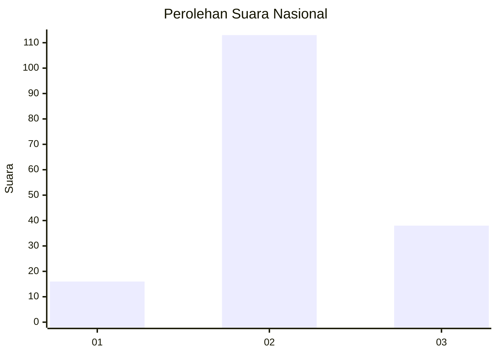
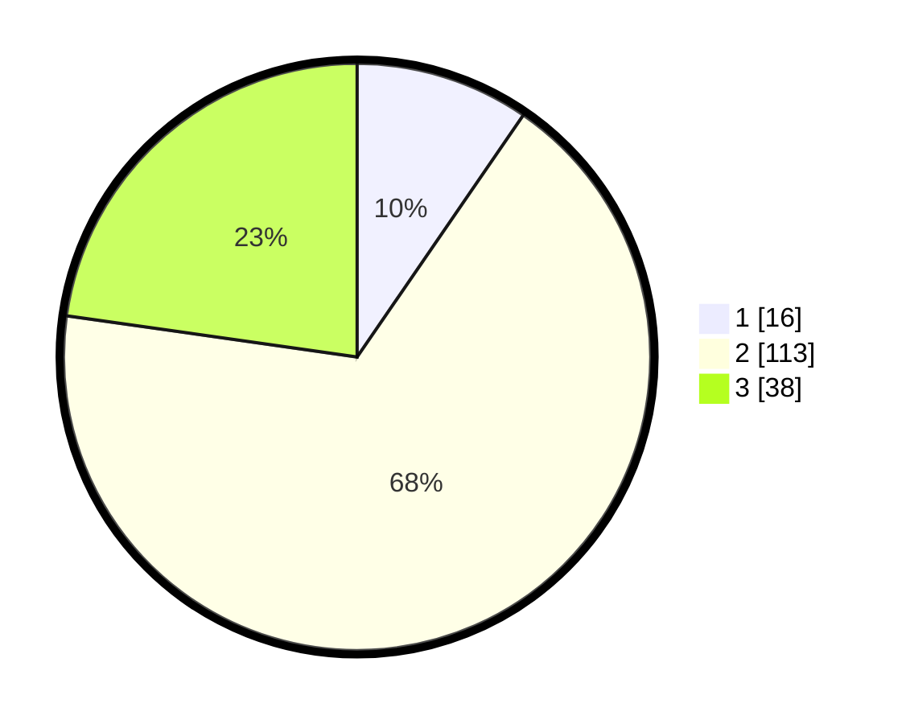

# Hasil

## Grafik

## Tabel

| No. | Nama Paslon    | Suara | Suara (raw) | Persentase |
|:--- |:-------------- | -----:| -----------:| ----------:|
| 1   | ANIES MUHAIMIN | 16    | [16][p-1]   | 9,58       |
| 2   | PRABOWO GIBRAN | 113   | [113][p-2]  | 67,66      |
| 3   | GANJAR MAHFUD  | 38    | [38][p-3]   | 22,75      |

[p-1]: https://github.com/gigit-pemilu/pemilu-2024/blob/main/pilpres/hitung-suara/sub/34-di-yogyakarta/sub/04-sleman/sub/09-prambanan/sub/2004-sambirejo/sub/003-tps/sub/paslon-1.txt
[p-2]: https://github.com/gigit-pemilu/pemilu-2024/blob/main/pilpres/hitung-suara/sub/34-di-yogyakarta/sub/04-sleman/sub/09-prambanan/sub/2004-sambirejo/sub/003-tps/sub/paslon-2.txt
[p-3]: https://github.com/gigit-pemilu/pemilu-2024/blob/main/pilpres/hitung-suara/sub/34-di-yogyakarta/sub/04-sleman/sub/09-prambanan/sub/2004-sambirejo/sub/003-tps/sub/paslon-3.txt

## Foto C Plano

https://sirekap-obj-formc.kpu.go.id/97a6/pemilu/ppwp/34/04/09/20/04/3404092004003-20240214-222136--71bb4709-ff88-4611-b458-9170b3f9fc84.jpg

https://sirekap-obj-formc.kpu.go.id/97a6/pemilu/ppwp/34/04/09/20/04/3404092004003-20240214-230347--6ef07af1-eeb4-4336-a152-cd84010a788c.jpg

https://sirekap-obj-formc.kpu.go.id/97a6/pemilu/ppwp/34/04/09/20/04/3404092004003-20240214-230534--4f656008-a90a-4102-9f1b-db31fa000ec2.jpg

## Metadata

| Key        | Value               |
| ---------- | ------------------- |
| Time Stamp | 2024-02-15 16:30:25 |

