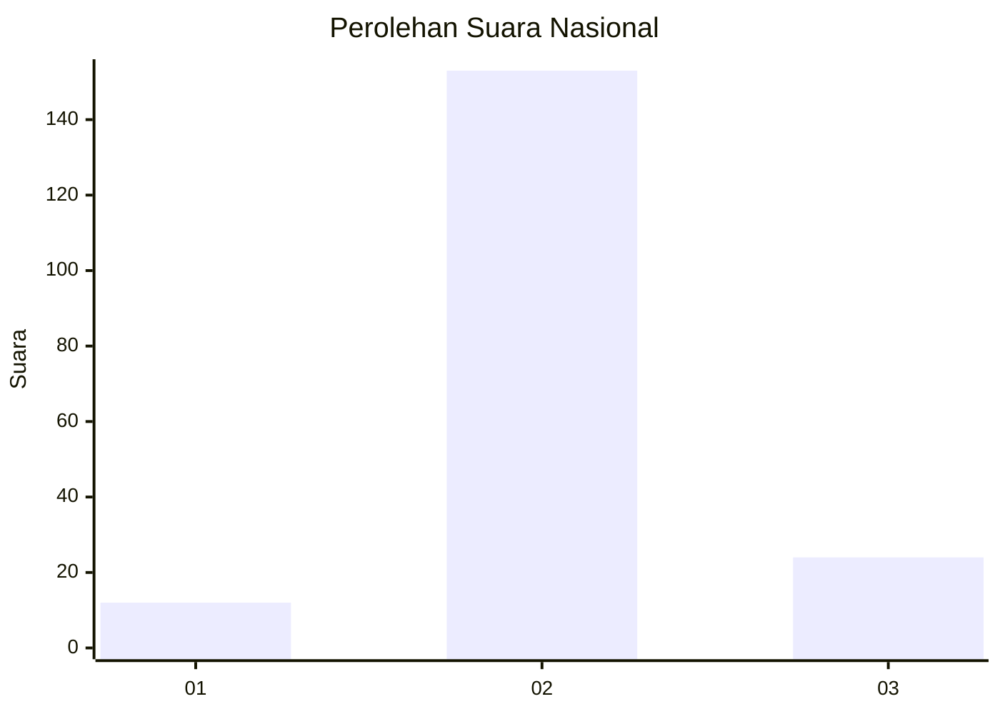
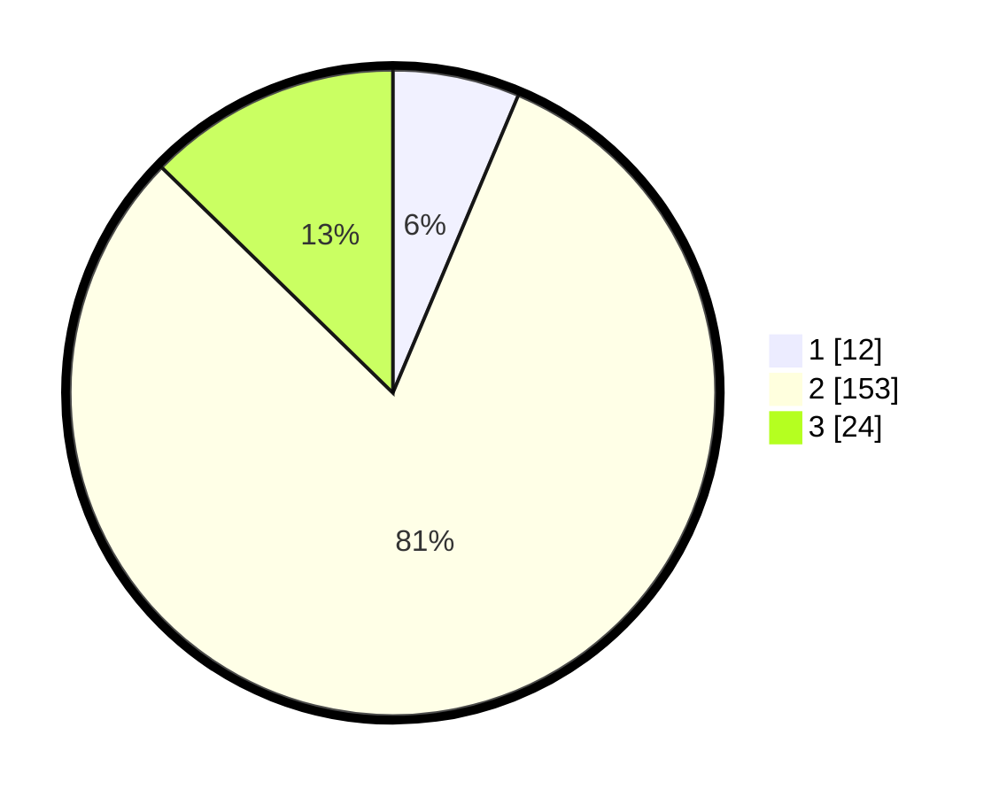

# Hasil

## Grafik

## Tabel

| No. | Nama Paslon    | Suara | Suara (raw) | Persentase |
|:--- |:-------------- | -----:| -----------:| ----------:|
| 1   | ANIES MUHAIMIN | 12    | [12][p-1]   | 6,35       |
| 2   | PRABOWO GIBRAN | 153   | [153][p-2]  | 80,95      |
| 3   | GANJAR MAHFUD  | 24    | [24][p-3]   | 12,70      |

[p-1]: https://github.com/gigit-pemilu/pemilu-2024/blob/main/pilpres/hitung-suara/sub/34-di-yogyakarta/sub/04-sleman/sub/09-prambanan/sub/2004-sambirejo/sub/008-tps/sub/paslon-1.txt
[p-2]: https://github.com/gigit-pemilu/pemilu-2024/blob/main/pilpres/hitung-suara/sub/34-di-yogyakarta/sub/04-sleman/sub/09-prambanan/sub/2004-sambirejo/sub/008-tps/sub/paslon-2.txt
[p-3]: https://github.com/gigit-pemilu/pemilu-2024/blob/main/pilpres/hitung-suara/sub/34-di-yogyakarta/sub/04-sleman/sub/09-prambanan/sub/2004-sambirejo/sub/008-tps/sub/paslon-3.txt

## Foto C Plano

https://sirekap-obj-formc.kpu.go.id/8c1d/pemilu/ppwp/34/04/09/20/04/3404092004008-20240215-045018--47602e08-4367-4064-a5bc-df9816ef59dd.jpg

https://sirekap-obj-formc.kpu.go.id/8c1d/pemilu/ppwp/34/04/09/20/04/3404092004008-20240215-034550--511d5805-c2bf-4a18-99e8-7dc6adc25c29.jpg

https://sirekap-obj-formc.kpu.go.id/8c1d/pemilu/ppwp/34/04/09/20/04/3404092004008-20240215-034556--ed8f75d8-daaf-467a-a9e8-f90dae8d1bcd.jpg

## Metadata

| Key        | Value               |
| ---------- | ------------------- |
| Time Stamp | 2024-02-15 16:30:25 |

