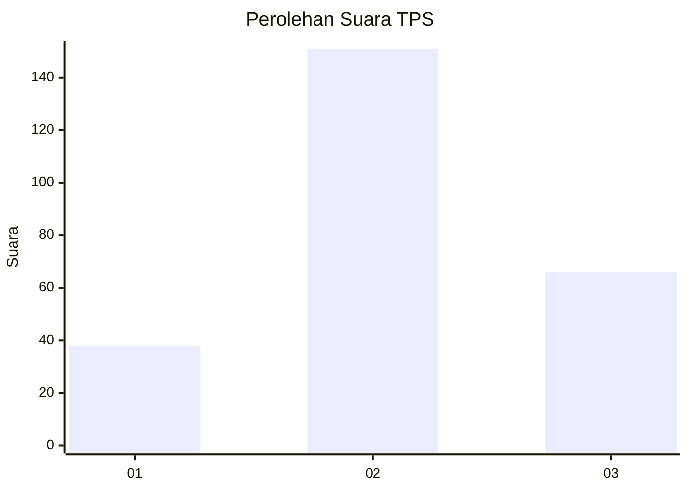
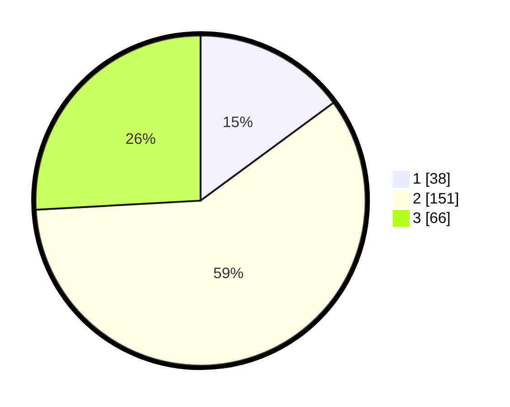

# Hasil

## Grafik

## Tabel

| No. | Nama Paslon    | Suara | Suara (raw) | Persentase |
|:--- |:-------------- | -----:| -----------:| ----------:|
| 1   | ANIES MUHAIMIN | 38    | [38][p-1]   | 14,90      |
| 2   | PRABOWO GIBRAN | 151   | [151][p-2]  | 59,22      |
| 3   | GANJAR MAHFUD  | 66    | [66][p-3]   | 25,88      |

[p-1]: https://github.com/gigit-pemilu/pemilu-2024-34-di-yogyakarta/blob/main/pilpres/hitung-suara/sub/34-di-yogyakarta/sub/04-sleman/sub/09-prambanan/sub/2004-sambirejo/sub/012-tps/sub/paslon-1.txt
[p-2]: https://github.com/gigit-pemilu/pemilu-2024-34-di-yogyakarta/blob/main/pilpres/hitung-suara/sub/34-di-yogyakarta/sub/04-sleman/sub/09-prambanan/sub/2004-sambirejo/sub/012-tps/sub/paslon-2.txt
[p-3]: https://github.com/gigit-pemilu/pemilu-2024-34-di-yogyakarta/blob/main/pilpres/hitung-suara/sub/34-di-yogyakarta/sub/04-sleman/sub/09-prambanan/sub/2004-sambirejo/sub/012-tps/sub/paslon-3.txt

## Foto C Plano

https://sirekap-obj-formc.kpu.go.id/420a/pemilu/ppwp/34/04/09/20/04/3404092004012-20240214-224630--e00c6828-9a46-4041-81f6-7cf7fa42a461.jpg

https://sirekap-obj-formc.kpu.go.id/420a/pemilu/ppwp/34/04/09/20/04/3404092004012-20240214-224758--1571fefc-601b-4782-b585-9eb7d33ecd39.jpg

## Metadata

| Key        | Value               |
| ---------- | ------------------- |
| Time Stamp | 2024-02-26 14:00:00 |

