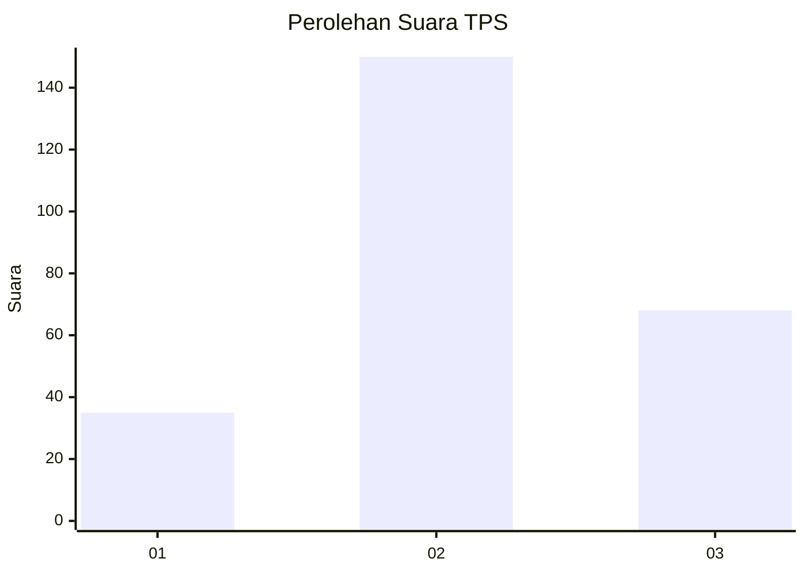
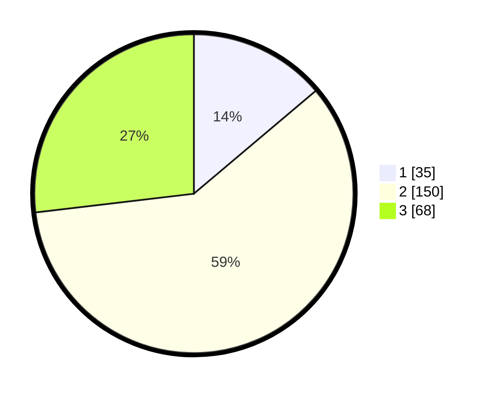

# Hasil

## Grafik

## Tabel

| No. | Nama Paslon    | Suara | Suara (raw) | Persentase |
|:--- |:-------------- | -----:| -----------:| ----------:|
| 1   | ANIES MUHAIMIN | 35    | [35][p-1]   | 13,83      |
| 2   | PRABOWO GIBRAN | 150   | [150][p-2]  | 59,29      |
| 3   | GANJAR MAHFUD  | 68    | [68][p-3]   | 26,88      |

[p-1]: https://github.com/gigit-pemilu/pemilu-2024-34-di-yogyakarta/blob/main/pilpres/hitung-suara/sub/34-di-yogyakarta/sub/04-sleman/sub/09-prambanan/sub/2004-sambirejo/sub/015-tps/sub/paslon-1.txt
[p-2]: https://github.com/gigit-pemilu/pemilu-2024-34-di-yogyakarta/blob/main/pilpres/hitung-suara/sub/34-di-yogyakarta/sub/04-sleman/sub/09-prambanan/sub/2004-sambirejo/sub/015-tps/sub/paslon-2.txt
[p-3]: https://github.com/gigit-pemilu/pemilu-2024-34-di-yogyakarta/blob/main/pilpres/hitung-suara/sub/34-di-yogyakarta/sub/04-sleman/sub/09-prambanan/sub/2004-sambirejo/sub/015-tps/sub/paslon-3.txt

## Foto C Plano

https://sirekap-obj-formc.kpu.go.id/396f/pemilu/ppwp/34/04/09/20/04/3404092004015-20240214-210529--3380f56b-4428-48fc-a7dd-8b89e30515bb.jpg

https://sirekap-obj-formc.kpu.go.id/396f/pemilu/ppwp/34/04/09/20/04/3404092004015-20240214-210713--e64de862-bad3-4f4a-b95a-f9bbb9f59a50.jpg

https://sirekap-obj-formc.kpu.go.id/396f/pemilu/ppwp/34/04/09/20/04/3404092004015-20240214-211803--fbfe590e-0f8c-4cfa-af0f-880f8a7a5b7f.jpg

## Metadata

| Key        | Value               |
| ---------- | ------------------- |
| Time Stamp | 2024-02-16 14:00:34 |

