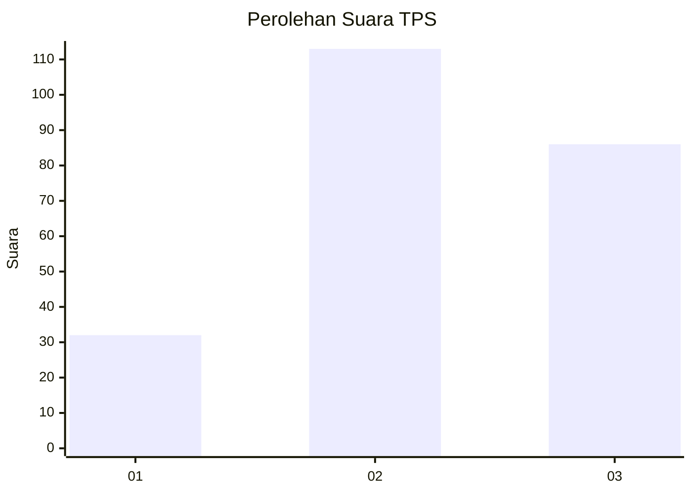
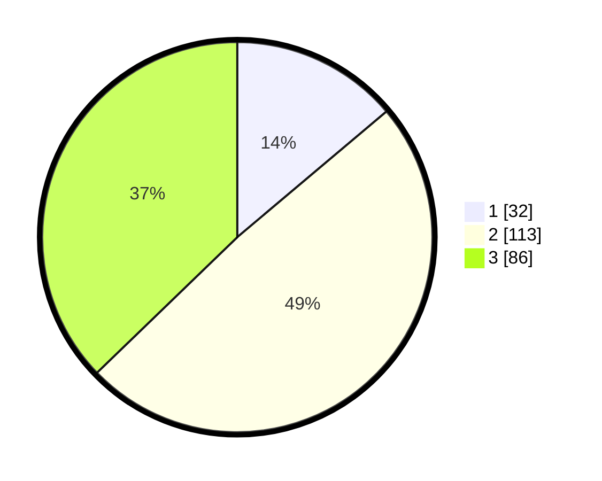

# Hasil

## Grafik

## Tabel

| No. | Nama Paslon    | Suara | Suara (raw) | Persentase |
|:--- |:-------------- | -----:| -----------:| ----------:|
| 1   | ANIES MUHAIMIN | 32    | [32][p-1]   | 13,85      |
| 2   | PRABOWO GIBRAN | 113   | [113][p-2]  | 48,92      |
| 3   | GANJAR MAHFUD  | 86    | [86][p-3]   | 37,23      |

[p-1]: https://github.com/gigit-pemilu/pemilu-2024-34-di-yogyakarta/blob/main/pilpres/hitung-suara/sub/34-di-yogyakarta/sub/04-sleman/sub/09-prambanan/sub/2005-madurejo/sub/002-tps/sub/paslon-1.txt
[p-2]: https://github.com/gigit-pemilu/pemilu-2024-34-di-yogyakarta/blob/main/pilpres/hitung-suara/sub/34-di-yogyakarta/sub/04-sleman/sub/09-prambanan/sub/2005-madurejo/sub/002-tps/sub/paslon-2.txt
[p-3]: https://github.com/gigit-pemilu/pemilu-2024-34-di-yogyakarta/blob/main/pilpres/hitung-suara/sub/34-di-yogyakarta/sub/04-sleman/sub/09-prambanan/sub/2005-madurejo/sub/002-tps/sub/paslon-3.txt

## Foto C Plano

https://sirekap-obj-formc.kpu.go.id/1514/pemilu/ppwp/34/04/09/20/05/3404092005002-20240215-002111--e7e61b1f-dd52-42bf-82e5-3da9282a6d8c.jpg

https://sirekap-obj-formc.kpu.go.id/1514/pemilu/ppwp/34/04/09/20/05/3404092005002-20240215-002439--30f86cd7-35a2-4394-9cf4-c25c518e0443.jpg

https://sirekap-obj-formc.kpu.go.id/1514/pemilu/ppwp/34/04/09/20/05/3404092005002-20240215-002210--304a3a9f-4744-4ced-8647-ac545318e997.jpg

## Metadata

| Key        | Value               |
| ---------- | ------------------- |
| Time Stamp | 2024-02-17 10:00:02 |

