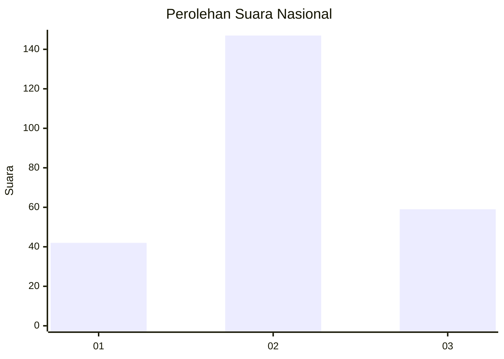
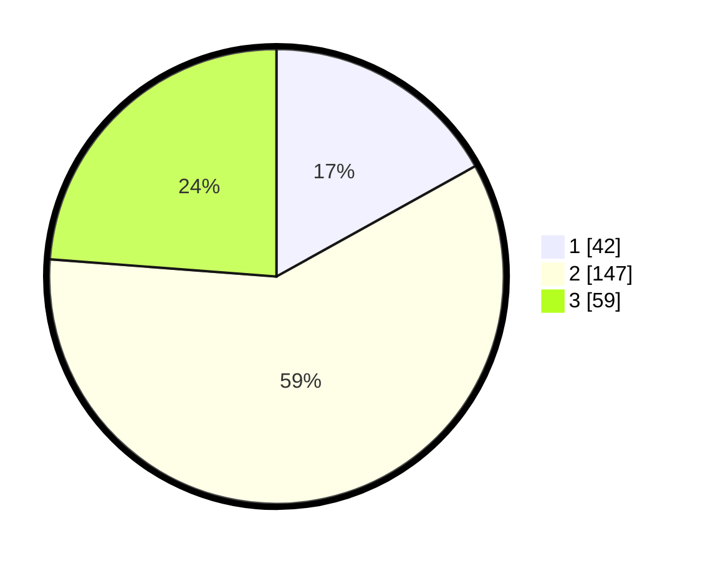

# Hasil

## Grafik

## Tabel

| No. | Nama Paslon    | Suara | Suara (raw) | Persentase |
|:--- |:-------------- | -----:| -----------:| ----------:|
| 1   | ANIES MUHAIMIN | 42    | [42][p-1]   | 16,94      |
| 2   | PRABOWO GIBRAN | 147   | [147][p-2]  | 59,27      |
| 3   | GANJAR MAHFUD  | 59    | [59][p-3]   | 23,79      |

[p-1]: https://github.com/gigit-pemilu/pemilu-2024/blob/main/pilpres/hitung-suara/sub/34-di-yogyakarta/sub/04-sleman/sub/09-prambanan/sub/2005-madurejo/sub/028-tps/sub/paslon-1.txt
[p-2]: https://github.com/gigit-pemilu/pemilu-2024/blob/main/pilpres/hitung-suara/sub/34-di-yogyakarta/sub/04-sleman/sub/09-prambanan/sub/2005-madurejo/sub/028-tps/sub/paslon-2.txt
[p-3]: https://github.com/gigit-pemilu/pemilu-2024/blob/main/pilpres/hitung-suara/sub/34-di-yogyakarta/sub/04-sleman/sub/09-prambanan/sub/2005-madurejo/sub/028-tps/sub/paslon-3.txt

## Foto C Plano

https://sirekap-obj-formc.kpu.go.id/e1bb/pemilu/ppwp/34/04/09/20/05/3404092005028-20240215-012639--2be4029b-6a50-41ff-bb4f-2881a9da8047.jpg

https://sirekap-obj-formc.kpu.go.id/e1bb/pemilu/ppwp/34/04/09/20/05/3404092005028-20240215-012653--aa6491c6-57ea-4d00-9fa7-31f21cdb8064.jpg

https://sirekap-obj-formc.kpu.go.id/e1bb/pemilu/ppwp/34/04/09/20/05/3404092005028-20240215-012710--5c7e2a71-c1ff-4551-846b-4b4243f5894a.jpg

## Metadata

| Key        | Value               |
| ---------- | ------------------- |
| Time Stamp | 2024-02-16 14:30:33 |

