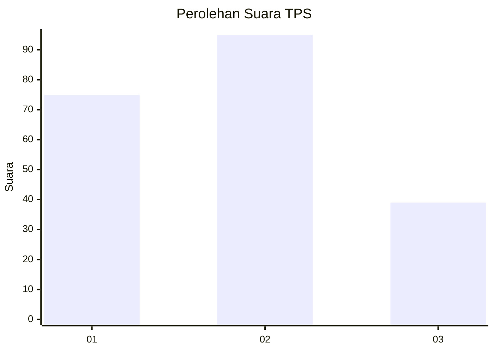
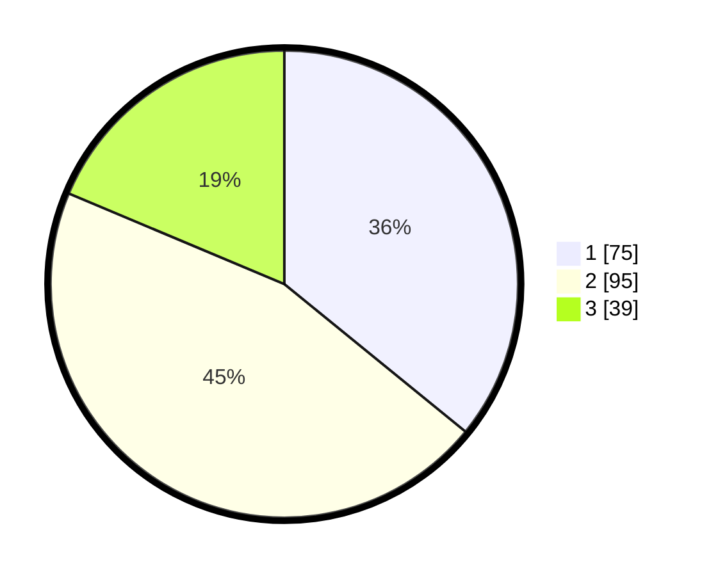

# Hasil

## Grafik

## Tabel

| No. | Nama Paslon    | Suara | Suara (raw) | Persentase |
|:--- |:-------------- | -----:| -----------:| ----------:|
| 1   | ANIES MUHAIMIN | 75    | [75][p-1]   | 35,89      |
| 2   | PRABOWO GIBRAN | 95    | [95][p-2]   | 45,45      |
| 3   | GANJAR MAHFUD  | 39    | [39][p-3]   | 18,66      |

[p-1]: https://github.com/gigit-pemilu/pemilu-2024-34-di-yogyakarta/blob/main/pilpres/hitung-suara/sub/34-di-yogyakarta/sub/04-sleman/sub/09-prambanan/sub/2006-bokoharjo/sub/001-tps/sub/paslon-1.txt
[p-2]: https://github.com/gigit-pemilu/pemilu-2024-34-di-yogyakarta/blob/main/pilpres/hitung-suara/sub/34-di-yogyakarta/sub/04-sleman/sub/09-prambanan/sub/2006-bokoharjo/sub/001-tps/sub/paslon-2.txt
[p-3]: https://github.com/gigit-pemilu/pemilu-2024-34-di-yogyakarta/blob/main/pilpres/hitung-suara/sub/34-di-yogyakarta/sub/04-sleman/sub/09-prambanan/sub/2006-bokoharjo/sub/001-tps/sub/paslon-3.txt

## Foto C Plano

https://sirekap-obj-formc.kpu.go.id/93c2/pemilu/ppwp/34/04/09/20/06/3404092006001-20240215-035932--6faab3ed-a30c-41f9-a5b1-769dcdca7cf4.jpg

https://sirekap-obj-formc.kpu.go.id/93c2/pemilu/ppwp/34/04/09/20/06/3404092006001-20240215-035505--1474bf11-1162-4d5f-ab71-23755b035472.jpg

https://sirekap-obj-formc.kpu.go.id/93c2/pemilu/ppwp/34/04/09/20/06/3404092006001-20240215-035640--b12af22b-27fc-49da-bf18-08860af47211.jpg

## Metadata

| Key        | Value               |
| ---------- | ------------------- |
| Time Stamp | 2024-02-16 16:25:10 |

