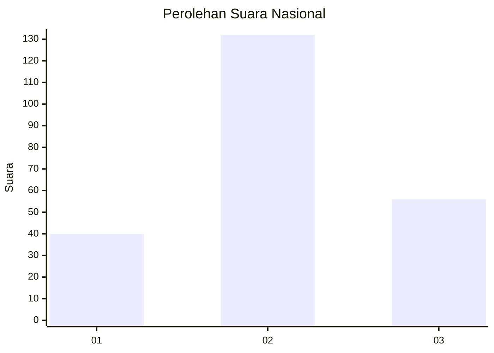
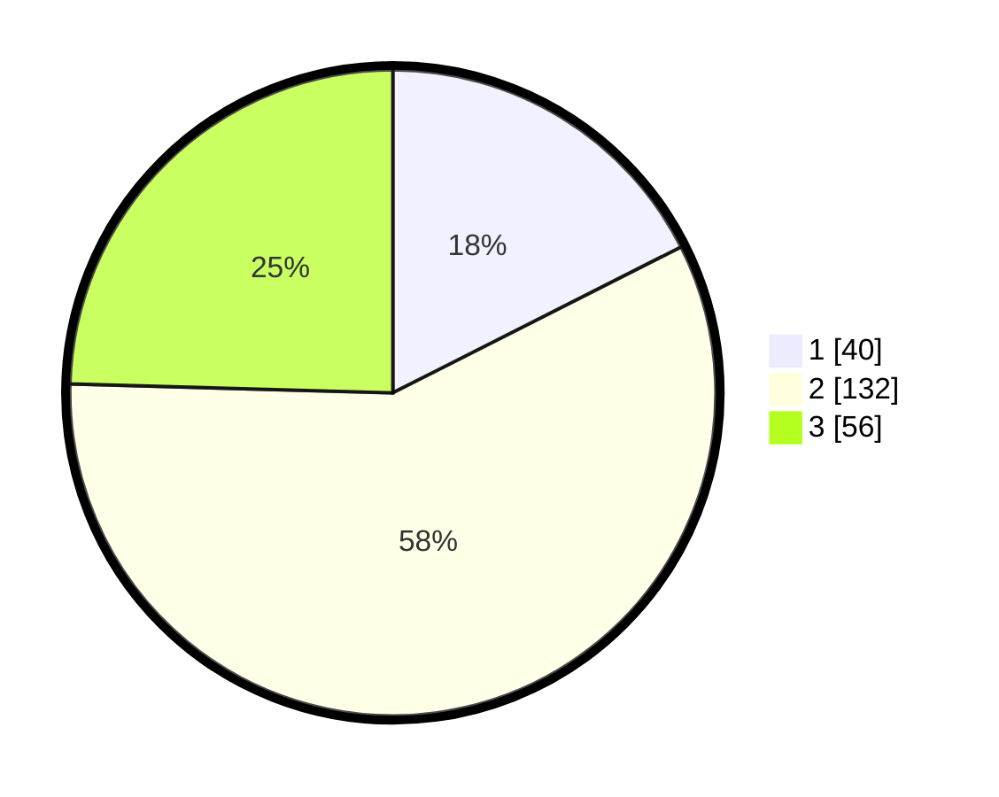

# Hasil

## Grafik

## Tabel

| No. | Nama Paslon    | Suara | Suara (raw) | Persentase |
|:--- |:-------------- | -----:| -----------:| ----------:|
| 1   | ANIES MUHAIMIN | 40    | [40][p-1]   | 17,54      |
| 2   | PRABOWO GIBRAN | 132   | [132][p-2]  | 57,89      |
| 3   | GANJAR MAHFUD  | 56    | [56][p-3]   | 24,56      |

[p-1]: https://github.com/gigit-pemilu/pemilu-2024/blob/main/pilpres/hitung-suara/sub/34-di-yogyakarta/sub/04-sleman/sub/09-prambanan/sub/2006-bokoharjo/sub/003-tps/sub/paslon-1.txt
[p-2]: https://github.com/gigit-pemilu/pemilu-2024/blob/main/pilpres/hitung-suara/sub/34-di-yogyakarta/sub/04-sleman/sub/09-prambanan/sub/2006-bokoharjo/sub/003-tps/sub/paslon-2.txt
[p-3]: https://github.com/gigit-pemilu/pemilu-2024/blob/main/pilpres/hitung-suara/sub/34-di-yogyakarta/sub/04-sleman/sub/09-prambanan/sub/2006-bokoharjo/sub/003-tps/sub/paslon-3.txt

## Foto C Plano

https://sirekap-obj-formc.kpu.go.id/687b/pemilu/ppwp/34/04/09/20/06/3404092006003-20240214-193025--89beaf9e-9585-411c-8fb3-3cf02a03a2e1.jpg

https://sirekap-obj-formc.kpu.go.id/687b/pemilu/ppwp/34/04/09/20/06/3404092006003-20240214-193050--e5065b91-2b76-4686-bfb2-a750bff31422.jpg

https://sirekap-obj-formc.kpu.go.id/687b/pemilu/ppwp/34/04/09/20/06/3404092006003-20240214-193109--530f20ff-377c-4b07-ba18-2d4ec2700065.jpg

## Metadata

| Key        | Value               |
| ---------- | ------------------- |
| Time Stamp | 2024-02-15 16:30:25 |

