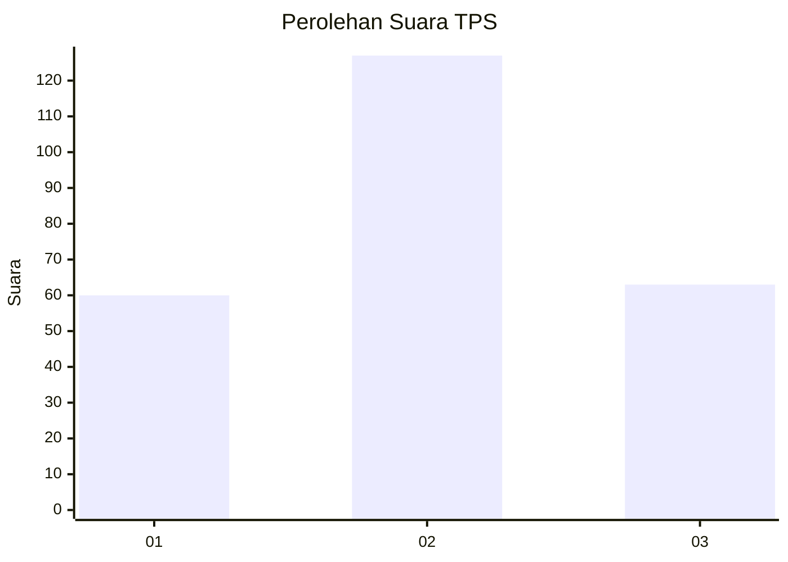
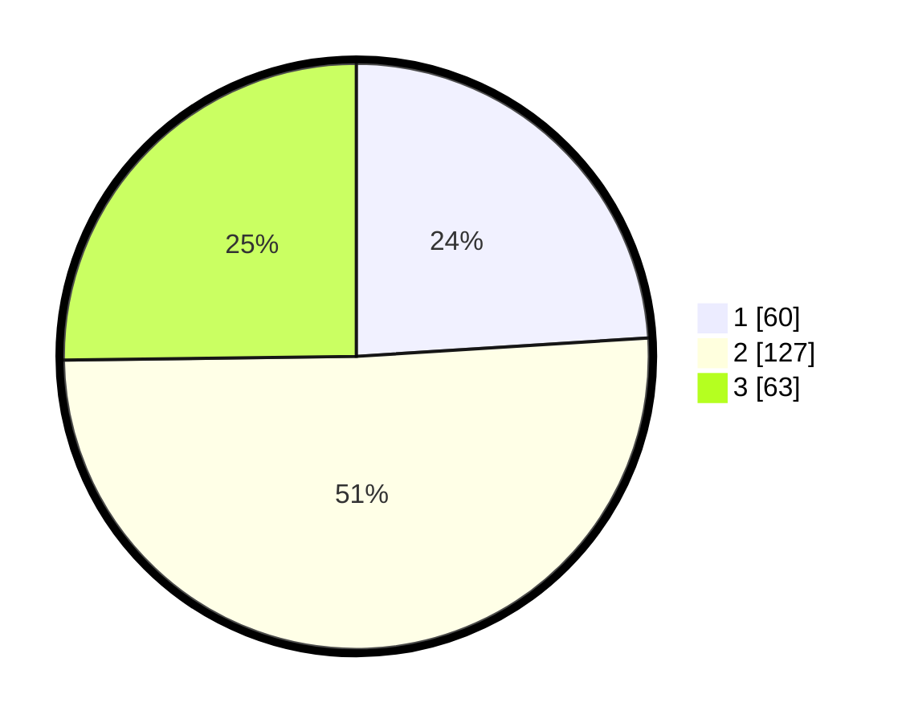

# Hasil

## Grafik

## Tabel

| No. | Nama Paslon    | Suara | Suara (raw) | Persentase |
|:--- |:-------------- | -----:| -----------:| ----------:|
| 1   | ANIES MUHAIMIN | 60    | [60][p-1]   | 24,00      |
| 2   | PRABOWO GIBRAN | 127   | [127][p-2]  | 50,80      |
| 3   | GANJAR MAHFUD  | 63    | [63][p-3]   | 25,20      |

[p-1]: https://github.com/gigit-pemilu/pemilu-2024-34-di-yogyakarta/blob/main/pilpres/hitung-suara/sub/34-di-yogyakarta/sub/04-sleman/sub/09-prambanan/sub/2006-bokoharjo/sub/005-tps/sub/paslon-1.txt
[p-2]: https://github.com/gigit-pemilu/pemilu-2024-34-di-yogyakarta/blob/main/pilpres/hitung-suara/sub/34-di-yogyakarta/sub/04-sleman/sub/09-prambanan/sub/2006-bokoharjo/sub/005-tps/sub/paslon-2.txt
[p-3]: https://github.com/gigit-pemilu/pemilu-2024-34-di-yogyakarta/blob/main/pilpres/hitung-suara/sub/34-di-yogyakarta/sub/04-sleman/sub/09-prambanan/sub/2006-bokoharjo/sub/005-tps/sub/paslon-3.txt

## Foto C Plano

https://sirekap-obj-formc.kpu.go.id/fc4d/pemilu/ppwp/34/04/09/20/06/3404092006005-20240214-214457--351bb968-1a0b-486c-a6f7-2bd8bdbef5b9.jpg

https://sirekap-obj-formc.kpu.go.id/fc4d/pemilu/ppwp/34/04/09/20/06/3404092006005-20240214-221210--6e9fb6e5-8859-49fa-bad8-d659d088ed27.jpg

https://sirekap-obj-formc.kpu.go.id/fc4d/pemilu/ppwp/34/04/09/20/06/3404092006005-20240214-221331--c06977f1-401f-4967-9aa7-9c251a5e4653.jpg

## Metadata

| Key        | Value               |
| ---------- | ------------------- |
| Time Stamp | 2024-02-15 17:00:25 |

