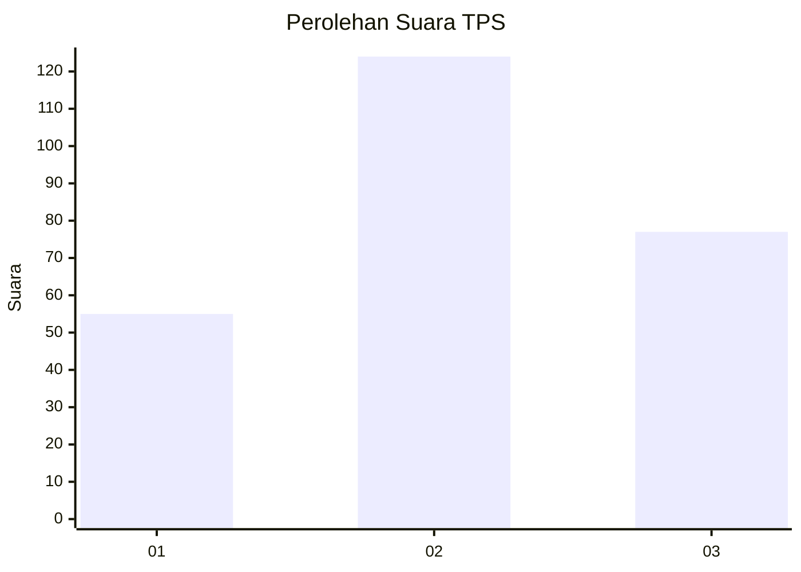
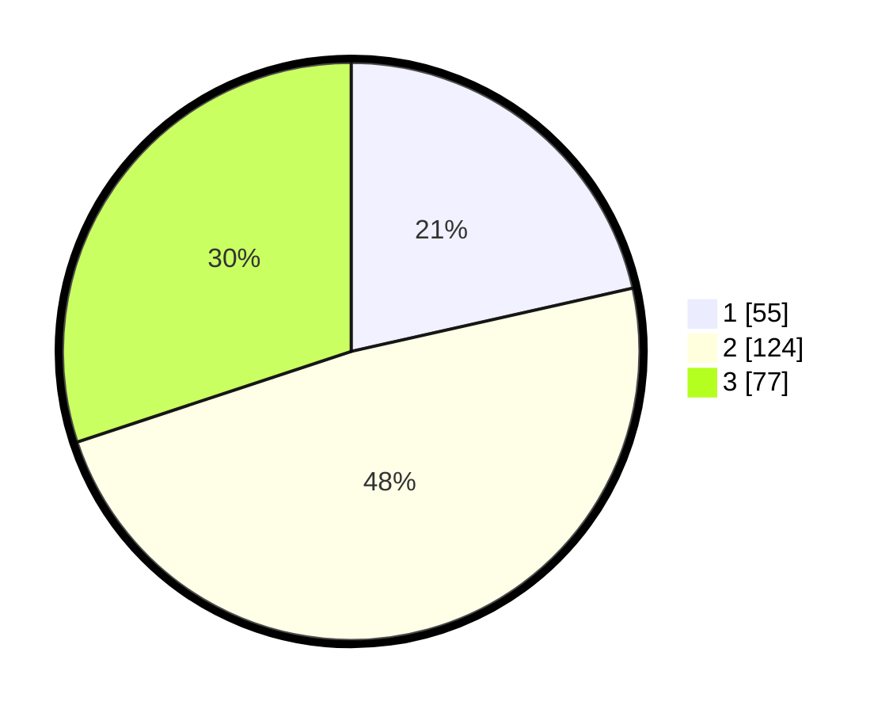

# Hasil

## Grafik

## Tabel

| No. | Nama Paslon    | Suara | Suara (raw) | Persentase |
|:--- |:-------------- | -----:| -----------:| ----------:|
| 1   | ANIES MUHAIMIN | 55    | [55][p-1]   | 21,48      |
| 2   | PRABOWO GIBRAN | 124   | [124][p-2]  | 48,44      |
| 3   | GANJAR MAHFUD  | 77    | [77][p-3]   | 30,08      |

[p-1]: https://github.com/gigit-pemilu/pemilu-2024-34-di-yogyakarta/blob/main/pilpres/hitung-suara/sub/34-di-yogyakarta/sub/04-sleman/sub/09-prambanan/sub/2006-bokoharjo/sub/019-tps/sub/paslon-1.txt
[p-2]: https://github.com/gigit-pemilu/pemilu-2024-34-di-yogyakarta/blob/main/pilpres/hitung-suara/sub/34-di-yogyakarta/sub/04-sleman/sub/09-prambanan/sub/2006-bokoharjo/sub/019-tps/sub/paslon-2.txt
[p-3]: https://github.com/gigit-pemilu/pemilu-2024-34-di-yogyakarta/blob/main/pilpres/hitung-suara/sub/34-di-yogyakarta/sub/04-sleman/sub/09-prambanan/sub/2006-bokoharjo/sub/019-tps/sub/paslon-3.txt

## Foto C Plano

https://sirekap-obj-formc.kpu.go.id/f0c3/pemilu/ppwp/34/04/09/20/06/3404092006019-20240214-185501--e7f07454-6490-4ed1-867d-8fa9fd35c39a.jpg

https://sirekap-obj-formc.kpu.go.id/f0c3/pemilu/ppwp/34/04/09/20/06/3404092006019-20240214-155509--b7e3004c-489e-4d64-9c72-99fa8dc00218.jpg

https://sirekap-obj-formc.kpu.go.id/f0c3/pemilu/ppwp/34/04/09/20/06/3404092006019-20240214-155059--dc74465b-abb9-4c85-930b-7e4ac1400b2d.jpg

## Metadata

| Key        | Value               |
| ---------- | ------------------- |
| Time Stamp | 2024-02-15 20:00:44 |

