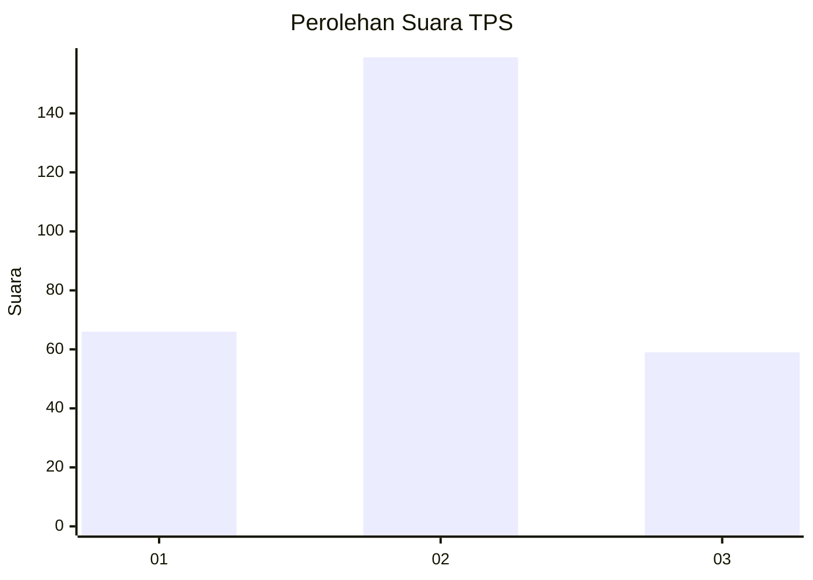
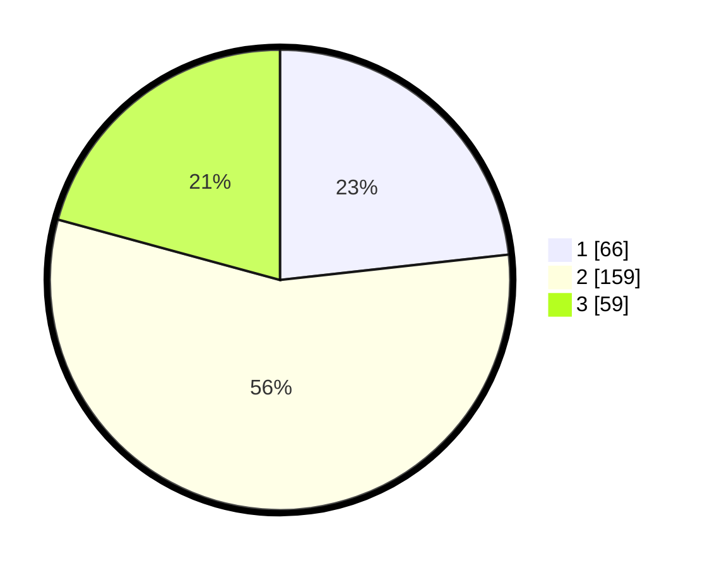

# Hasil

## Grafik

## Tabel

| No. | Nama Paslon    | Suara | Suara (raw) | Persentase |
|:--- |:-------------- | -----:| -----------:| ----------:|
| 1   | ANIES MUHAIMIN | 66    | [66][p-1]   | 23,24      |
| 2   | PRABOWO GIBRAN | 159   | [159][p-2]  | 55,99      |
| 3   | GANJAR MAHFUD  | 59    | [59][p-3]   | 20,77      |

[p-1]: https://github.com/gigit-pemilu/pemilu-2024-34-di-yogyakarta/blob/main/pilpres/hitung-suara/sub/34-di-yogyakarta/sub/04-sleman/sub/09-prambanan/sub/2006-bokoharjo/sub/025-tps/sub/paslon-1.txt
[p-2]: https://github.com/gigit-pemilu/pemilu-2024-34-di-yogyakarta/blob/main/pilpres/hitung-suara/sub/34-di-yogyakarta/sub/04-sleman/sub/09-prambanan/sub/2006-bokoharjo/sub/025-tps/sub/paslon-2.txt
[p-3]: https://github.com/gigit-pemilu/pemilu-2024-34-di-yogyakarta/blob/main/pilpres/hitung-suara/sub/34-di-yogyakarta/sub/04-sleman/sub/09-prambanan/sub/2006-bokoharjo/sub/025-tps/sub/paslon-3.txt

## Foto C Plano

https://sirekap-obj-formc.kpu.go.id/b44e/pemilu/ppwp/34/04/09/20/06/3404092006025-20240215-032849--ec1797c0-fba8-4f36-8d20-037f8b8d70bb.jpg

https://sirekap-obj-formc.kpu.go.id/b44e/pemilu/ppwp/34/04/09/20/06/3404092006025-20240215-032940--cf4e0a42-8e2e-4243-8d60-3ff2dc5ff8c2.jpg

https://sirekap-obj-formc.kpu.go.id/b44e/pemilu/ppwp/34/04/09/20/06/3404092006025-20240215-033009--dcdcfb48-ea46-4abb-9d64-8d2bbbb65961.jpg

## Metadata

| Key        | Value               |
| ---------- | ------------------- |
| Time Stamp | 2024-02-15 16:30:25 |

