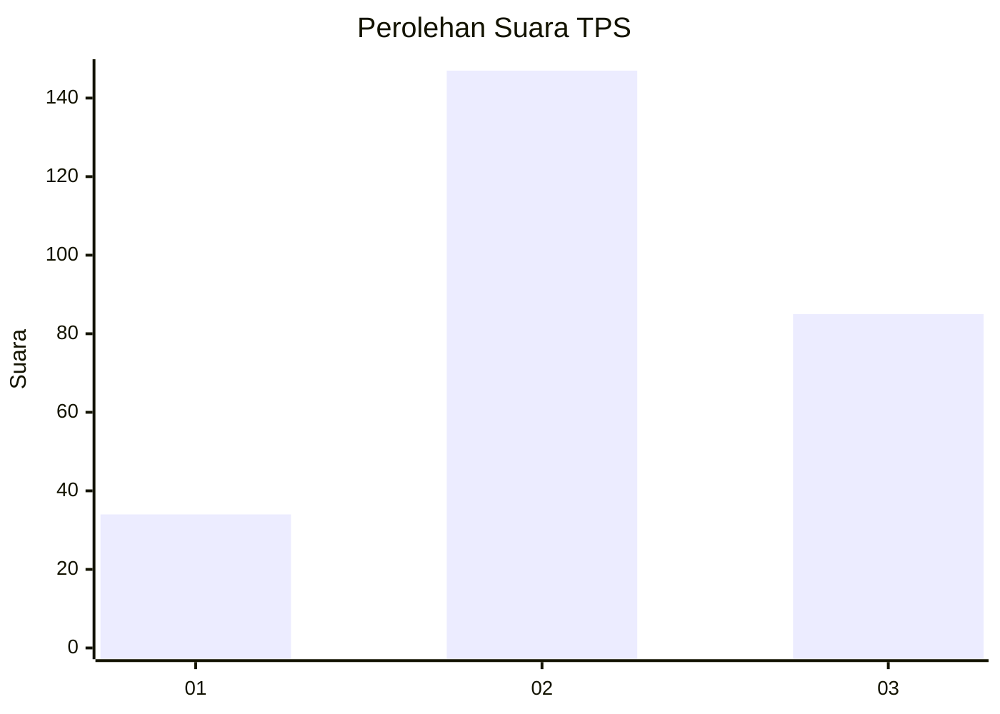
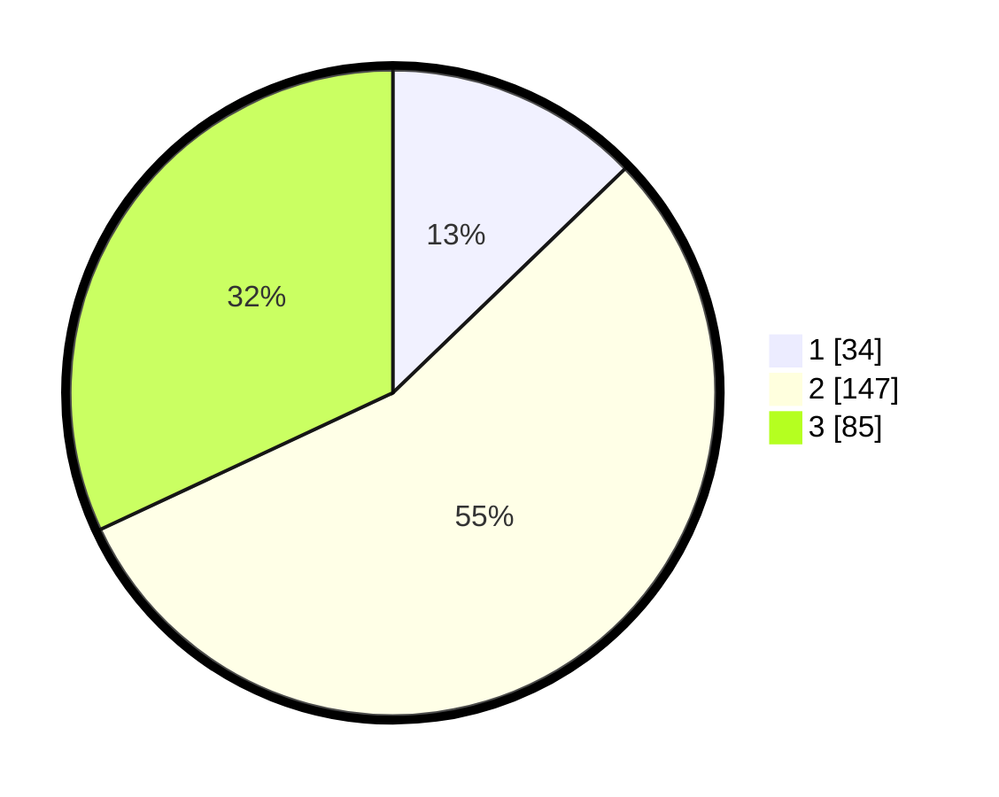

# Hasil

## Grafik

## Tabel

| No. | Nama Paslon    | Suara | Suara (raw) | Persentase |
|:--- |:-------------- | -----:| -----------:| ----------:|
| 1   | ANIES MUHAIMIN | 34    | [34][p-1]   | 12,78      |
| 2   | PRABOWO GIBRAN | 147   | [147][p-2]  | 55,26      |
| 3   | GANJAR MAHFUD  | 85    | [85][p-3]   | 31,95      |

[p-1]: https://github.com/gigit-pemilu/pemilu-2024-34-di-yogyakarta/blob/main/pilpres/hitung-suara/sub/34-di-yogyakarta/sub/04-sleman/sub/10-kalasan/sub/2001-purwomartani/sub/002-tps/sub/paslon-1.txt
[p-2]: https://github.com/gigit-pemilu/pemilu-2024-34-di-yogyakarta/blob/main/pilpres/hitung-suara/sub/34-di-yogyakarta/sub/04-sleman/sub/10-kalasan/sub/2001-purwomartani/sub/002-tps/sub/paslon-2.txt
[p-3]: https://github.com/gigit-pemilu/pemilu-2024-34-di-yogyakarta/blob/main/pilpres/hitung-suara/sub/34-di-yogyakarta/sub/04-sleman/sub/10-kalasan/sub/2001-purwomartani/sub/002-tps/sub/paslon-3.txt

## Foto C Plano

https://sirekap-obj-formc.kpu.go.id/12c6/pemilu/ppwp/34/04/10/20/01/3404102001002-20240216-024641--5d78f64a-7edc-439d-9fa3-3bbee472ff29.jpg

https://sirekap-obj-formc.kpu.go.id/12c6/pemilu/ppwp/34/04/10/20/01/3404102001002-20240216-024643--51444930-0ee9-436e-8d42-8fc7efa77b2d.jpg

https://sirekap-obj-formc.kpu.go.id/12c6/pemilu/ppwp/34/04/10/20/01/3404102001002-20240216-024642--78e8e28e-2839-44dd-862f-0c98ddc9db75.jpg

## Metadata

| Key        | Value               |
| ---------- | ------------------- |
| Time Stamp | 2024-02-16 09:30:28 |

## DATA PEMILIH TETAP

Jumlah pemilih dalam DPT: **293**.
 * L: **132**.
 * P: **161**.

## DATA PENGGUNA HAK PILIH

Jumlah pengguna hak pilih dalam DPT: **264**.
 * L: **115**.
 * P: **149**.

Jumlah pengguna hak pilih dalam DPTb: **3**.
 * L: **1**.
 * P: **2**.

Jumlah pengguna hak pilih dalam DPK: **5**.
 * L: **3**.
 * P: **2**.

Jumlah pengguna hak pilih: **272**.
 * L: **119**.
 * P: **153**.

## JUMLAH SUARA SAH DAN TIDAK SAH

JUMLAH SELURUH SUARA SAH: **266**.

JUMLAH SUARA TIDAK SAH: **6**.

JUMLAH SELURUH SUARA SAH DAN SUARA TIDAK SAH: **272**.

