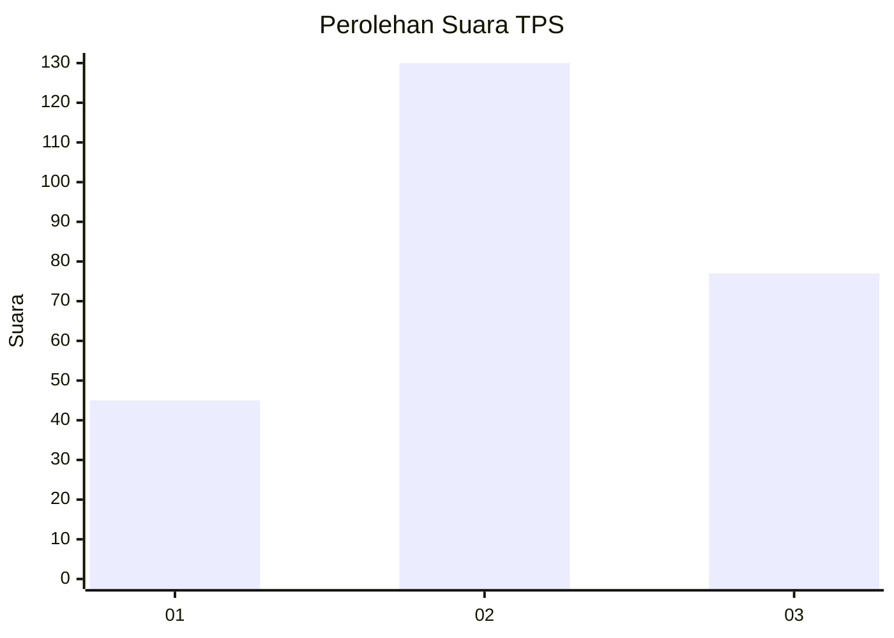
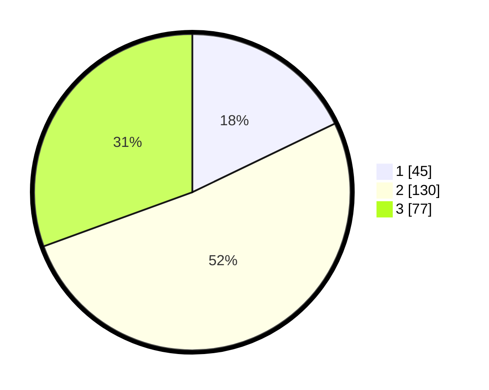

# Hasil

## Grafik

## Tabel

| No. | Nama Paslon    | Suara | Suara (raw) | Persentase |
|:--- |:-------------- | -----:| -----------:| ----------:|
| 1   | ANIES MUHAIMIN | 45    | [45][p-1]   | 17,86      |
| 2   | PRABOWO GIBRAN | 130   | [130][p-2]  | 51,59      |
| 3   | GANJAR MAHFUD  | 77    | [77][p-3]   | 30,56      |

[p-1]: https://github.com/gigit-pemilu/pemilu-2024-34-di-yogyakarta/blob/main/pilpres/hitung-suara/sub/34-di-yogyakarta/sub/04-sleman/sub/10-kalasan/sub/2001-purwomartani/sub/003-tps/sub/paslon-1.txt
[p-2]: https://github.com/gigit-pemilu/pemilu-2024-34-di-yogyakarta/blob/main/pilpres/hitung-suara/sub/34-di-yogyakarta/sub/04-sleman/sub/10-kalasan/sub/2001-purwomartani/sub/003-tps/sub/paslon-2.txt
[p-3]: https://github.com/gigit-pemilu/pemilu-2024-34-di-yogyakarta/blob/main/pilpres/hitung-suara/sub/34-di-yogyakarta/sub/04-sleman/sub/10-kalasan/sub/2001-purwomartani/sub/003-tps/sub/paslon-3.txt

## Foto C Plano

https://sirekap-obj-formc.kpu.go.id/0ef4/pemilu/ppwp/34/04/10/20/01/3404102001003-20240214-155812--1afb38cb-1ae6-4939-80b7-aed960516e18.jpg

https://sirekap-obj-formc.kpu.go.id/0ef4/pemilu/ppwp/34/04/10/20/01/3404102001003-20240214-160055--5275ef83-7ef4-470d-8c18-6bb74547c463.jpg

https://sirekap-obj-formc.kpu.go.id/0ef4/pemilu/ppwp/34/04/10/20/01/3404102001003-20240214-155147--9197b179-f280-4e61-a803-92900b4e0d11.jpg

## Metadata

| Key        | Value               |
| ---------- | ------------------- |
| Time Stamp | 2024-02-15 00:41:44 |

## DATA PEMILIH TETAP

Jumlah pemilih dalam DPT: **296**.
 * L: **145**.
 * P: **151**.

## DATA PENGGUNA HAK PILIH

Jumlah pengguna hak pilih dalam DPT: **235**.
 * L: **107**.
 * P: **128**.

Jumlah pengguna hak pilih dalam DPTb: **8**.
 * L: **3**.
 * P: **5**.

Jumlah pengguna hak pilih dalam DPK: **12**.
 * L: **8**.
 * P: **4**.

Jumlah pengguna hak pilih: **255**.
 * L: **118**.
 * P: **137**.

## JUMLAH SUARA SAH DAN TIDAK SAH

JUMLAH SELURUH SUARA SAH: **252**.

JUMLAH SUARA TIDAK SAH: **3**.

JUMLAH SELURUH SUARA SAH DAN SUARA TIDAK SAH: **255**.

