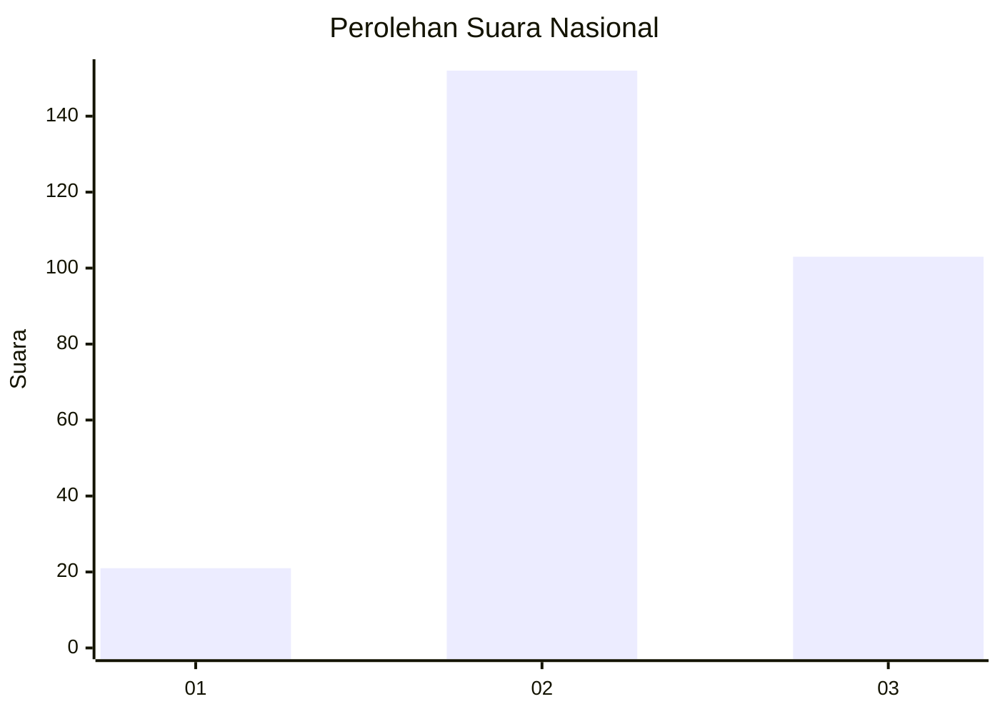
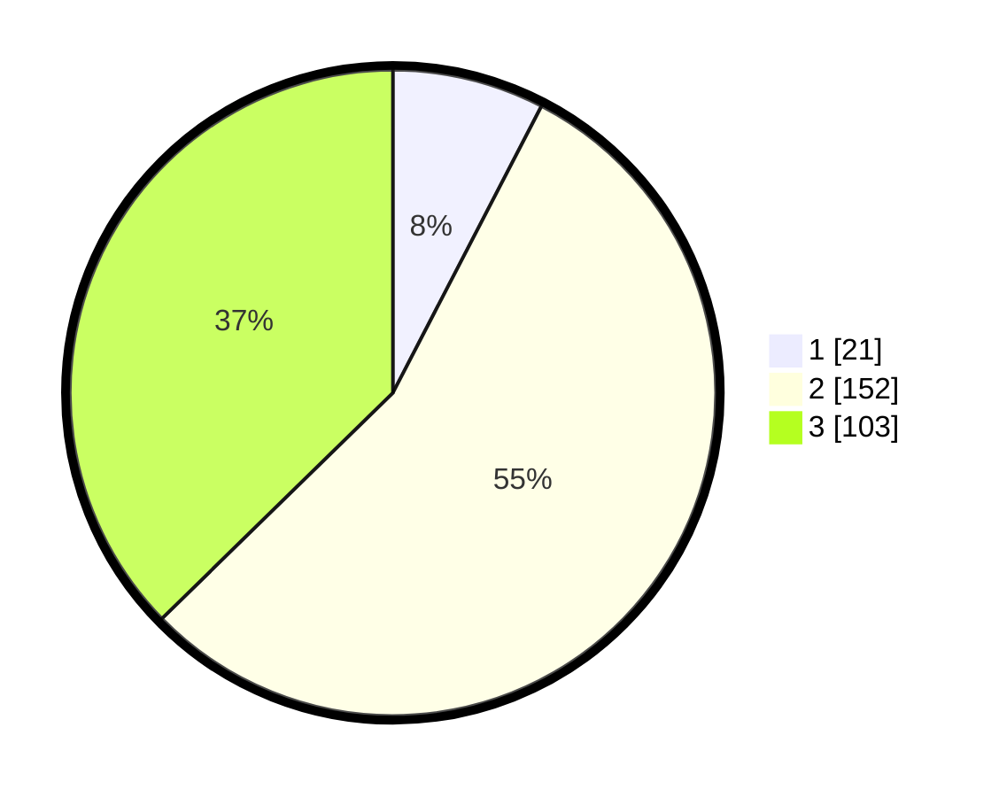

# Hasil

## Grafik

## Tabel

| No. | Nama Paslon    | Suara | Suara (raw) | Persentase |
|:--- |:-------------- | -----:| -----------:| ----------:|
| 1   | ANIES MUHAIMIN | 21    | [21][p-1]   | 7,61       |
| 2   | PRABOWO GIBRAN | 152   | [152][p-2]  | 55,07      |
| 3   | GANJAR MAHFUD  | 103   | [103][p-3]  | 37,32      |

[p-1]: https://github.com/gigit-pemilu/pemilu-2024/blob/main/pilpres/hitung-suara/sub/34-di-yogyakarta/sub/04-sleman/sub/10-kalasan/sub/2001-purwomartani/sub/004-tps/sub/paslon-1.txt
[p-2]: https://github.com/gigit-pemilu/pemilu-2024/blob/main/pilpres/hitung-suara/sub/34-di-yogyakarta/sub/04-sleman/sub/10-kalasan/sub/2001-purwomartani/sub/004-tps/sub/paslon-2.txt
[p-3]: https://github.com/gigit-pemilu/pemilu-2024/blob/main/pilpres/hitung-suara/sub/34-di-yogyakarta/sub/04-sleman/sub/10-kalasan/sub/2001-purwomartani/sub/004-tps/sub/paslon-3.txt

## Foto C Plano

https://sirekap-obj-formc.kpu.go.id/b7e9/pemilu/ppwp/34/04/10/20/01/3404102001004-20240217-082308--0d4c93ca-c5b9-447d-bf31-cdd65cf3c1e8.jpg

https://sirekap-obj-formc.kpu.go.id/b7e9/pemilu/ppwp/34/04/10/20/01/3404102001004-20240216-152017--4032c530-f169-4caf-aea7-fa1383ae567c.jpg

https://sirekap-obj-formc.kpu.go.id/b7e9/pemilu/ppwp/34/04/10/20/01/3404102001004-20240217-082309--fa7e1952-acb2-4416-be31-9eaf329d7e03.jpg

## Metadata

| Key        | Value               |
| ---------- | ------------------- |
| Time Stamp | 2024-02-17 08:30:03 |

## DATA PEMILIH TETAP

Jumlah pemilih dalam DPT: **292**.
 * L: **139**.
 * P: **153**.

## DATA PENGGUNA HAK PILIH

Jumlah pengguna hak pilih dalam DPT: **267**.
 * L: **128**.
 * P: **139**.

Jumlah pengguna hak pilih dalam DPTb: **7**.
 * L: **3**.
 * P: **4**.

Jumlah pengguna hak pilih dalam DPK: **4**.
 * L: **3**.
 * P: **1**.

Jumlah pengguna hak pilih: **278**.
 * L: **134**.
 * P: **144**.

## JUMLAH SUARA SAH DAN TIDAK SAH

JUMLAH SELURUH SUARA SAH: **276**.

JUMLAH SUARA TIDAK SAH: **2**.

JUMLAH SELURUH SUARA SAH DAN SUARA TIDAK SAH: **278**.

