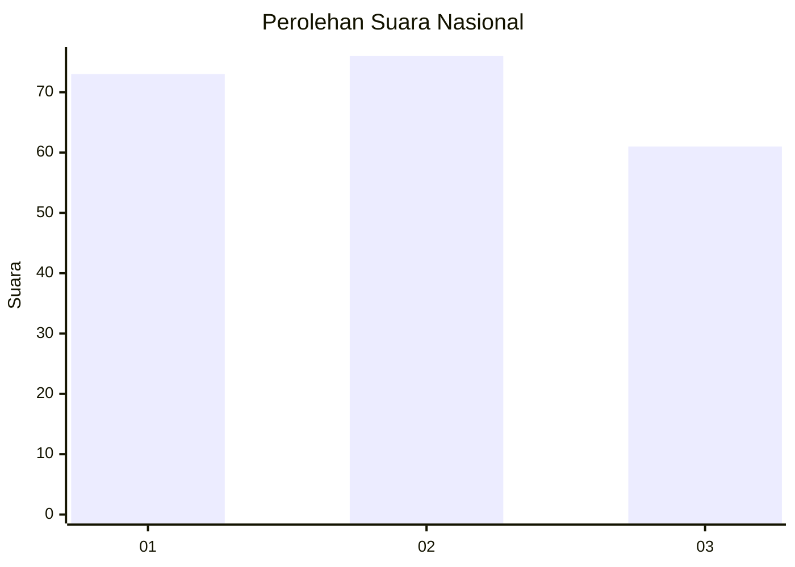
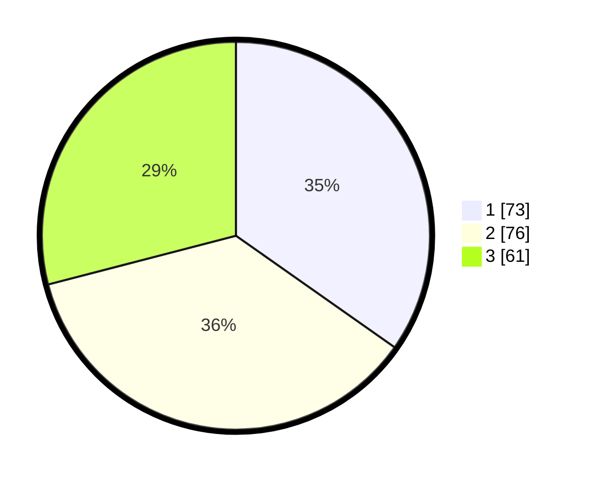

# Hasil

## Grafik

## Tabel

| No. | Nama Paslon    | Suara | Suara (raw) | Persentase |
|:--- |:-------------- | -----:| -----------:| ----------:|
| 1   | ANIES MUHAIMIN | 73    | [73][p-1]   | 34,76      |
| 2   | PRABOWO GIBRAN | 76    | [76][p-2]   | 36,19      |
| 3   | GANJAR MAHFUD  | 61    | [61][p-3]   | 29,05      |

[p-1]: https://github.com/gigit-pemilu/pemilu-2024/blob/main/pilpres/hitung-suara/sub/34-di-yogyakarta/sub/04-sleman/sub/10-kalasan/sub/2001-purwomartani/sub/005-tps/sub/paslon-1.txt
[p-2]: https://github.com/gigit-pemilu/pemilu-2024/blob/main/pilpres/hitung-suara/sub/34-di-yogyakarta/sub/04-sleman/sub/10-kalasan/sub/2001-purwomartani/sub/005-tps/sub/paslon-2.txt
[p-3]: https://github.com/gigit-pemilu/pemilu-2024/blob/main/pilpres/hitung-suara/sub/34-di-yogyakarta/sub/04-sleman/sub/10-kalasan/sub/2001-purwomartani/sub/005-tps/sub/paslon-3.txt

## Foto C Plano

https://sirekap-obj-formc.kpu.go.id/00c8/pemilu/ppwp/34/04/10/20/01/3404102001005-20240214-203528--00cb5e48-ce50-40cb-914f-05e90367bf9a.jpg

https://sirekap-obj-formc.kpu.go.id/00c8/pemilu/ppwp/34/04/10/20/01/3404102001005-20240214-203641--9a0baa95-08e7-409b-8564-a12088bf0540.jpg

https://sirekap-obj-formc.kpu.go.id/00c8/pemilu/ppwp/34/04/10/20/01/3404102001005-20240214-203733--ae46703b-76cb-4f3e-b0eb-2fda79dfe9d5.jpg

## Metadata

| Key        | Value               |
| ---------- | ------------------- |
| Time Stamp | 2024-02-16 21:01:00 |

