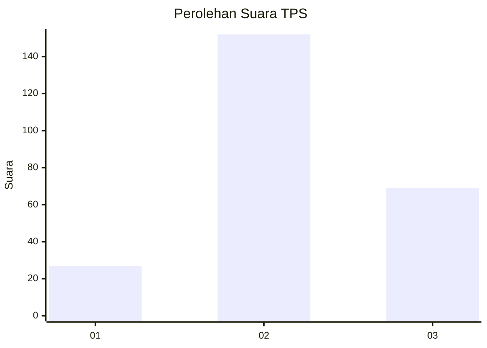
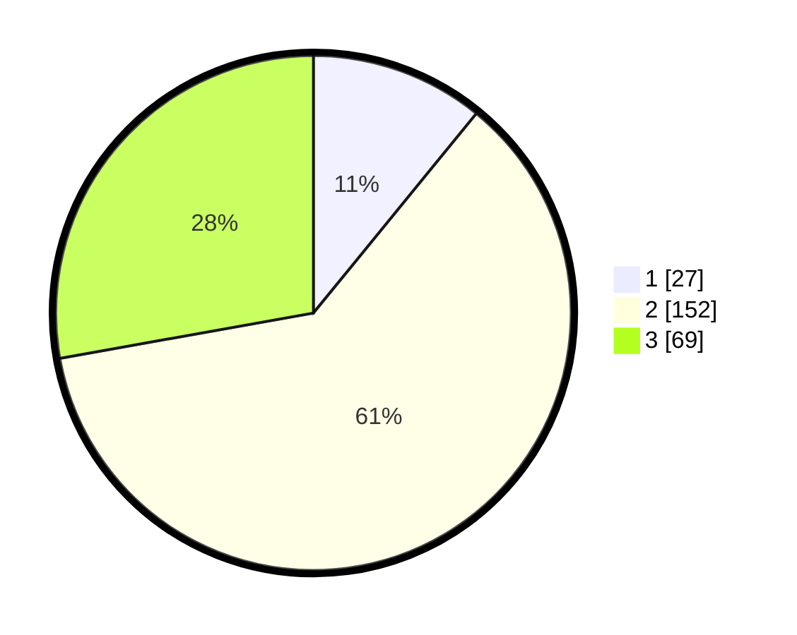

# Hasil

## Grafik

## Tabel

| No. | Nama Paslon    | Suara | Suara (raw) | Persentase |
|:--- |:-------------- | -----:| -----------:| ----------:|
| 1   | ANIES MUHAIMIN | 27    | [27][p-1]   | 10,89      |
| 2   | PRABOWO GIBRAN | 152   | [152][p-2]  | 61,29      |
| 3   | GANJAR MAHFUD  | 69    | [69][p-3]   | 27,82      |

[p-1]: https://github.com/gigit-pemilu/pemilu-2024-34-di-yogyakarta/blob/main/pilpres/hitung-suara/sub/34-di-yogyakarta/sub/04-sleman/sub/10-kalasan/sub/2001-purwomartani/sub/006-tps/sub/paslon-1.txt
[p-2]: https://github.com/gigit-pemilu/pemilu-2024-34-di-yogyakarta/blob/main/pilpres/hitung-suara/sub/34-di-yogyakarta/sub/04-sleman/sub/10-kalasan/sub/2001-purwomartani/sub/006-tps/sub/paslon-2.txt
[p-3]: https://github.com/gigit-pemilu/pemilu-2024-34-di-yogyakarta/blob/main/pilpres/hitung-suara/sub/34-di-yogyakarta/sub/04-sleman/sub/10-kalasan/sub/2001-purwomartani/sub/006-tps/sub/paslon-3.txt

## Foto C Plano

https://sirekap-obj-formc.kpu.go.id/d446/pemilu/ppwp/34/04/10/20/01/3404102001006-20240214-200515--487c9388-fb5a-407b-9a27-4015806706ba.jpg

https://sirekap-obj-formc.kpu.go.id/d446/pemilu/ppwp/34/04/10/20/01/3404102001006-20240214-200741--2b5ce15e-df76-4745-a19d-8956580ed71f.jpg

https://sirekap-obj-formc.kpu.go.id/d446/pemilu/ppwp/34/04/10/20/01/3404102001006-20240214-200835--14c76708-232f-46d5-8949-8913adf11c83.jpg

## Metadata

| Key        | Value               |
| ---------- | ------------------- |
| Time Stamp | 2024-02-21 02:00:00 |

