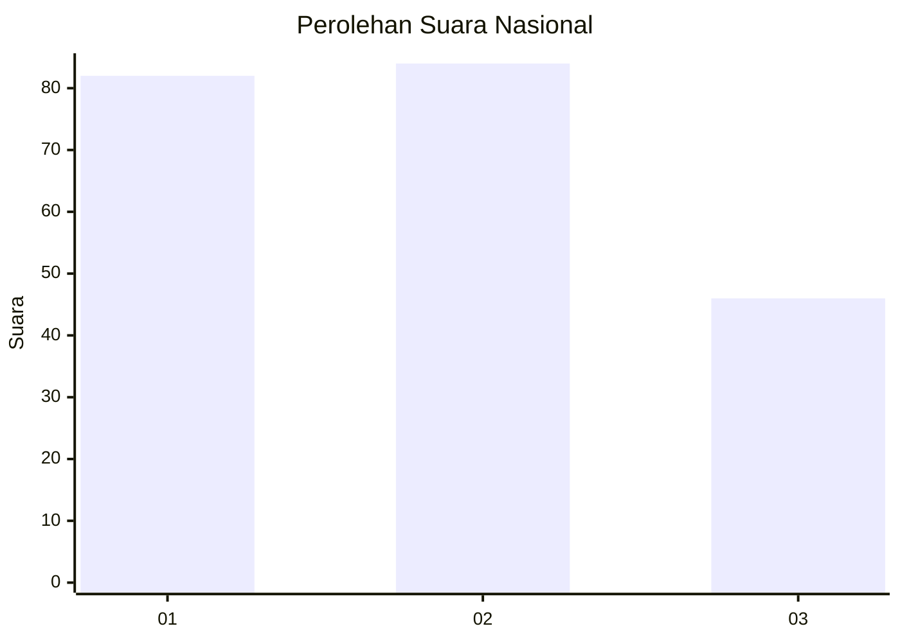
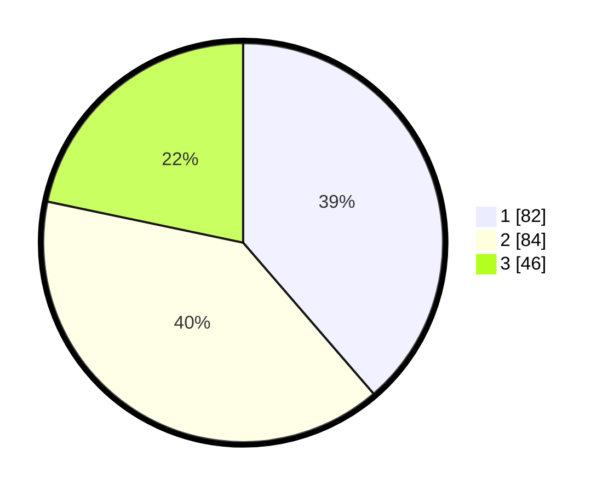

# Hasil

## Grafik

## Tabel

| No. | Nama Paslon    | Suara | Suara (raw) | Persentase |
|:--- |:-------------- | -----:| -----------:| ----------:|
| 1   | ANIES MUHAIMIN | 82    | [82][p-1]   | 38,68      |
| 2   | PRABOWO GIBRAN | 84    | [84][p-2]   | 39,62      |
| 3   | GANJAR MAHFUD  | 46    | [46][p-3]   | 21,70      |

[p-1]: https://github.com/gigit-pemilu/pemilu-2024/blob/main/pilpres/hitung-suara/sub/34-di-yogyakarta/sub/04-sleman/sub/10-kalasan/sub/2001-purwomartani/sub/023-tps/sub/paslon-1.txt
[p-2]: https://github.com/gigit-pemilu/pemilu-2024/blob/main/pilpres/hitung-suara/sub/34-di-yogyakarta/sub/04-sleman/sub/10-kalasan/sub/2001-purwomartani/sub/023-tps/sub/paslon-2.txt
[p-3]: https://github.com/gigit-pemilu/pemilu-2024/blob/main/pilpres/hitung-suara/sub/34-di-yogyakarta/sub/04-sleman/sub/10-kalasan/sub/2001-purwomartani/sub/023-tps/sub/paslon-3.txt

## Foto C Plano

https://sirekap-obj-formc.kpu.go.id/f5bb/pemilu/ppwp/34/04/10/20/01/3404102001023-20240216-124517--930ab688-3992-4e0b-a906-b9f2a3511037.jpg

https://sirekap-obj-formc.kpu.go.id/f5bb/pemilu/ppwp/34/04/10/20/01/3404102001023-20240216-124520--880d3b56-c66d-49f5-b535-d2f3907352b9.jpg

https://sirekap-obj-formc.kpu.go.id/f5bb/pemilu/ppwp/34/04/10/20/01/3404102001023-20240216-124519--4bf35867-8c0c-4d6d-a118-172ad9bdeb99.jpg

## Metadata

| Key        | Value               |
| ---------- | ------------------- |
| Time Stamp | 2024-02-16 13:30:32 |

## DATA PEMILIH TETAP

Jumlah pemilih dalam DPT: **263**.
 * L: **120**.
 * P: **143**.

## DATA PENGGUNA HAK PILIH

Jumlah pengguna hak pilih dalam DPT: **197**.
 * L: **87**.
 * P: **110**.

Jumlah pengguna hak pilih dalam DPTb: **11**.
 * L: **3**.
 * P: **8**.

Jumlah pengguna hak pilih dalam DPK: **8**.
 * L: **1**.
 * P: **7**.

Jumlah pengguna hak pilih: **216**.
 * L: **91**.
 * P: **125**.

## JUMLAH SUARA SAH DAN TIDAK SAH

JUMLAH SELURUH SUARA SAH: **212**.

JUMLAH SUARA TIDAK SAH: **4**.

JUMLAH SELURUH SUARA SAH DAN SUARA TIDAK SAH: **216**.

