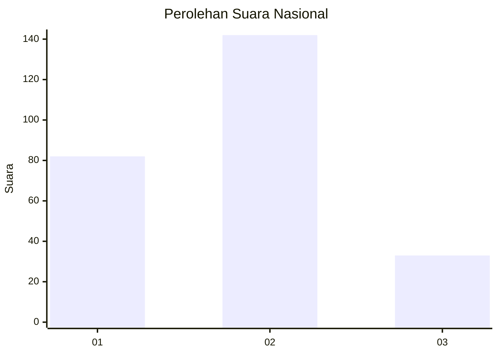
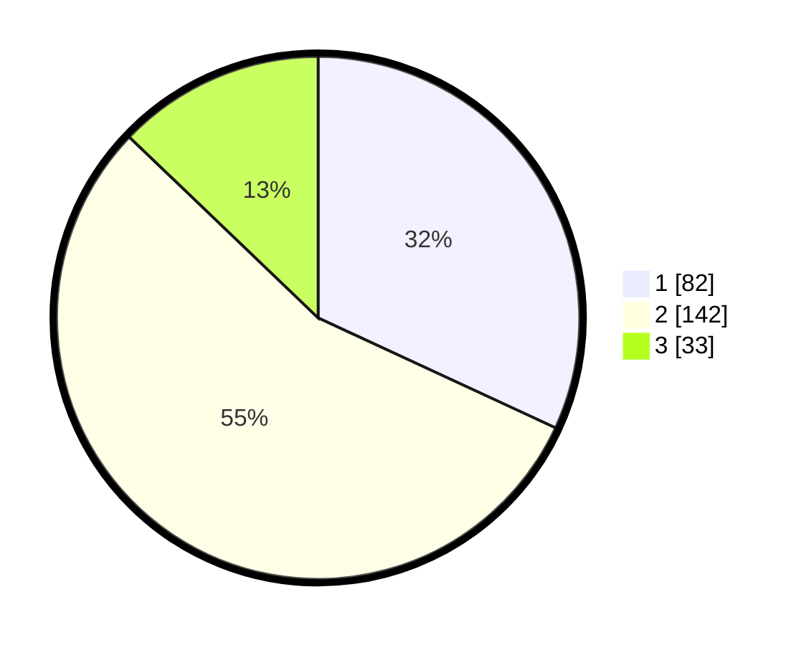

# Hasil

## Grafik

## Tabel

| No. | Nama Paslon    | Suara | Suara (raw) | Persentase |
|:--- |:-------------- | -----:| -----------:| ----------:|
| 1   | ANIES MUHAIMIN | 82    | [82][p-1]   | 31,91      |
| 2   | PRABOWO GIBRAN | 142   | [142][p-2]  | 55,25      |
| 3   | GANJAR MAHFUD  | 33    | [33][p-3]   | 12,84      |

[p-1]: https://github.com/gigit-pemilu/pemilu-2024/blob/main/pilpres/hitung-suara/sub/34-di-yogyakarta/sub/04-sleman/sub/10-kalasan/sub/2001-purwomartani/sub/033-tps/sub/paslon-1.txt
[p-2]: https://github.com/gigit-pemilu/pemilu-2024/blob/main/pilpres/hitung-suara/sub/34-di-yogyakarta/sub/04-sleman/sub/10-kalasan/sub/2001-purwomartani/sub/033-tps/sub/paslon-2.txt
[p-3]: https://github.com/gigit-pemilu/pemilu-2024/blob/main/pilpres/hitung-suara/sub/34-di-yogyakarta/sub/04-sleman/sub/10-kalasan/sub/2001-purwomartani/sub/033-tps/sub/paslon-3.txt

## Foto C Plano

https://sirekap-obj-formc.kpu.go.id/2283/pemilu/ppwp/34/04/10/20/01/3404102001033-20240215-012737--e7780040-c8ea-4cb3-bba4-351179bd7854.jpg

https://sirekap-obj-formc.kpu.go.id/2283/pemilu/ppwp/34/04/10/20/01/3404102001033-20240215-030937--64e225a3-83d9-4d9a-b2ff-adf7f10e8367.jpg

https://sirekap-obj-formc.kpu.go.id/2283/pemilu/ppwp/34/04/10/20/01/3404102001033-20240215-031457--3fab03e0-0df7-41e8-9f74-861ac2cc8fc9.jpg

## Metadata

| Key        | Value               |
| ---------- | ------------------- |
| Time Stamp | 2024-02-15 17:00:25 |

