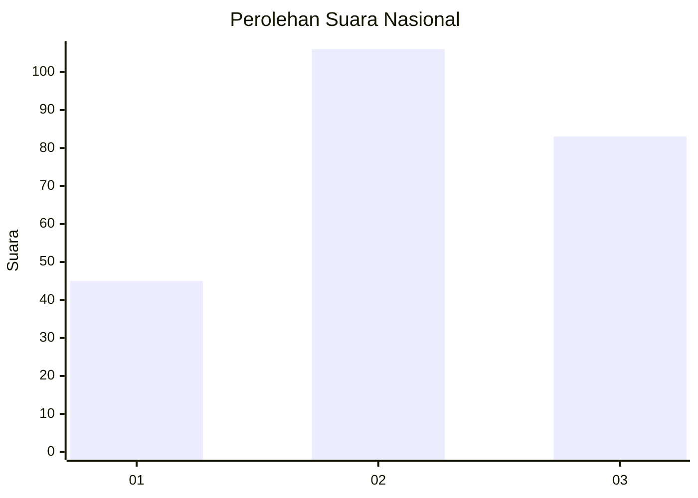
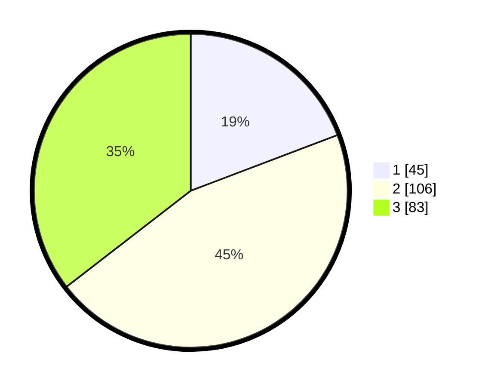

# Hasil

## Grafik

## Tabel

| No. | Nama Paslon    | Suara | Suara (raw) | Persentase |
|:--- |:-------------- | -----:| -----------:| ----------:|
| 1   | ANIES MUHAIMIN | 45    | [45][p-1]   | 19,23      |
| 2   | PRABOWO GIBRAN | 106   | [106][p-2]  | 45,30      |
| 3   | GANJAR MAHFUD  | 83    | [83][p-3]   | 35,47      |

[p-1]: https://github.com/gigit-pemilu/pemilu-2024/blob/main/pilpres/hitung-suara/sub/34-di-yogyakarta/sub/04-sleman/sub/10-kalasan/sub/2001-purwomartani/sub/036-tps/sub/paslon-1.txt
[p-2]: https://github.com/gigit-pemilu/pemilu-2024/blob/main/pilpres/hitung-suara/sub/34-di-yogyakarta/sub/04-sleman/sub/10-kalasan/sub/2001-purwomartani/sub/036-tps/sub/paslon-2.txt
[p-3]: https://github.com/gigit-pemilu/pemilu-2024/blob/main/pilpres/hitung-suara/sub/34-di-yogyakarta/sub/04-sleman/sub/10-kalasan/sub/2001-purwomartani/sub/036-tps/sub/paslon-3.txt

## Foto C Plano

https://sirekap-obj-formc.kpu.go.id/4968/pemilu/ppwp/34/04/10/20/01/3404102001036-20240215-012831--a0fab977-3d41-4389-839d-46dde6197085.jpg

https://sirekap-obj-formc.kpu.go.id/4968/pemilu/ppwp/34/04/10/20/01/3404102001036-20240215-013028--b045bfc6-30b6-4a67-80ff-28305012cd5c.jpg

https://sirekap-obj-formc.kpu.go.id/4968/pemilu/ppwp/34/04/10/20/01/3404102001036-20240215-013220--86ae02bf-90d5-4ad1-8cf1-ecf930187b83.jpg

## Metadata

| Key        | Value               |
| ---------- | ------------------- |
| Time Stamp | 2024-02-15 17:30:25 |

