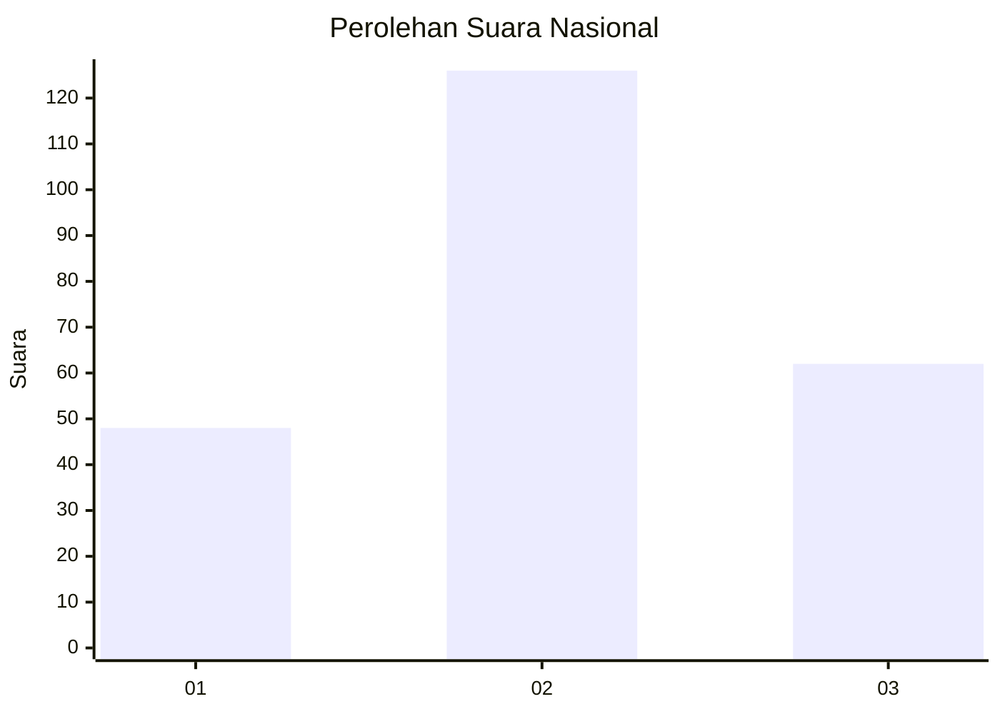
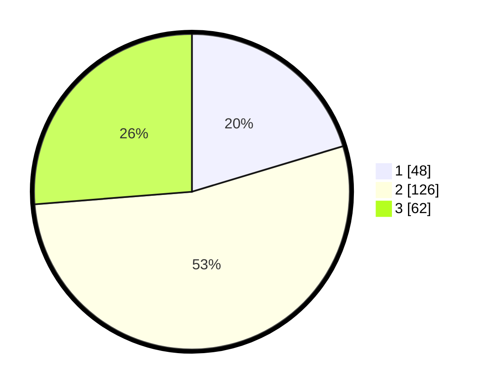

# Hasil

## Grafik

## Tabel

| No. | Nama Paslon    | Suara | Suara (raw) | Persentase |
|:--- |:-------------- | -----:| -----------:| ----------:|
| 1   | ANIES MUHAIMIN | 48    | [48][p-1]   | 20,34      |
| 2   | PRABOWO GIBRAN | 126   | [126][p-2]  | 53,39      |
| 3   | GANJAR MAHFUD  | 62    | [62][p-3]   | 26,27      |

[p-1]: https://github.com/gigit-pemilu/pemilu-2024/blob/main/pilpres/hitung-suara/sub/34-di-yogyakarta/sub/04-sleman/sub/10-kalasan/sub/2001-purwomartani/sub/050-tps/sub/paslon-1.txt
[p-2]: https://github.com/gigit-pemilu/pemilu-2024/blob/main/pilpres/hitung-suara/sub/34-di-yogyakarta/sub/04-sleman/sub/10-kalasan/sub/2001-purwomartani/sub/050-tps/sub/paslon-2.txt
[p-3]: https://github.com/gigit-pemilu/pemilu-2024/blob/main/pilpres/hitung-suara/sub/34-di-yogyakarta/sub/04-sleman/sub/10-kalasan/sub/2001-purwomartani/sub/050-tps/sub/paslon-3.txt

## Foto C Plano

https://sirekap-obj-formc.kpu.go.id/f90a/pemilu/ppwp/34/04/10/20/01/3404102001050-20240214-202822--24b1982b-c2c3-48cc-b227-abb87c6b743d.jpg

https://sirekap-obj-formc.kpu.go.id/f90a/pemilu/ppwp/34/04/10/20/01/3404102001050-20240214-202840--083a7017-0524-490f-9ede-8d255a7d0215.jpg

https://sirekap-obj-formc.kpu.go.id/f90a/pemilu/ppwp/34/04/10/20/01/3404102001050-20240214-202902--73d3252b-130b-4ef3-a218-97a7b103a481.jpg

## Metadata

| Key        | Value               |
| ---------- | ------------------- |
| Time Stamp | 2024-02-16 12:51:22 |

## DATA PEMILIH TETAP

Jumlah pemilih dalam DPT: **282**.
 * L: **146**.
 * P: **175**.

## DATA PENGGUNA HAK PILIH

Jumlah pengguna hak pilih dalam DPT: **225**.
 * L: **112**.
 * P: **114**.

Jumlah pengguna hak pilih dalam DPTb: **6**.
 * L: **4**.
 * P: **2**.

Jumlah pengguna hak pilih dalam DPK: **8**.
 * L: **7**.
 * P: **5**.

Jumlah pengguna hak pilih: **240**.
 * L: **129**.
 * P: **222**.

## JUMLAH SUARA SAH DAN TIDAK SAH

JUMLAH SELURUH SUARA SAH: **236**.

JUMLAH SUARA TIDAK SAH: **4**.

JUMLAH SELURUH SUARA SAH DAN SUARA TIDAK SAH: **240**.

