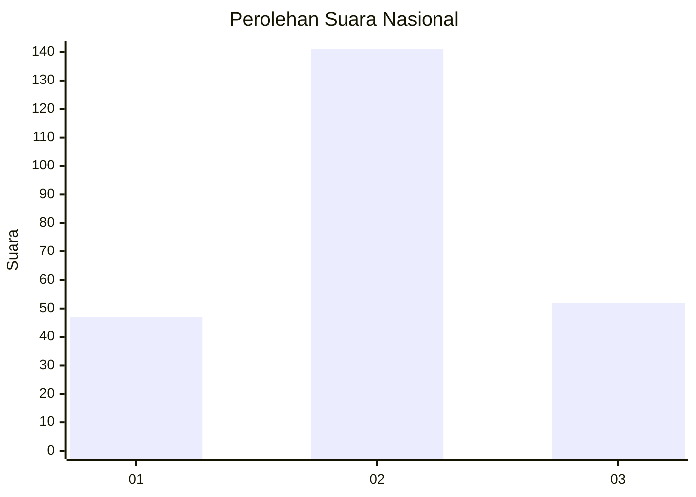
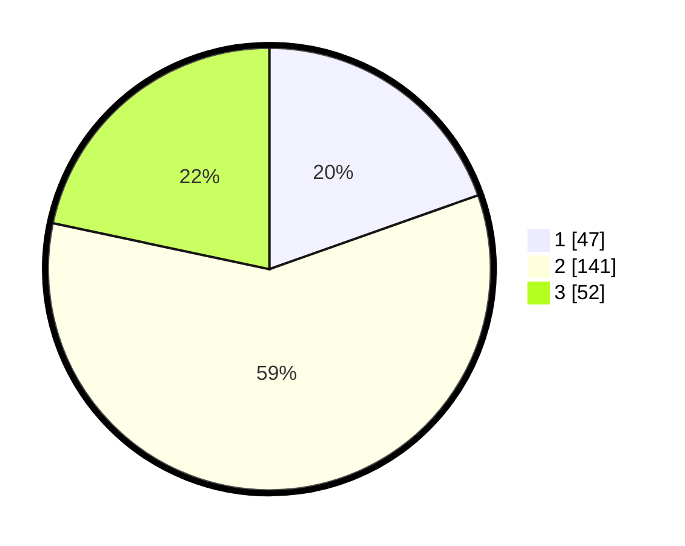

# Hasil

## Grafik

## Tabel

| No. | Nama Paslon    | Suara | Suara (raw) | Persentase |
|:--- |:-------------- | -----:| -----------:| ----------:|
| 1   | ANIES MUHAIMIN | 47    | [47][p-1]   | 19,58      |
| 2   | PRABOWO GIBRAN | 141   | [141][p-2]  | 58,75      |
| 3   | GANJAR MAHFUD  | 52    | [52][p-3]   | 21,67      |

[p-1]: https://github.com/gigit-pemilu/pemilu-2024/blob/main/pilpres/hitung-suara/sub/34-di-yogyakarta/sub/04-sleman/sub/10-kalasan/sub/2001-purwomartani/sub/060-tps/sub/paslon-1.txt
[p-2]: https://github.com/gigit-pemilu/pemilu-2024/blob/main/pilpres/hitung-suara/sub/34-di-yogyakarta/sub/04-sleman/sub/10-kalasan/sub/2001-purwomartani/sub/060-tps/sub/paslon-2.txt
[p-3]: https://github.com/gigit-pemilu/pemilu-2024/blob/main/pilpres/hitung-suara/sub/34-di-yogyakarta/sub/04-sleman/sub/10-kalasan/sub/2001-purwomartani/sub/060-tps/sub/paslon-3.txt

## Foto C Plano

https://sirekap-obj-formc.kpu.go.id/1d5f/pemilu/ppwp/34/04/10/20/01/3404102001060-20240215-010518--0c745dd3-56d3-44b6-9166-d5d30f41c9d7.jpg

https://sirekap-obj-formc.kpu.go.id/1d5f/pemilu/ppwp/34/04/10/20/01/3404102001060-20240215-010725--b9a095f8-aa95-479e-a075-15f7f2d61987.jpg

https://sirekap-obj-formc.kpu.go.id/1d5f/pemilu/ppwp/34/04/10/20/01/3404102001060-20240215-010832--741af7b6-932a-4004-89f2-95d3391f0c93.jpg

## Metadata

| Key        | Value               |
| ---------- | ------------------- |
| Time Stamp | 2024-02-15 17:30:25 |

