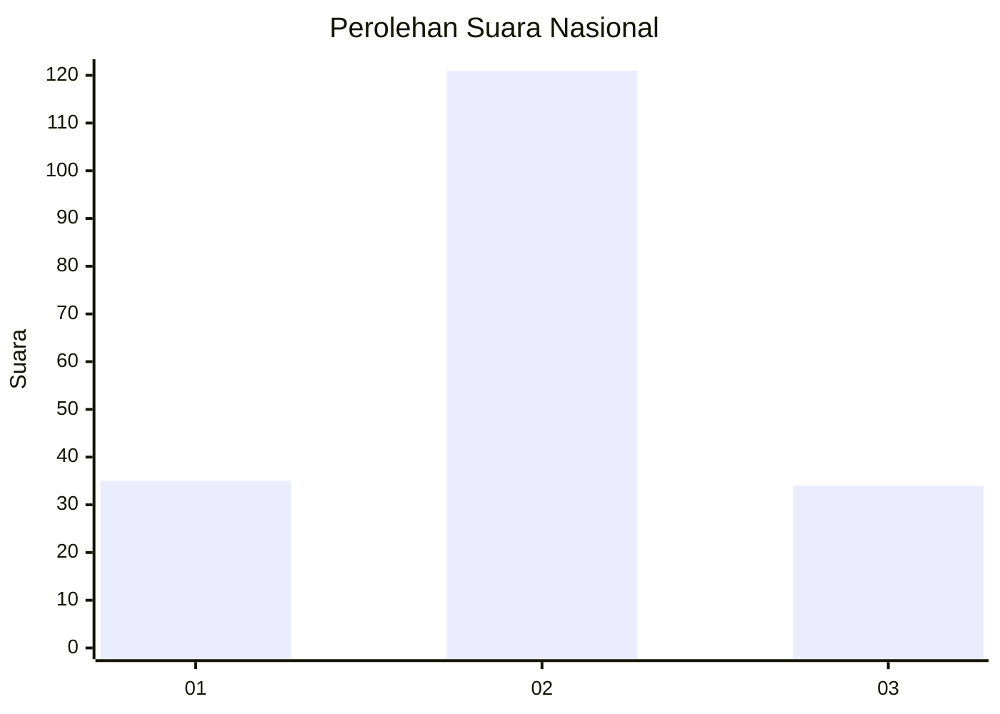
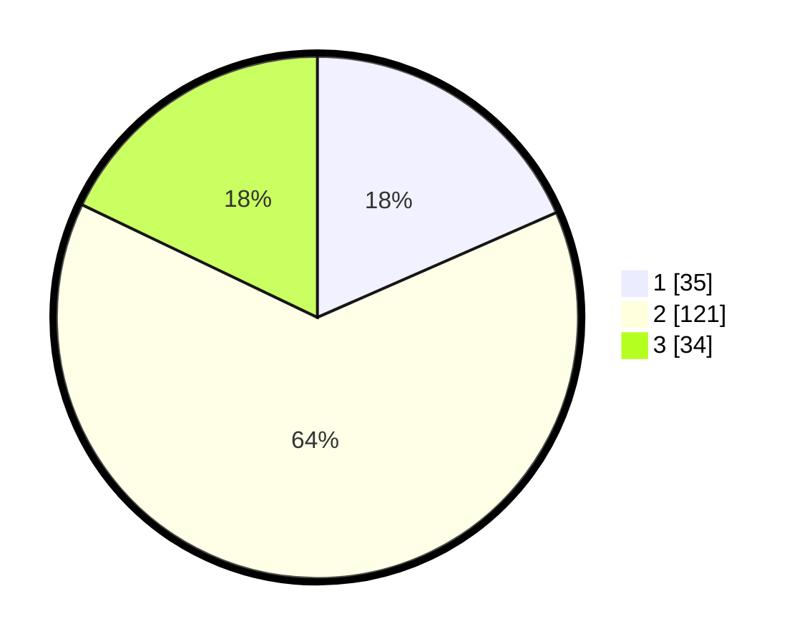

# Hasil

## Grafik

## Tabel

| No. | Nama Paslon    | Suara | Suara (raw) | Persentase |
|:--- |:-------------- | -----:| -----------:| ----------:|
| 1   | ANIES MUHAIMIN | 35    | [35][p-1]   | 18,42      |
| 2   | PRABOWO GIBRAN | 121   | [121][p-2]  | 63,68      |
| 3   | GANJAR MAHFUD  | 34    | [34][p-3]   | 17,89      |

[p-1]: https://github.com/gigit-pemilu/pemilu-2024/blob/main/pilpres/hitung-suara/sub/34-di-yogyakarta/sub/04-sleman/sub/10-kalasan/sub/2001-purwomartani/sub/066-tps/sub/paslon-1.txt
[p-2]: https://github.com/gigit-pemilu/pemilu-2024/blob/main/pilpres/hitung-suara/sub/34-di-yogyakarta/sub/04-sleman/sub/10-kalasan/sub/2001-purwomartani/sub/066-tps/sub/paslon-2.txt
[p-3]: https://github.com/gigit-pemilu/pemilu-2024/blob/main/pilpres/hitung-suara/sub/34-di-yogyakarta/sub/04-sleman/sub/10-kalasan/sub/2001-purwomartani/sub/066-tps/sub/paslon-3.txt

## Foto C Plano

https://sirekap-obj-formc.kpu.go.id/f6c0/pemilu/ppwp/34/04/10/20/01/3404102001066-20240214-194918--3edad3b5-e141-4f89-a255-4366bf0a8124.jpg

https://sirekap-obj-formc.kpu.go.id/f6c0/pemilu/ppwp/34/04/10/20/01/3404102001066-20240214-194923--cbc5db79-41e5-4946-a2d3-eb2740cb2e51.jpg

https://sirekap-obj-formc.kpu.go.id/f6c0/pemilu/ppwp/34/04/10/20/01/3404102001066-20240214-194927--8415f926-290d-475c-9b13-3713442f9c2b.jpg

## Metadata

| Key        | Value               |
| ---------- | ------------------- |
| Time Stamp | 2024-02-16 21:01:00 |

