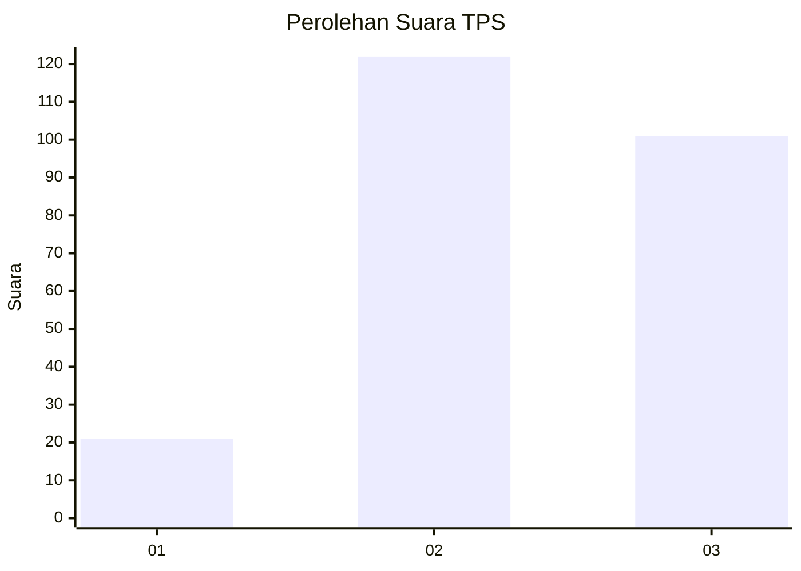
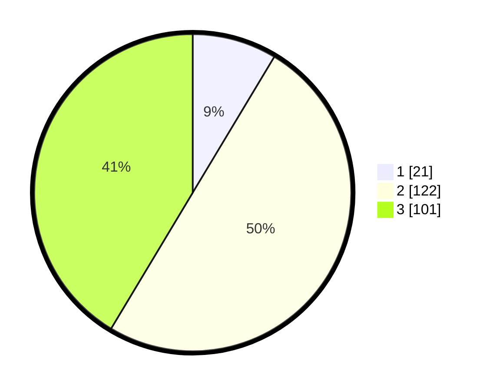

# Hasil

## Grafik

## Tabel

| No. | Nama Paslon    | Suara | Suara (raw) | Persentase |
|:--- |:-------------- | -----:| -----------:| ----------:|
| 1   | ANIES MUHAIMIN | 21    | [21][p-1]   | 8,61       |
| 2   | PRABOWO GIBRAN | 122   | [122][p-2]  | 50,00      |
| 3   | GANJAR MAHFUD  | 101   | [101][p-3]  | 41,39      |

[p-1]: https://github.com/gigit-pemilu/pemilu-2024-34-di-yogyakarta/blob/main/pilpres/hitung-suara/sub/34-di-yogyakarta/sub/04-sleman/sub/10-kalasan/sub/2001-purwomartani/sub/076-tps/sub/paslon-1.txt
[p-2]: https://github.com/gigit-pemilu/pemilu-2024-34-di-yogyakarta/blob/main/pilpres/hitung-suara/sub/34-di-yogyakarta/sub/04-sleman/sub/10-kalasan/sub/2001-purwomartani/sub/076-tps/sub/paslon-2.txt
[p-3]: https://github.com/gigit-pemilu/pemilu-2024-34-di-yogyakarta/blob/main/pilpres/hitung-suara/sub/34-di-yogyakarta/sub/04-sleman/sub/10-kalasan/sub/2001-purwomartani/sub/076-tps/sub/paslon-3.txt

## Foto C Plano

https://sirekap-obj-formc.kpu.go.id/3afe/pemilu/ppwp/34/04/10/20/01/3404102001076-20240214-201343--2e3d862f-f763-4e25-8cd2-edbe3befa5bf.jpg

https://sirekap-obj-formc.kpu.go.id/3afe/pemilu/ppwp/34/04/10/20/01/3404102001076-20240214-201356--41b613e5-26c0-4749-b4f5-65d9374ccbc0.jpg

https://sirekap-obj-formc.kpu.go.id/3afe/pemilu/ppwp/34/04/10/20/01/3404102001076-20240214-201415--4599f049-9257-4235-a41a-f7670577d145.jpg

## Metadata

| Key        | Value               |
| ---------- | ------------------- |
| Time Stamp | 2024-02-15 17:30:25 |

