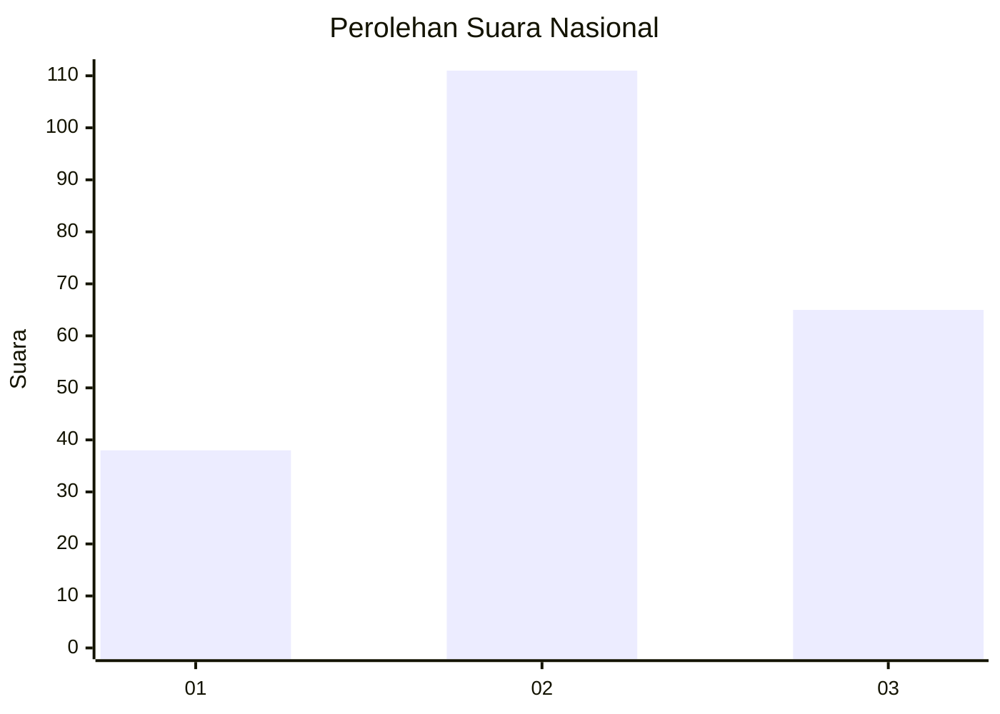
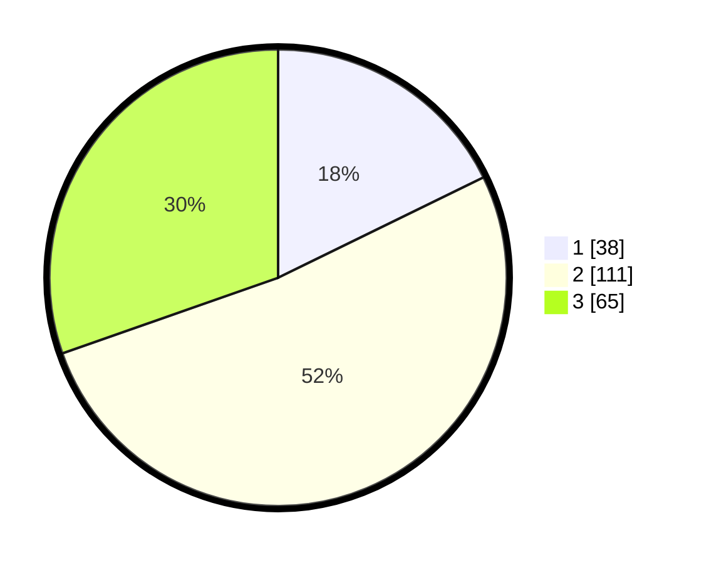

# Hasil

## Grafik

## Tabel

| No. | Nama Paslon    | Suara | Suara (raw) | Persentase |
|:--- |:-------------- | -----:| -----------:| ----------:|
| 1   | ANIES MUHAIMIN | 38    | [38][p-1]   | 17,76      |
| 2   | PRABOWO GIBRAN | 111   | [111][p-2]  | 51,87      |
| 3   | GANJAR MAHFUD  | 65    | [65][p-3]   | 30,37      |

[p-1]: https://github.com/gigit-pemilu/pemilu-2024/blob/main/pilpres/hitung-suara/sub/34-di-yogyakarta/sub/04-sleman/sub/10-kalasan/sub/2001-purwomartani/sub/084-tps/sub/paslon-1.txt
[p-2]: https://github.com/gigit-pemilu/pemilu-2024/blob/main/pilpres/hitung-suara/sub/34-di-yogyakarta/sub/04-sleman/sub/10-kalasan/sub/2001-purwomartani/sub/084-tps/sub/paslon-2.txt
[p-3]: https://github.com/gigit-pemilu/pemilu-2024/blob/main/pilpres/hitung-suara/sub/34-di-yogyakarta/sub/04-sleman/sub/10-kalasan/sub/2001-purwomartani/sub/084-tps/sub/paslon-3.txt

## Foto C Plano

https://sirekap-obj-formc.kpu.go.id/d6d5/pemilu/ppwp/34/04/10/20/01/3404102001084-20240215-010437--341dee48-cf1c-4ad4-b4b1-8f14df679633.jpg

https://sirekap-obj-formc.kpu.go.id/d6d5/pemilu/ppwp/34/04/10/20/01/3404102001084-20240215-010527--421faa54-7807-4b43-81ec-3d971871f516.jpg

https://sirekap-obj-formc.kpu.go.id/d6d5/pemilu/ppwp/34/04/10/20/01/3404102001084-20240215-010627--03999de7-12d2-4156-a7bc-e2e7f02d05fc.jpg

## Metadata

| Key        | Value               |
| ---------- | ------------------- |
| Time Stamp | 2024-02-15 17:30:25 |

