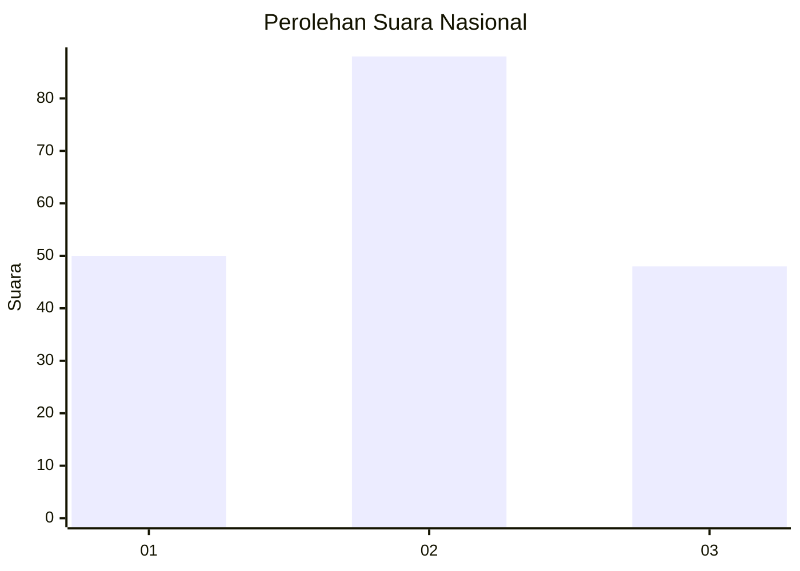
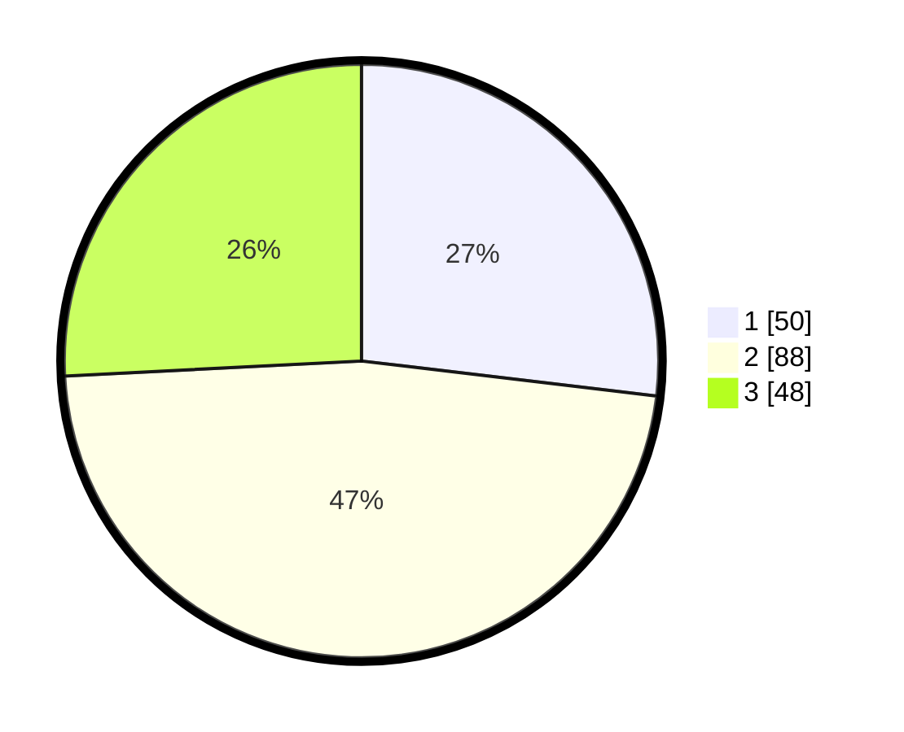

# Hasil

## Grafik

## Tabel

| No. | Nama Paslon    | Suara | Suara (raw) | Persentase |
|:--- |:-------------- | -----:| -----------:| ----------:|
| 1   | ANIES MUHAIMIN | 50    | [50][p-1]   | 26,88      |
| 2   | PRABOWO GIBRAN | 88    | [88][p-2]   | 47,31      |
| 3   | GANJAR MAHFUD  | 48    | [48][p-3]   | 25,81      |

[p-1]: https://github.com/gigit-pemilu/pemilu-2024/blob/main/pilpres/hitung-suara/sub/34-di-yogyakarta/sub/04-sleman/sub/10-kalasan/sub/2001-purwomartani/sub/086-tps/sub/paslon-1.txt
[p-2]: https://github.com/gigit-pemilu/pemilu-2024/blob/main/pilpres/hitung-suara/sub/34-di-yogyakarta/sub/04-sleman/sub/10-kalasan/sub/2001-purwomartani/sub/086-tps/sub/paslon-2.txt
[p-3]: https://github.com/gigit-pemilu/pemilu-2024/blob/main/pilpres/hitung-suara/sub/34-di-yogyakarta/sub/04-sleman/sub/10-kalasan/sub/2001-purwomartani/sub/086-tps/sub/paslon-3.txt

## Foto C Plano

https://sirekap-obj-formc.kpu.go.id/be68/pemilu/ppwp/34/04/10/20/01/3404102001086-20240215-025829--e7a09e3e-cecb-424e-9104-9bc177bf4485.jpg

https://sirekap-obj-formc.kpu.go.id/be68/pemilu/ppwp/34/04/10/20/01/3404102001086-20240215-025846--f6f30894-9f07-4a7d-b7af-526ae7776d95.jpg

https://sirekap-obj-formc.kpu.go.id/be68/pemilu/ppwp/34/04/10/20/01/3404102001086-20240215-025854--77cda1c9-74d6-4ea8-901c-a14a12e7e27b.jpg

## Metadata

| Key        | Value               |
| ---------- | ------------------- |
| Time Stamp | 2024-02-15 17:30:25 |

