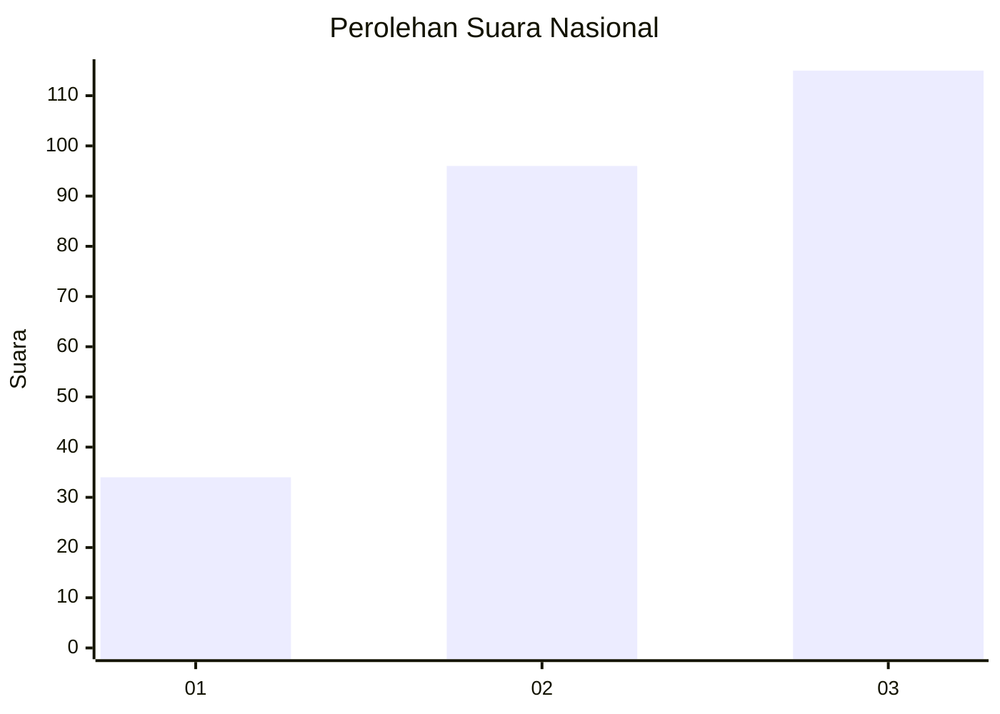
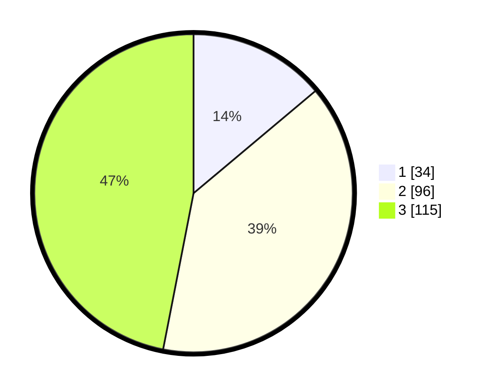

# Hasil

## Grafik

## Tabel

| No. | Nama Paslon    | Suara | Suara (raw) | Persentase |
|:--- |:-------------- | -----:| -----------:| ----------:|
| 1   | ANIES MUHAIMIN | 34    | [34][p-1]   | 13,88      |
| 2   | PRABOWO GIBRAN | 96    | [96][p-2]   | 39,18      |
| 3   | GANJAR MAHFUD  | 115   | [115][p-3]  | 46,94      |

[p-1]: https://github.com/gigit-pemilu/pemilu-2024/blob/main/pilpres/hitung-suara/sub/34-di-yogyakarta/sub/04-sleman/sub/10-kalasan/sub/2001-purwomartani/sub/098-tps/sub/paslon-1.txt
[p-2]: https://github.com/gigit-pemilu/pemilu-2024/blob/main/pilpres/hitung-suara/sub/34-di-yogyakarta/sub/04-sleman/sub/10-kalasan/sub/2001-purwomartani/sub/098-tps/sub/paslon-2.txt
[p-3]: https://github.com/gigit-pemilu/pemilu-2024/blob/main/pilpres/hitung-suara/sub/34-di-yogyakarta/sub/04-sleman/sub/10-kalasan/sub/2001-purwomartani/sub/098-tps/sub/paslon-3.txt

## Foto C Plano

https://sirekap-obj-formc.kpu.go.id/de5e/pemilu/ppwp/34/04/10/20/01/3404102001098-20240216-062810--ecedfdf8-a57f-4a31-9d70-73d3ad3fb87a.jpg

https://sirekap-obj-formc.kpu.go.id/de5e/pemilu/ppwp/34/04/10/20/01/3404102001098-20240216-062812--b08fe80a-3429-4fc4-90bb-a94502681bea.jpg

https://sirekap-obj-formc.kpu.go.id/de5e/pemilu/ppwp/34/04/10/20/01/3404102001098-20240216-062811--610de116-52d8-4f5a-963a-0bef38407ab3.jpg

## Metadata

| Key        | Value               |
| ---------- | ------------------- |
| Time Stamp | 2024-02-16 09:30:28 |

## DATA PEMILIH TETAP

Jumlah pemilih dalam DPT: **292**.
 * L: **144**.
 * P: **148**.

## DATA PENGGUNA HAK PILIH

Jumlah pengguna hak pilih dalam DPT: **234**.
 * L: **106**.
 * P: **128**.

Jumlah pengguna hak pilih dalam DPTb: **9**.
 * L: **0**.
 * P: **9**.

Jumlah pengguna hak pilih dalam DPK: **5**.
 * L: **2**.
 * P: **3**.

Jumlah pengguna hak pilih: **248**.
 * L: **108**.
 * P: **140**.

## JUMLAH SUARA SAH DAN TIDAK SAH

JUMLAH SELURUH SUARA SAH: **245**.

JUMLAH SUARA TIDAK SAH: **3**.

JUMLAH SELURUH SUARA SAH DAN SUARA TIDAK SAH: **248**.

