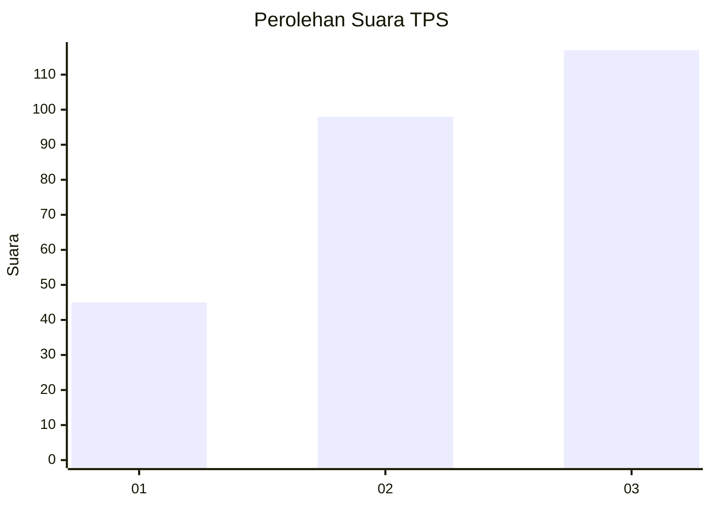
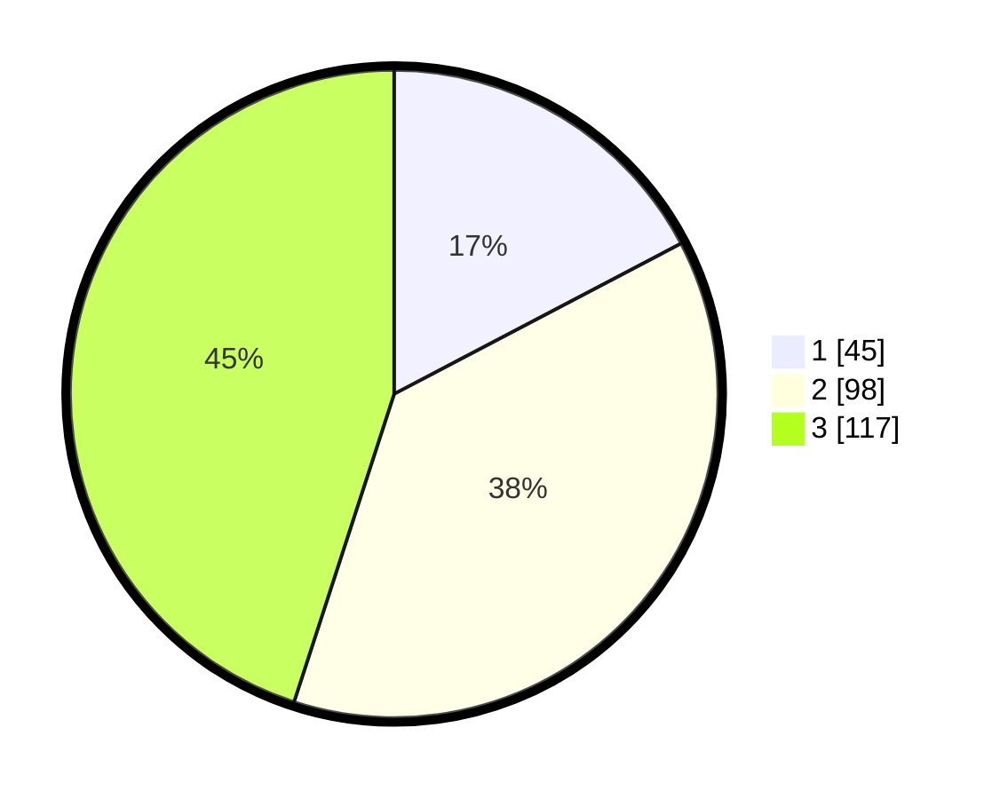

# Hasil

## Grafik

## Tabel

| No. | Nama Paslon    | Suara | Suara (raw) | Persentase |
|:--- |:-------------- | -----:| -----------:| ----------:|
| 1   | ANIES MUHAIMIN | 45    | [45][p-1]   | 17,31      |
| 2   | PRABOWO GIBRAN | 98    | [98][p-2]   | 37,69      |
| 3   | GANJAR MAHFUD  | 117   | [117][p-3]  | 45,00      |

[p-1]: https://github.com/gigit-pemilu/pemilu-2024-34-di-yogyakarta/blob/main/pilpres/hitung-suara/sub/34-di-yogyakarta/sub/04-sleman/sub/10-kalasan/sub/2001-purwomartani/sub/099-tps/sub/paslon-1.txt
[p-2]: https://github.com/gigit-pemilu/pemilu-2024-34-di-yogyakarta/blob/main/pilpres/hitung-suara/sub/34-di-yogyakarta/sub/04-sleman/sub/10-kalasan/sub/2001-purwomartani/sub/099-tps/sub/paslon-2.txt
[p-3]: https://github.com/gigit-pemilu/pemilu-2024-34-di-yogyakarta/blob/main/pilpres/hitung-suara/sub/34-di-yogyakarta/sub/04-sleman/sub/10-kalasan/sub/2001-purwomartani/sub/099-tps/sub/paslon-3.txt

## Foto C Plano

https://sirekap-obj-formc.kpu.go.id/e310/pemilu/ppwp/34/04/10/20/01/3404102001099-20240214-155146--bee5ea06-c959-4b7c-a3eb-b76df561e661.jpg

https://sirekap-obj-formc.kpu.go.id/e310/pemilu/ppwp/34/04/10/20/01/3404102001099-20240214-155138--1e9ce103-4eb9-4df1-96b8-13f650e0ce0f.jpg

https://sirekap-obj-formc.kpu.go.id/e310/pemilu/ppwp/34/04/10/20/01/3404102001099-20240214-155306--c1407e1f-9116-4c05-a384-bca687ac8fea.jpg

## Metadata

| Key        | Value               |
| ---------- | ------------------- |
| Time Stamp | 2024-02-15 17:30:25 |

