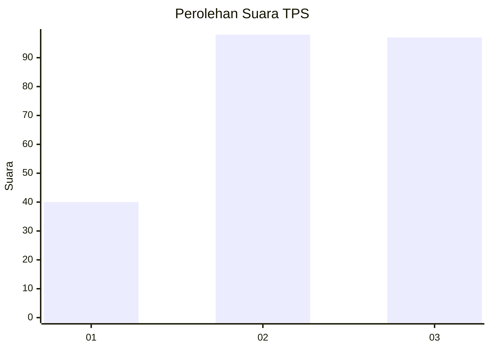
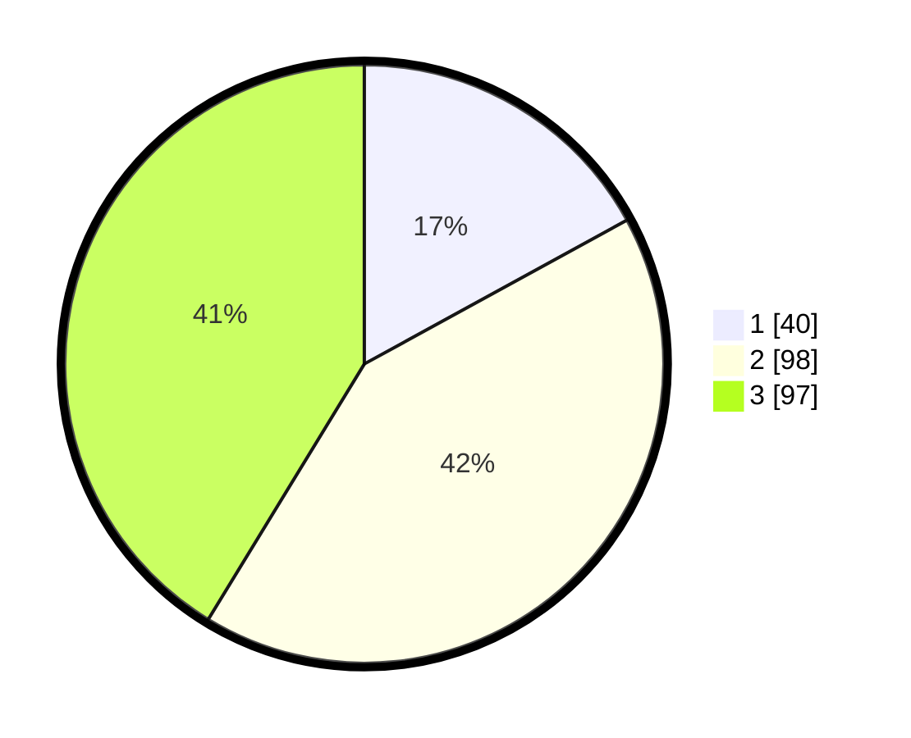

# Hasil

## Grafik

## Tabel

| No. | Nama Paslon    | Suara | Suara (raw) | Persentase |
|:--- |:-------------- | -----:| -----------:| ----------:|
| 1   | ANIES MUHAIMIN | 40    | [40][p-1]   | 17,02      |
| 2   | PRABOWO GIBRAN | 98    | [98][p-2]   | 41,70      |
| 3   | GANJAR MAHFUD  | 97    | [97][p-3]   | 41,28      |

[p-1]: https://github.com/gigit-pemilu/pemilu-2024-34-di-yogyakarta/blob/main/pilpres/hitung-suara/sub/34-di-yogyakarta/sub/04-sleman/sub/10-kalasan/sub/2001-purwomartani/sub/103-tps/sub/paslon-1.txt
[p-2]: https://github.com/gigit-pemilu/pemilu-2024-34-di-yogyakarta/blob/main/pilpres/hitung-suara/sub/34-di-yogyakarta/sub/04-sleman/sub/10-kalasan/sub/2001-purwomartani/sub/103-tps/sub/paslon-2.txt
[p-3]: https://github.com/gigit-pemilu/pemilu-2024-34-di-yogyakarta/blob/main/pilpres/hitung-suara/sub/34-di-yogyakarta/sub/04-sleman/sub/10-kalasan/sub/2001-purwomartani/sub/103-tps/sub/paslon-3.txt

## Foto C Plano

https://sirekap-obj-formc.kpu.go.id/c6c0/pemilu/ppwp/34/04/10/20/01/3404102001103-20240214-193634--b91f30b1-8483-435f-ab33-996afec0b925.jpg

https://sirekap-obj-formc.kpu.go.id/c6c0/pemilu/ppwp/34/04/10/20/01/3404102001103-20240214-193739--33660e11-354e-4363-8a5d-3bf3287e6c77.jpg

https://sirekap-obj-formc.kpu.go.id/c6c0/pemilu/ppwp/34/04/10/20/01/3404102001103-20240214-193856--61af8d27-2e60-42a9-938a-d3ff7c67c429.jpg

## Metadata

| Key        | Value               |
| ---------- | ------------------- |
| Time Stamp | 2024-02-15 17:30:25 |

