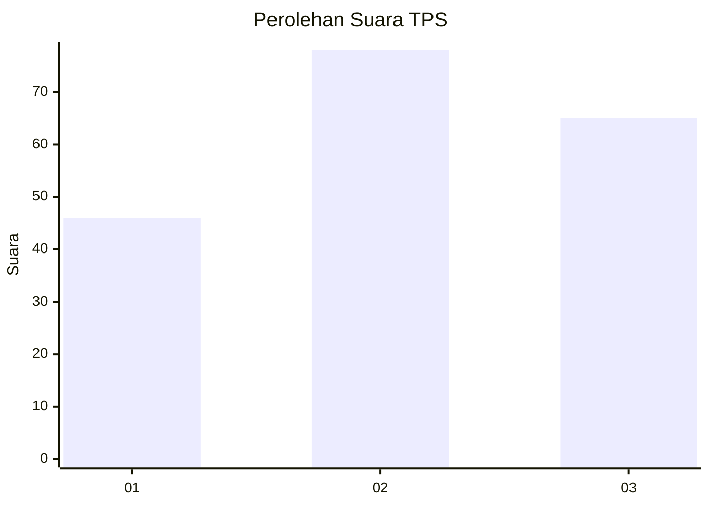
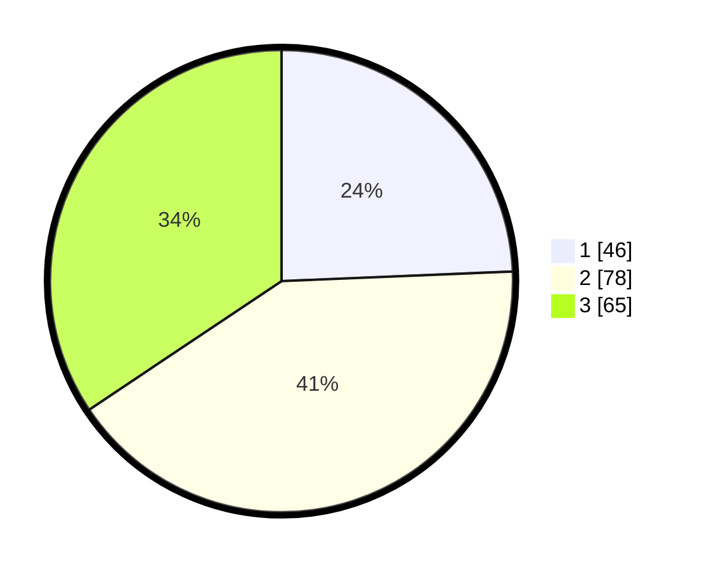

# Hasil

## Grafik

## Tabel

| No. | Nama Paslon    | Suara | Suara (raw) | Persentase |
|:--- |:-------------- | -----:| -----------:| ----------:|
| 1   | ANIES MUHAIMIN | 46    | [46][p-1]   | 24,34      |
| 2   | PRABOWO GIBRAN | 78    | [78][p-2]   | 41,27      |
| 3   | GANJAR MAHFUD  | 65    | [65][p-3]   | 34,39      |

[p-1]: https://github.com/gigit-pemilu/pemilu-2024-34-di-yogyakarta/blob/main/pilpres/hitung-suara/sub/34-di-yogyakarta/sub/04-sleman/sub/10-kalasan/sub/2002-tirtomartani/sub/001-tps/sub/paslon-1.txt
[p-2]: https://github.com/gigit-pemilu/pemilu-2024-34-di-yogyakarta/blob/main/pilpres/hitung-suara/sub/34-di-yogyakarta/sub/04-sleman/sub/10-kalasan/sub/2002-tirtomartani/sub/001-tps/sub/paslon-2.txt
[p-3]: https://github.com/gigit-pemilu/pemilu-2024-34-di-yogyakarta/blob/main/pilpres/hitung-suara/sub/34-di-yogyakarta/sub/04-sleman/sub/10-kalasan/sub/2002-tirtomartani/sub/001-tps/sub/paslon-3.txt

## Foto C Plano

https://sirekap-obj-formc.kpu.go.id/606f/pemilu/ppwp/34/04/10/20/02/3404102002001-20240214-203129--fa8d3db5-8a04-4ec6-993d-0e9c027cbc43.jpg

https://sirekap-obj-formc.kpu.go.id/606f/pemilu/ppwp/34/04/10/20/02/3404102002001-20240216-134555--990e7da4-a6af-4b16-afd7-b1388fc95c64.jpg

https://sirekap-obj-formc.kpu.go.id/606f/pemilu/ppwp/34/04/10/20/02/3404102002001-20240214-203142--7cf92daa-1a7a-4cef-bfa5-35601b1eefcf.jpg

## Metadata

| Key        | Value               |
| ---------- | ------------------- |
| Time Stamp | 2024-02-25 09:00:00 |

