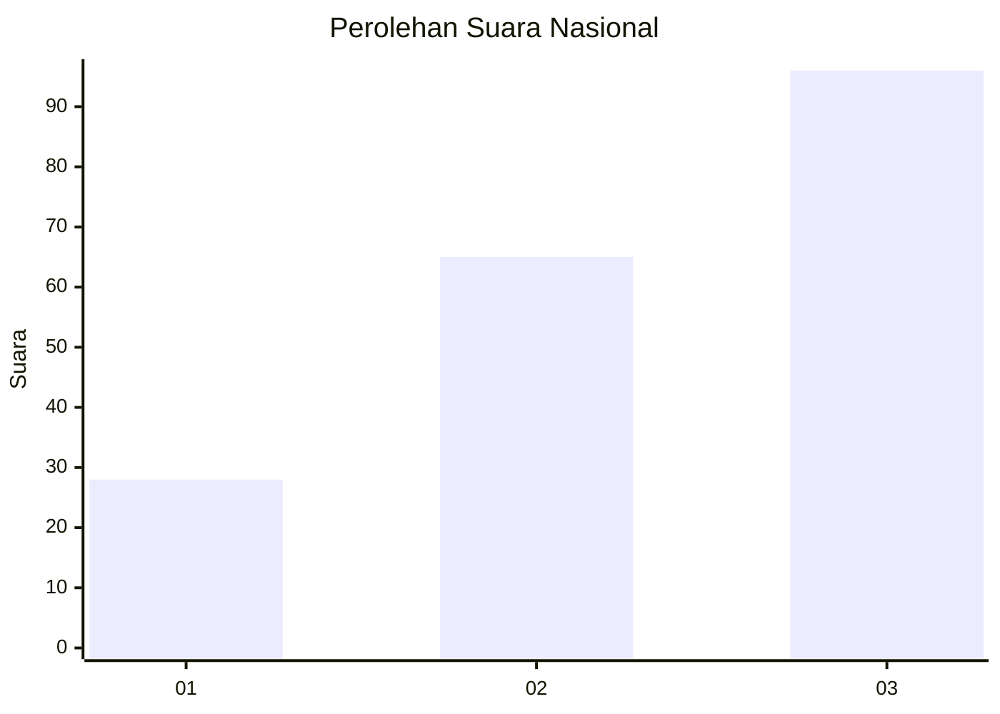
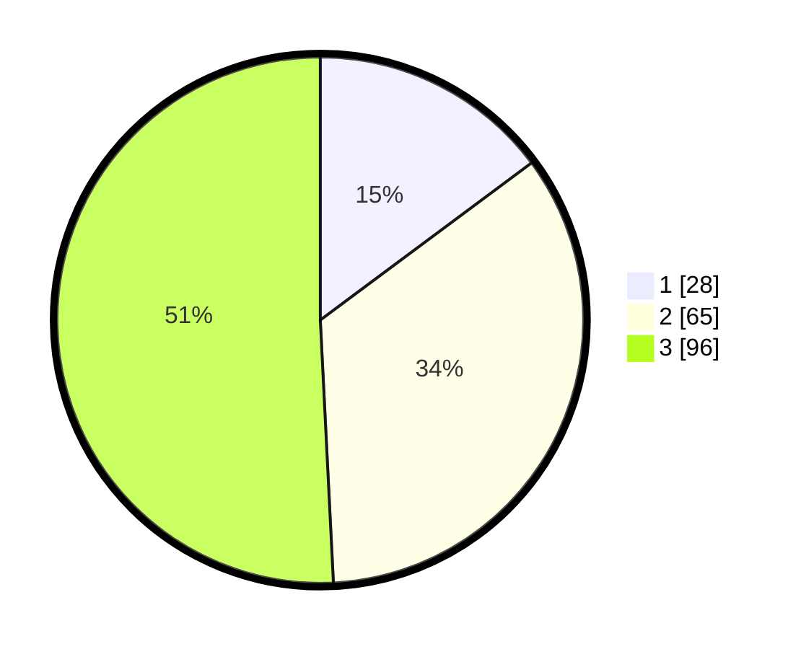

# Hasil

## Grafik

## Tabel

| No. | Nama Paslon    | Suara | Suara (raw) | Persentase |
|:--- |:-------------- | -----:| -----------:| ----------:|
| 1   | ANIES MUHAIMIN | 28    | [28][p-1]   | 14,81      |
| 2   | PRABOWO GIBRAN | 65    | [65][p-2]   | 34,39      |
| 3   | GANJAR MAHFUD  | 96    | [96][p-3]   | 50,79      |

[p-1]: https://github.com/gigit-pemilu/pemilu-2024/blob/main/pilpres/hitung-suara/sub/34-di-yogyakarta/sub/04-sleman/sub/10-kalasan/sub/2002-tirtomartani/sub/010-tps/sub/paslon-1.txt
[p-2]: https://github.com/gigit-pemilu/pemilu-2024/blob/main/pilpres/hitung-suara/sub/34-di-yogyakarta/sub/04-sleman/sub/10-kalasan/sub/2002-tirtomartani/sub/010-tps/sub/paslon-2.txt
[p-3]: https://github.com/gigit-pemilu/pemilu-2024/blob/main/pilpres/hitung-suara/sub/34-di-yogyakarta/sub/04-sleman/sub/10-kalasan/sub/2002-tirtomartani/sub/010-tps/sub/paslon-3.txt

## Foto C Plano

https://sirekap-obj-formc.kpu.go.id/3eaa/pemilu/ppwp/34/04/10/20/02/3404102002010-20240214-141102--d5db6440-7f92-4f15-9806-be80fa50d47e.jpg

https://sirekap-obj-formc.kpu.go.id/3eaa/pemilu/ppwp/34/04/10/20/02/3404102002010-20240214-141201--8613fc45-466f-4412-92d5-972b1c48afc9.jpg

https://sirekap-obj-formc.kpu.go.id/3eaa/pemilu/ppwp/34/04/10/20/02/3404102002010-20240214-141307--ab86b660-c37e-4a8c-9212-b6585fc9f52c.jpg

## Metadata

| Key        | Value               |
| ---------- | ------------------- |
| Time Stamp | 2024-02-15 17:30:25 |

