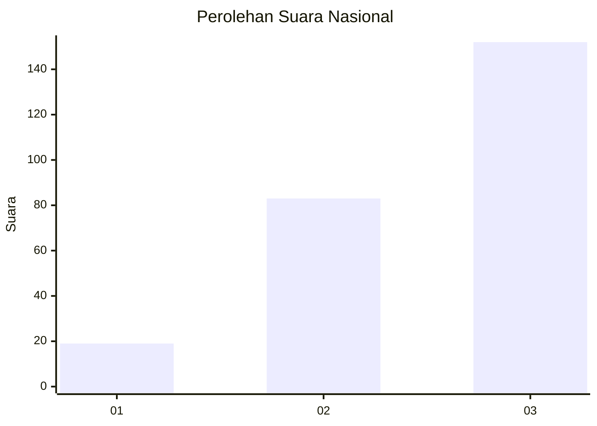
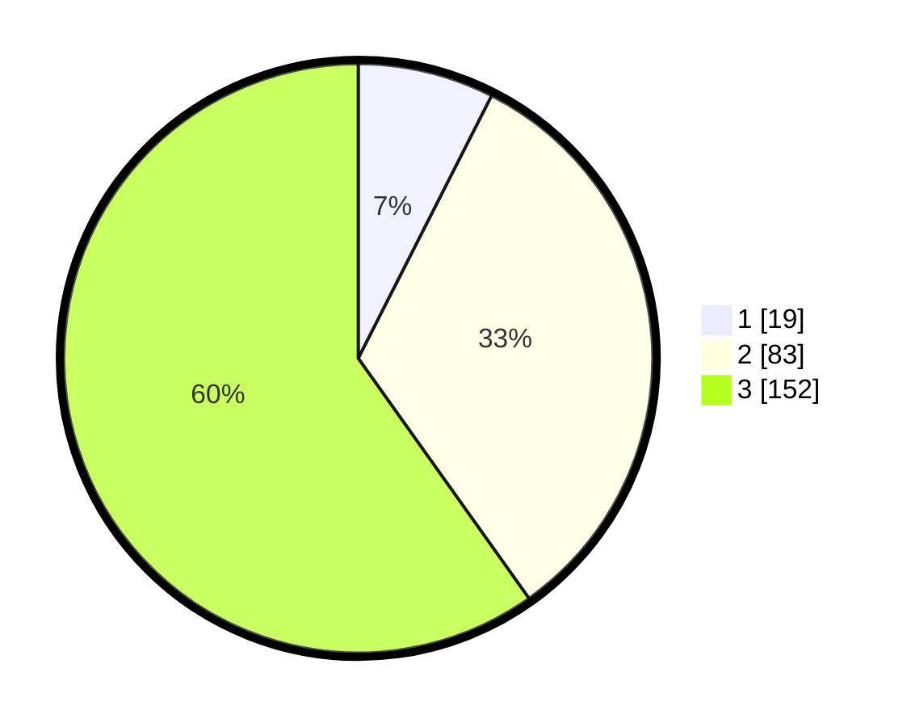

# Hasil

## Grafik

## Tabel

| No. | Nama Paslon    | Suara | Suara (raw) | Persentase |
|:--- |:-------------- | -----:| -----------:| ----------:|
| 1   | ANIES MUHAIMIN | 19    | [19][p-1]   | 7,48       |
| 2   | PRABOWO GIBRAN | 83    | [83][p-2]   | 32,68      |
| 3   | GANJAR MAHFUD  | 152   | [152][p-3]  | 59,84      |

[p-1]: https://github.com/gigit-pemilu/pemilu-2024/blob/main/pilpres/hitung-suara/sub/34-di-yogyakarta/sub/04-sleman/sub/10-kalasan/sub/2002-tirtomartani/sub/011-tps/sub/paslon-1.txt
[p-2]: https://github.com/gigit-pemilu/pemilu-2024/blob/main/pilpres/hitung-suara/sub/34-di-yogyakarta/sub/04-sleman/sub/10-kalasan/sub/2002-tirtomartani/sub/011-tps/sub/paslon-2.txt
[p-3]: https://github.com/gigit-pemilu/pemilu-2024/blob/main/pilpres/hitung-suara/sub/34-di-yogyakarta/sub/04-sleman/sub/10-kalasan/sub/2002-tirtomartani/sub/011-tps/sub/paslon-3.txt

## Foto C Plano

https://sirekap-obj-formc.kpu.go.id/9cbe/pemilu/ppwp/34/04/10/20/02/3404102002011-20240216-020429--64f6a6c5-f87e-4fc6-a269-93b576a08460.jpg

https://sirekap-obj-formc.kpu.go.id/9cbe/pemilu/ppwp/34/04/10/20/02/3404102002011-20240216-020432--86f4d3c7-9bd6-4ceb-ae66-d488a496d1d9.jpg

https://sirekap-obj-formc.kpu.go.id/9cbe/pemilu/ppwp/34/04/10/20/02/3404102002011-20240216-020431--34c50fad-9557-45eb-a7f2-10caa234969f.jpg

## Metadata

| Key        | Value               |
| ---------- | ------------------- |
| Time Stamp | 2024-02-16 09:30:28 |

## DATA PEMILIH TETAP

Jumlah pemilih dalam DPT: **268**.
 * L: **115**.
 * P: **153**.

## DATA PENGGUNA HAK PILIH

Jumlah pengguna hak pilih dalam DPT: **236**.
 * L: **102**.
 * P: **134**.

Jumlah pengguna hak pilih dalam DPTb: **6**.
 * L: **5**.
 * P: **1**.

Jumlah pengguna hak pilih dalam DPK: **12**.
 * L: **3**.
 * P: **9**.

Jumlah pengguna hak pilih: **254**.
 * L: **110**.
 * P: **144**.

## JUMLAH SUARA SAH DAN TIDAK SAH

JUMLAH SELURUH SUARA SAH: **254**.

JUMLAH SUARA TIDAK SAH: **0**.

JUMLAH SELURUH SUARA SAH DAN SUARA TIDAK SAH: **254**.

