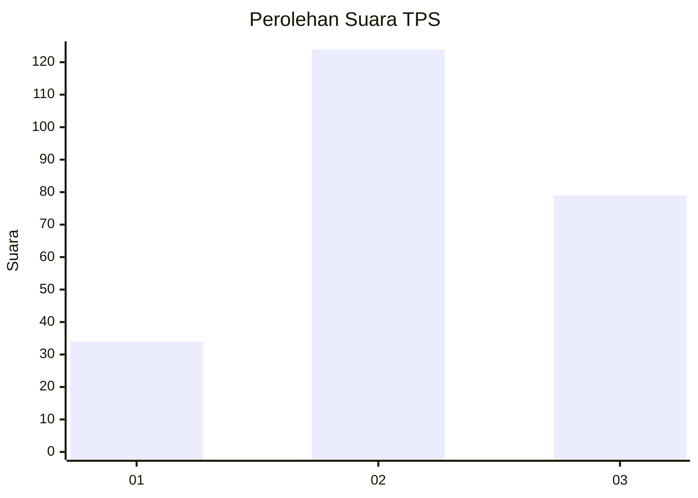
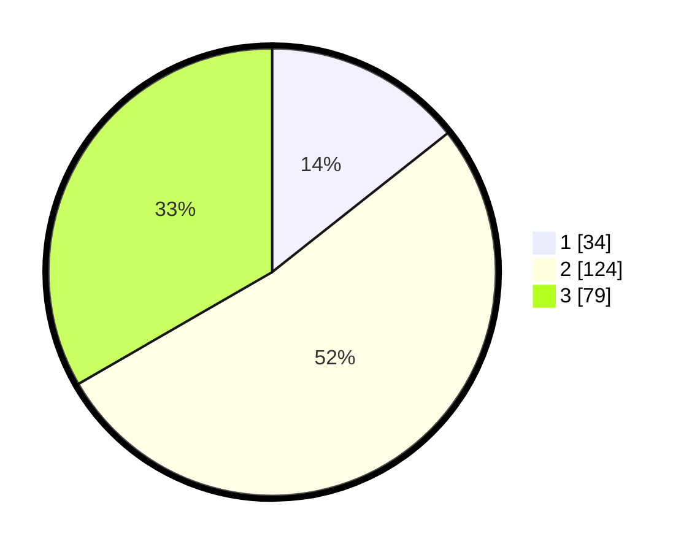

# Hasil

## Grafik

## Tabel

| No. | Nama Paslon    | Suara | Suara (raw) | Persentase |
|:--- |:-------------- | -----:| -----------:| ----------:|
| 1   | ANIES MUHAIMIN | 34    | [34][p-1]   | 14,35      |
| 2   | PRABOWO GIBRAN | 124   | [124][p-2]  | 52,32      |
| 3   | GANJAR MAHFUD  | 79    | [79][p-3]   | 33,33      |

[p-1]: https://github.com/gigit-pemilu/pemilu-2024-34-di-yogyakarta/blob/main/pilpres/hitung-suara/sub/34-di-yogyakarta/sub/04-sleman/sub/10-kalasan/sub/2002-tirtomartani/sub/024-tps/sub/paslon-1.txt
[p-2]: https://github.com/gigit-pemilu/pemilu-2024-34-di-yogyakarta/blob/main/pilpres/hitung-suara/sub/34-di-yogyakarta/sub/04-sleman/sub/10-kalasan/sub/2002-tirtomartani/sub/024-tps/sub/paslon-2.txt
[p-3]: https://github.com/gigit-pemilu/pemilu-2024-34-di-yogyakarta/blob/main/pilpres/hitung-suara/sub/34-di-yogyakarta/sub/04-sleman/sub/10-kalasan/sub/2002-tirtomartani/sub/024-tps/sub/paslon-3.txt

## Foto C Plano

https://sirekap-obj-formc.kpu.go.id/98e5/pemilu/ppwp/34/04/10/20/02/3404102002024-20240215-023319--2cddcd4a-f95f-4497-b78c-3f42a2d591cd.jpg

https://sirekap-obj-formc.kpu.go.id/98e5/pemilu/ppwp/34/04/10/20/02/3404102002024-20240215-022424--69ebbb2e-527a-4c8e-a859-88d3d9673713.jpg

https://sirekap-obj-formc.kpu.go.id/98e5/pemilu/ppwp/34/04/10/20/02/3404102002024-20240215-022840--3e96d5c5-3324-483a-90fb-f5c7d869d272.jpg

## Metadata

| Key        | Value               |
| ---------- | ------------------- |
| Time Stamp | 2024-02-15 19:00:26 |

