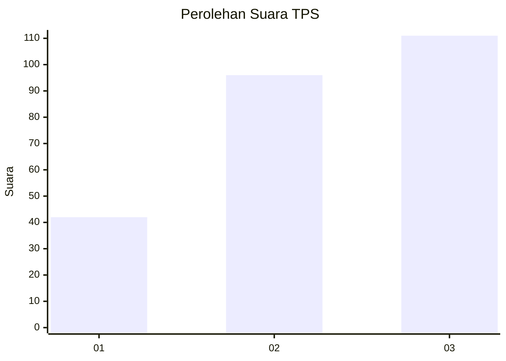
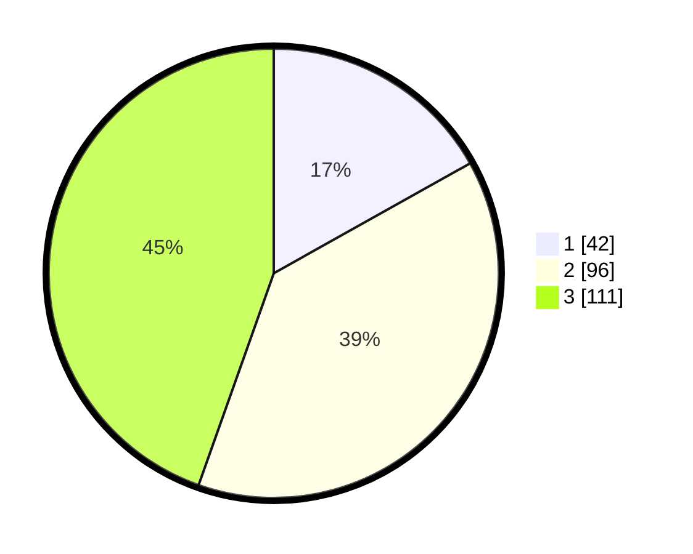

# Hasil

## Grafik

## Tabel

| No. | Nama Paslon    | Suara | Suara (raw) | Persentase |
|:--- |:-------------- | -----:| -----------:| ----------:|
| 1   | ANIES MUHAIMIN | 42    | [42][p-1]   | 16,87      |
| 2   | PRABOWO GIBRAN | 96    | [96][p-2]   | 38,55      |
| 3   | GANJAR MAHFUD  | 111   | [111][p-3]  | 44,58      |

[p-1]: https://github.com/gigit-pemilu/pemilu-2024-34-di-yogyakarta/blob/main/pilpres/hitung-suara/sub/34-di-yogyakarta/sub/04-sleman/sub/10-kalasan/sub/2002-tirtomartani/sub/025-tps/sub/paslon-1.txt
[p-2]: https://github.com/gigit-pemilu/pemilu-2024-34-di-yogyakarta/blob/main/pilpres/hitung-suara/sub/34-di-yogyakarta/sub/04-sleman/sub/10-kalasan/sub/2002-tirtomartani/sub/025-tps/sub/paslon-2.txt
[p-3]: https://github.com/gigit-pemilu/pemilu-2024-34-di-yogyakarta/blob/main/pilpres/hitung-suara/sub/34-di-yogyakarta/sub/04-sleman/sub/10-kalasan/sub/2002-tirtomartani/sub/025-tps/sub/paslon-3.txt

## Foto C Plano

https://sirekap-obj-formc.kpu.go.id/ff3a/pemilu/ppwp/34/04/10/20/02/3404102002025-20240215-002052--e1fa4958-2e3e-44ff-9b7e-8e15c8d27189.jpg

https://sirekap-obj-formc.kpu.go.id/ff3a/pemilu/ppwp/34/04/10/20/02/3404102002025-20240215-002232--55cfc763-98de-4eeb-927c-4e29ec03cf4a.jpg

https://sirekap-obj-formc.kpu.go.id/ff3a/pemilu/ppwp/34/04/10/20/02/3404102002025-20240215-002318--8b3136fb-1f7d-4d97-ac21-120addd0b6ee.jpg

## Metadata

| Key        | Value               |
| ---------- | ------------------- |
| Time Stamp | 2024-02-15 19:00:26 |

