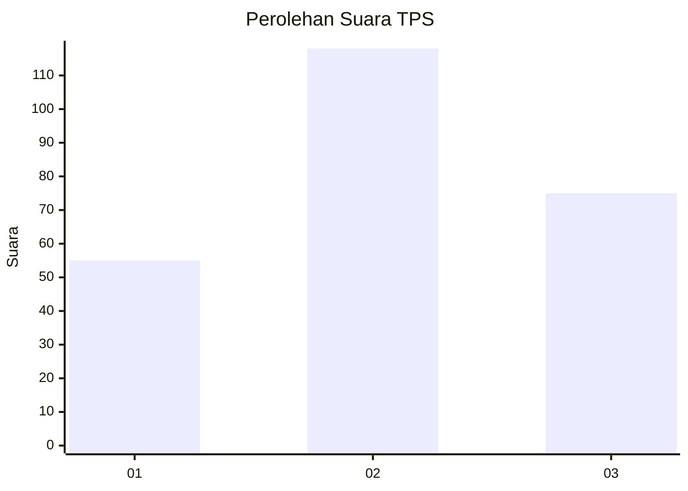
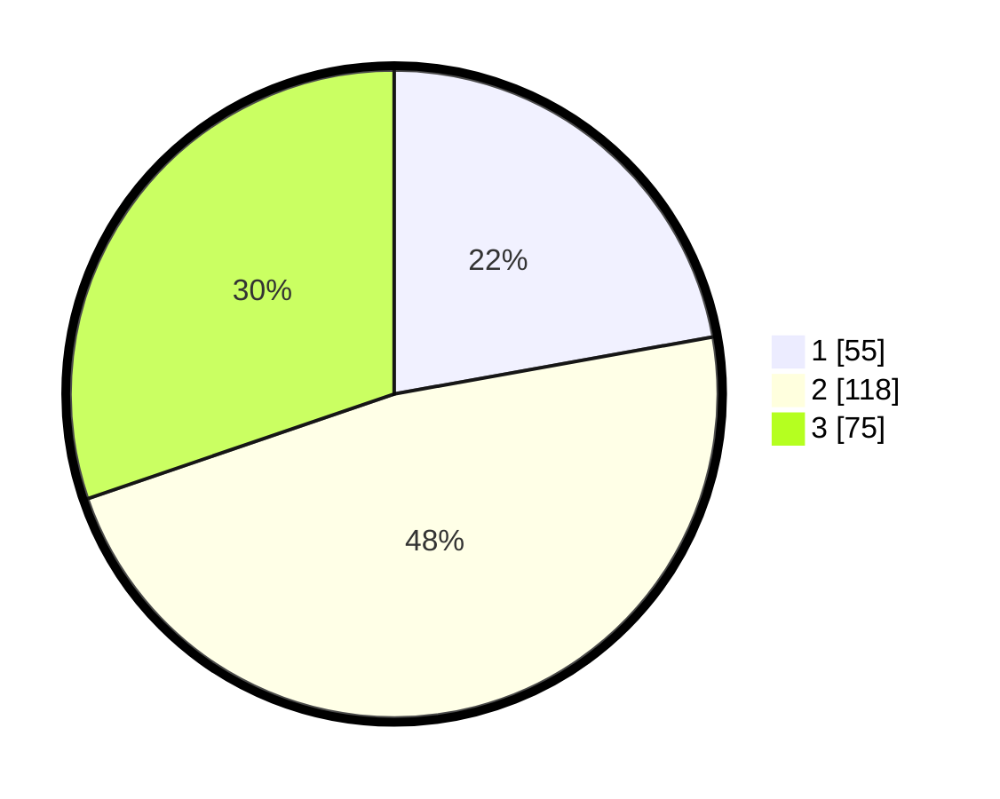

# Hasil

## Grafik

## Tabel

| No. | Nama Paslon    | Suara | Suara (raw) | Persentase |
|:--- |:-------------- | -----:| -----------:| ----------:|
| 1   | ANIES MUHAIMIN | 55    | [55][p-1]   | 22,18      |
| 2   | PRABOWO GIBRAN | 118   | [118][p-2]  | 47,58      |
| 3   | GANJAR MAHFUD  | 75    | [75][p-3]   | 30,24      |

[p-1]: https://github.com/gigit-pemilu/pemilu-2024-34-di-yogyakarta/blob/main/pilpres/hitung-suara/sub/34-di-yogyakarta/sub/04-sleman/sub/10-kalasan/sub/2002-tirtomartani/sub/032-tps/sub/paslon-1.txt
[p-2]: https://github.com/gigit-pemilu/pemilu-2024-34-di-yogyakarta/blob/main/pilpres/hitung-suara/sub/34-di-yogyakarta/sub/04-sleman/sub/10-kalasan/sub/2002-tirtomartani/sub/032-tps/sub/paslon-2.txt
[p-3]: https://github.com/gigit-pemilu/pemilu-2024-34-di-yogyakarta/blob/main/pilpres/hitung-suara/sub/34-di-yogyakarta/sub/04-sleman/sub/10-kalasan/sub/2002-tirtomartani/sub/032-tps/sub/paslon-3.txt

## Foto C Plano

https://sirekap-obj-formc.kpu.go.id/b94d/pemilu/ppwp/34/04/10/20/02/3404102002032-20240215-044426--265536dd-9908-4326-924c-9d43466e4be1.jpg

https://sirekap-obj-formc.kpu.go.id/b94d/pemilu/ppwp/34/04/10/20/02/3404102002032-20240215-045332--2f2a42a3-979c-4eb4-a2e6-dca71b96cff4.jpg

https://sirekap-obj-formc.kpu.go.id/b94d/pemilu/ppwp/34/04/10/20/02/3404102002032-20240215-045209--480e87d8-5f0e-495c-a519-31df0c2d7995.jpg

## Metadata

| Key        | Value               |
| ---------- | ------------------- |
| Time Stamp | 2024-02-15 19:00:26 |

