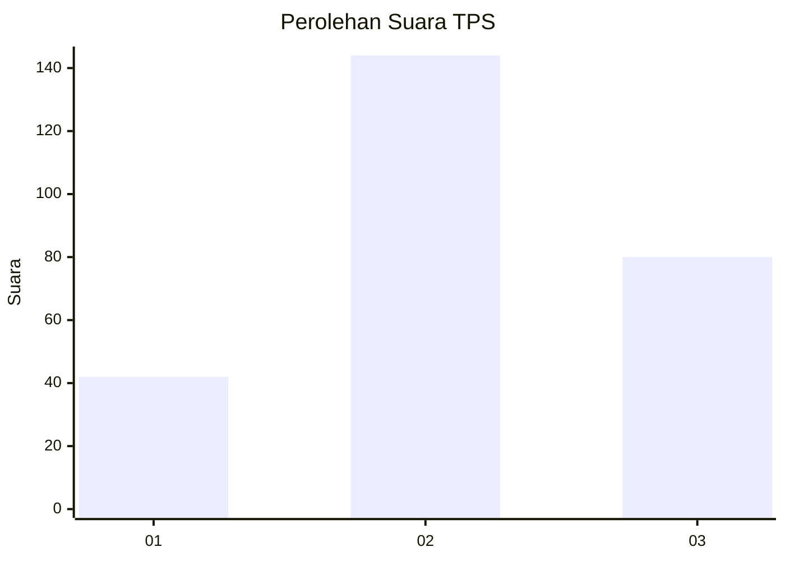
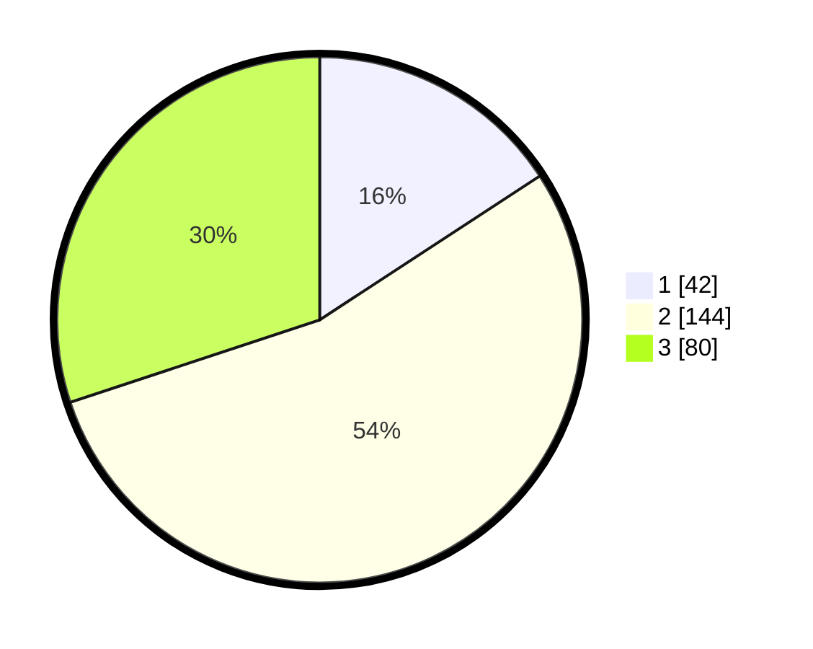

# Hasil

## Grafik

## Tabel

| No. | Nama Paslon    | Suara | Suara (raw) | Persentase |
|:--- |:-------------- | -----:| -----------:| ----------:|
| 1   | ANIES MUHAIMIN | 42    | [42][p-1]   | 15,79      |
| 2   | PRABOWO GIBRAN | 144   | [144][p-2]  | 54,14      |
| 3   | GANJAR MAHFUD  | 80    | [80][p-3]   | 30,08      |

[p-1]: https://github.com/gigit-pemilu/pemilu-2024-34-di-yogyakarta/blob/main/pilpres/hitung-suara/sub/34-di-yogyakarta/sub/04-sleman/sub/10-kalasan/sub/2002-tirtomartani/sub/036-tps/sub/paslon-1.txt
[p-2]: https://github.com/gigit-pemilu/pemilu-2024-34-di-yogyakarta/blob/main/pilpres/hitung-suara/sub/34-di-yogyakarta/sub/04-sleman/sub/10-kalasan/sub/2002-tirtomartani/sub/036-tps/sub/paslon-2.txt
[p-3]: https://github.com/gigit-pemilu/pemilu-2024-34-di-yogyakarta/blob/main/pilpres/hitung-suara/sub/34-di-yogyakarta/sub/04-sleman/sub/10-kalasan/sub/2002-tirtomartani/sub/036-tps/sub/paslon-3.txt

## Foto C Plano

https://sirekap-obj-formc.kpu.go.id/fd4e/pemilu/ppwp/34/04/10/20/02/3404102002036-20240214-222020--47fdde54-1d1f-4873-83c4-31796cbac0ce.jpg

https://sirekap-obj-formc.kpu.go.id/fd4e/pemilu/ppwp/34/04/10/20/02/3404102002036-20240214-222326--e5e34dcb-019c-4b6a-a7de-e99f276f757a.jpg

https://sirekap-obj-formc.kpu.go.id/fd4e/pemilu/ppwp/34/04/10/20/02/3404102002036-20240214-222656--ce9ecad5-5a9c-41ec-bdda-bd67a0c9082d.jpg

## Metadata

| Key        | Value               |
| ---------- | ------------------- |
| Time Stamp | 2024-02-15 19:30:26 |

