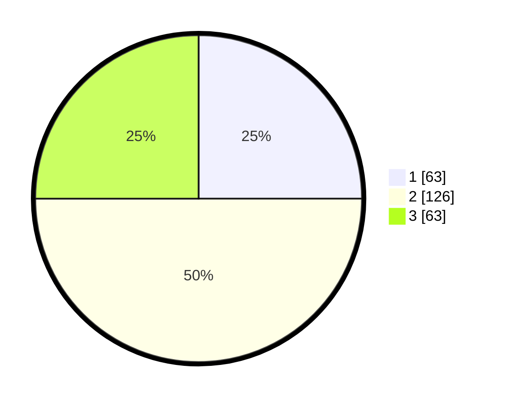

# Hasil

## Grafik

## Tabel

| No. | Nama Paslon    | Suara | Suara (raw) | Persentase |
|:--- |:-------------- | -----:| -----------:| ----------:|
| 1   | ANIES MUHAIMIN | 63    | [63][p-1]   | 25,00      |
| 2   | PRABOWO GIBRAN | 126   | [126][p-2]  | 50,00      |
| 3   | GANJAR MAHFUD  | 63    | [63][p-3]   | 25,00      |

[p-1]: https://github.com/gigit-pemilu/pemilu-2024-34-di-yogyakarta/blob/main/pilpres/hitung-suara/sub/34-di-yogyakarta/sub/04-sleman/sub/10-kalasan/sub/2002-tirtomartani/sub/041-tps/sub/paslon-1.txt
[p-2]: https://github.com/gigit-pemilu/pemilu-2024-34-di-yogyakarta/blob/main/pilpres/hitung-suara/sub/34-di-yogyakarta/sub/04-sleman/sub/10-kalasan/sub/2002-tirtomartani/sub/041-tps/sub/paslon-2.txt
[p-3]: https://github.com/gigit-pemilu/pemilu-2024-34-di-yogyakarta/blob/main/pilpres/hitung-suara/sub/34-di-yogyakarta/sub/04-sleman/sub/10-kalasan/sub/2002-tirtomartani/sub/041-tps/sub/paslon-3.txt

## Foto C Plano

https://sirekap-obj-formc.kpu.go.id/f8ca/pemilu/ppwp/34/04/10/20/02/3404102002041-20240214-213507--84f91d00-763a-494d-b08e-56d3cf35b135.jpg

https://sirekap-obj-formc.kpu.go.id/f8ca/pemilu/ppwp/34/04/10/20/02/3404102002041-20240214-213715--65f1ee9e-45d0-4f1a-b0cd-d57e7b22c6af.jpg

https://sirekap-obj-formc.kpu.go.id/f8ca/pemilu/ppwp/34/04/10/20/02/3404102002041-20240214-213833--dcbc6f0d-f207-495e-976a-395377f1a2b4.jpg

## Metadata

| Key        | Value               |
| ---------- | ------------------- |
| Time Stamp | 2024-02-15 19:30:26 |

