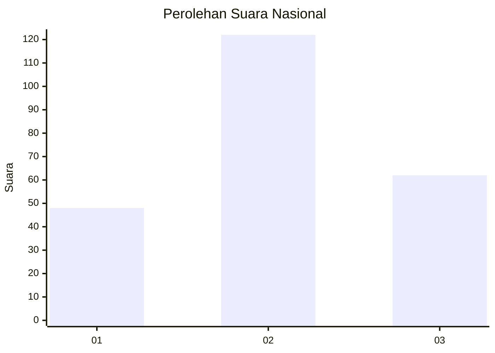
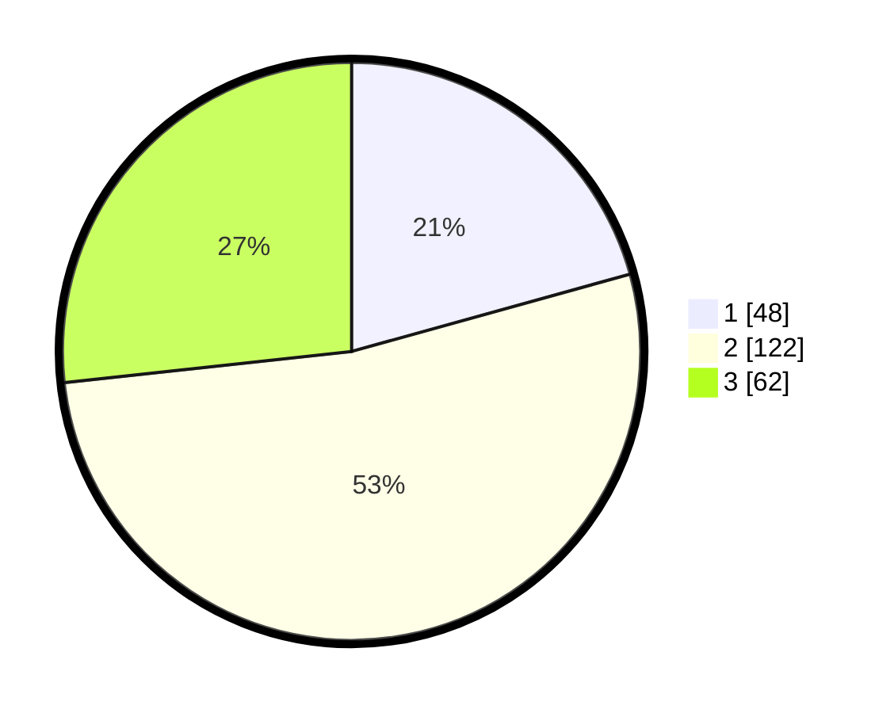

# Hasil

## Grafik

## Tabel

| No. | Nama Paslon    | Suara | Suara (raw) | Persentase |
|:--- |:-------------- | -----:| -----------:| ----------:|
| 1   | ANIES MUHAIMIN | 48    | [48][p-1]   | 20,69      |
| 2   | PRABOWO GIBRAN | 122   | [122][p-2]  | 52,59      |
| 3   | GANJAR MAHFUD  | 62    | [62][p-3]   | 26,72      |

[p-1]: https://github.com/gigit-pemilu/pemilu-2024/blob/main/pilpres/hitung-suara/sub/34-di-yogyakarta/sub/04-sleman/sub/10-kalasan/sub/2002-tirtomartani/sub/045-tps/sub/paslon-1.txt
[p-2]: https://github.com/gigit-pemilu/pemilu-2024/blob/main/pilpres/hitung-suara/sub/34-di-yogyakarta/sub/04-sleman/sub/10-kalasan/sub/2002-tirtomartani/sub/045-tps/sub/paslon-2.txt
[p-3]: https://github.com/gigit-pemilu/pemilu-2024/blob/main/pilpres/hitung-suara/sub/34-di-yogyakarta/sub/04-sleman/sub/10-kalasan/sub/2002-tirtomartani/sub/045-tps/sub/paslon-3.txt

## Foto C Plano

https://sirekap-obj-formc.kpu.go.id/5680/pemilu/ppwp/34/04/10/20/02/3404102002045-20240215-174212--304f29cb-a993-46dd-aea6-83f9c88e1eab.jpg

https://sirekap-obj-formc.kpu.go.id/5680/pemilu/ppwp/34/04/10/20/02/3404102002045-20240215-003341--9c925dba-326e-4e08-9a0d-e61ce2d138fe.jpg

https://sirekap-obj-formc.kpu.go.id/5680/pemilu/ppwp/34/04/10/20/02/3404102002045-20240215-003620--a702391a-8ec5-4f51-b5a6-7d45a5e6ef55.jpg

## Metadata

| Key        | Value               |
| ---------- | ------------------- |
| Time Stamp | 2024-02-15 18:30:25 |

