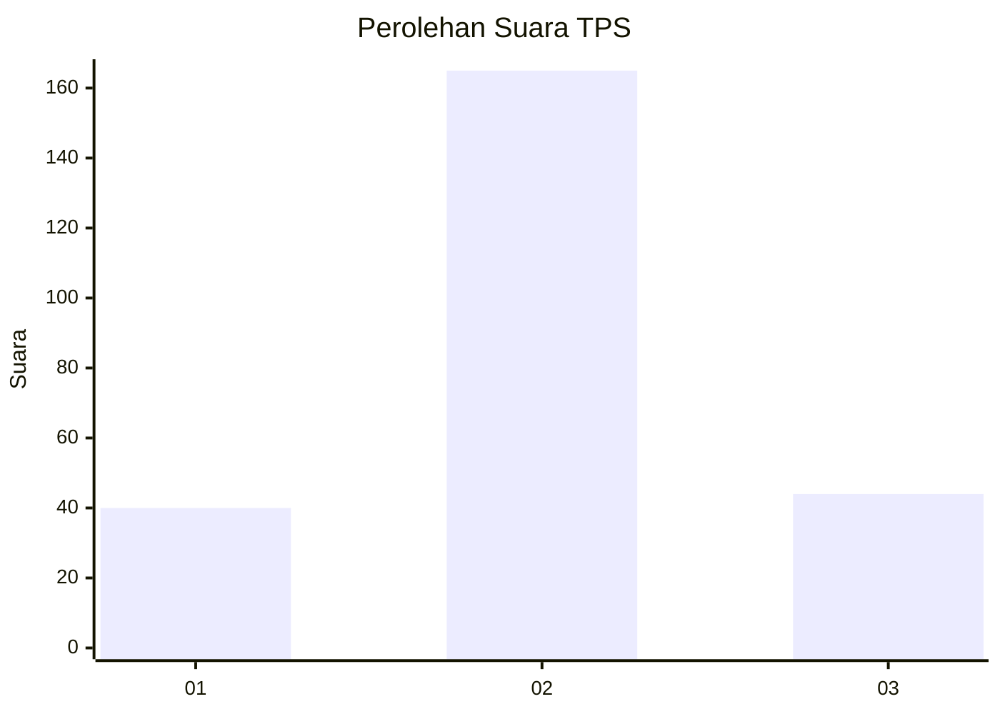
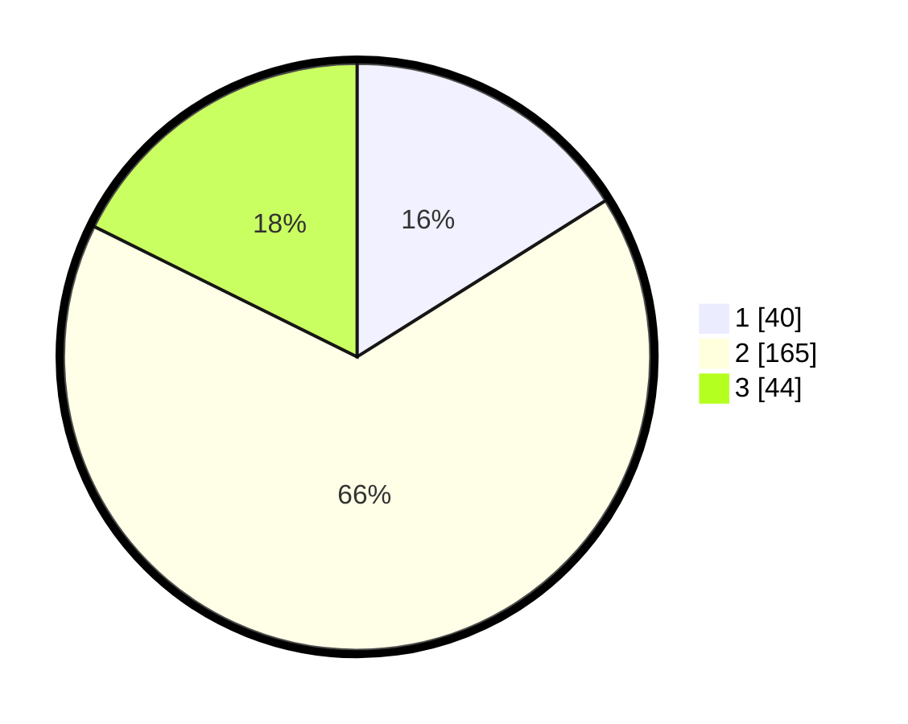

# Hasil

## Grafik

## Tabel

| No. | Nama Paslon    | Suara | Suara (raw) | Persentase |
|:--- |:-------------- | -----:| -----------:| ----------:|
| 1   | ANIES MUHAIMIN | 40    | [40][p-1]   | 16,06      |
| 2   | PRABOWO GIBRAN | 165   | [165][p-2]  | 66,27      |
| 3   | GANJAR MAHFUD  | 44    | [44][p-3]   | 17,67      |

[p-1]: https://github.com/gigit-pemilu/pemilu-2024-34-di-yogyakarta/blob/main/pilpres/hitung-suara/sub/34-di-yogyakarta/sub/04-sleman/sub/10-kalasan/sub/2002-tirtomartani/sub/046-tps/sub/paslon-1.txt
[p-2]: https://github.com/gigit-pemilu/pemilu-2024-34-di-yogyakarta/blob/main/pilpres/hitung-suara/sub/34-di-yogyakarta/sub/04-sleman/sub/10-kalasan/sub/2002-tirtomartani/sub/046-tps/sub/paslon-2.txt
[p-3]: https://github.com/gigit-pemilu/pemilu-2024-34-di-yogyakarta/blob/main/pilpres/hitung-suara/sub/34-di-yogyakarta/sub/04-sleman/sub/10-kalasan/sub/2002-tirtomartani/sub/046-tps/sub/paslon-3.txt

## Foto C Plano

https://sirekap-obj-formc.kpu.go.id/7478/pemilu/ppwp/34/04/10/20/02/3404102002046-20240214-231833--3df304df-046c-469f-b771-06d132403472.jpg

https://sirekap-obj-formc.kpu.go.id/7478/pemilu/ppwp/34/04/10/20/02/3404102002046-20240214-232015--211320b8-e7ab-46b0-a0a1-06f83714c56f.jpg

https://sirekap-obj-formc.kpu.go.id/7478/pemilu/ppwp/34/04/10/20/02/3404102002046-20240214-232117--b190ca81-3327-4226-8bbd-ef799a81c9f0.jpg

## Metadata

| Key        | Value               |
| ---------- | ------------------- |
| Time Stamp | 2024-02-16 21:01:00 |

