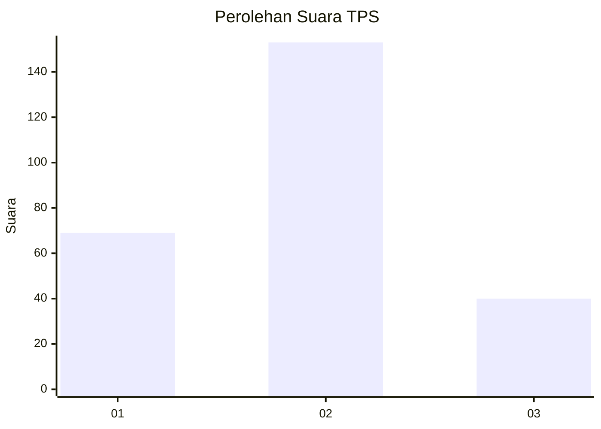
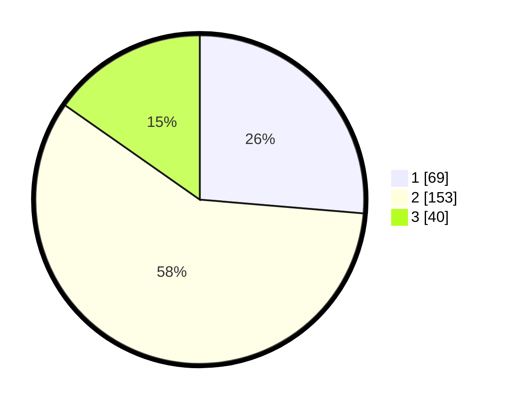

# Hasil

## Grafik

## Tabel

| No. | Nama Paslon    | Suara | Suara (raw) | Persentase |
|:--- |:-------------- | -----:| -----------:| ----------:|
| 1   | ANIES MUHAIMIN | 69    | [69][p-1]   | 26,34      |
| 2   | PRABOWO GIBRAN | 153   | [153][p-2]  | 58,40      |
| 3   | GANJAR MAHFUD  | 40    | [40][p-3]   | 15,27      |

[p-1]: https://github.com/gigit-pemilu/pemilu-2024-34-di-yogyakarta/blob/main/pilpres/hitung-suara/sub/34-di-yogyakarta/sub/04-sleman/sub/10-kalasan/sub/2002-tirtomartani/sub/048-tps/sub/paslon-1.txt
[p-2]: https://github.com/gigit-pemilu/pemilu-2024-34-di-yogyakarta/blob/main/pilpres/hitung-suara/sub/34-di-yogyakarta/sub/04-sleman/sub/10-kalasan/sub/2002-tirtomartani/sub/048-tps/sub/paslon-2.txt
[p-3]: https://github.com/gigit-pemilu/pemilu-2024-34-di-yogyakarta/blob/main/pilpres/hitung-suara/sub/34-di-yogyakarta/sub/04-sleman/sub/10-kalasan/sub/2002-tirtomartani/sub/048-tps/sub/paslon-3.txt

## Foto C Plano

https://sirekap-obj-formc.kpu.go.id/2be2/pemilu/ppwp/34/04/10/20/02/3404102002048-20240215-010228--89702bb5-6869-407d-ae75-e96528af71bf.jpg

https://sirekap-obj-formc.kpu.go.id/2be2/pemilu/ppwp/34/04/10/20/02/3404102002048-20240215-010314--89918a32-f10c-48cb-b2e8-8c5d2806d8c9.jpg

https://sirekap-obj-formc.kpu.go.id/2be2/pemilu/ppwp/34/04/10/20/02/3404102002048-20240215-010429--ce76aa16-b02e-4aeb-8b55-0f0e427ff9f7.jpg

## Metadata

| Key        | Value               |
| ---------- | ------------------- |
| Time Stamp | 2024-02-16 22:01:00 |

