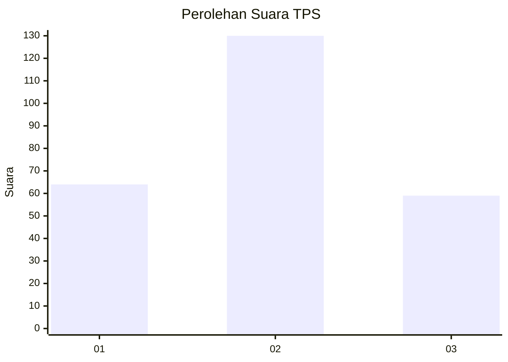
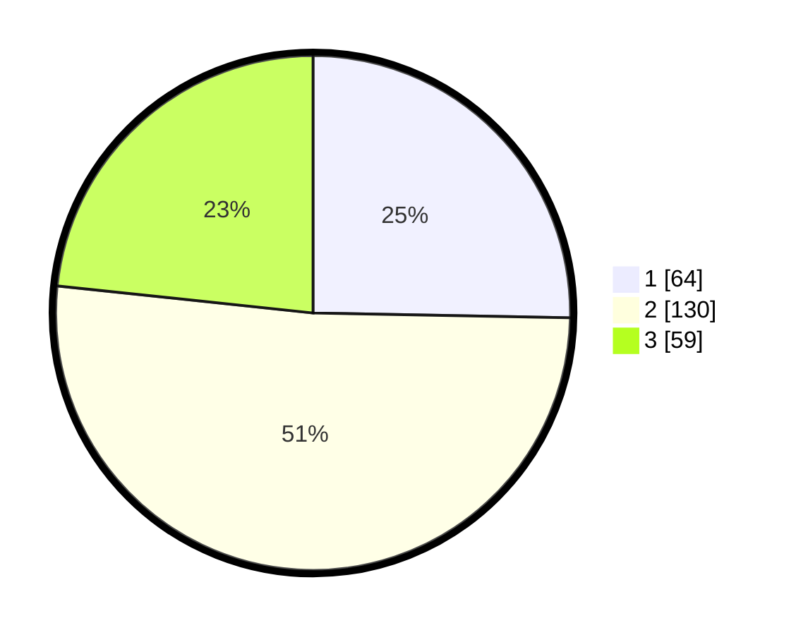

# Hasil

## Grafik

## Tabel

| No. | Nama Paslon    | Suara | Suara (raw) | Persentase |
|:--- |:-------------- | -----:| -----------:| ----------:|
| 1   | ANIES MUHAIMIN | 64    | [64][p-1]   | 25,30      |
| 2   | PRABOWO GIBRAN | 130   | [130][p-2]  | 51,38      |
| 3   | GANJAR MAHFUD  | 59    | [59][p-3]   | 23,32      |

[p-1]: https://github.com/gigit-pemilu/pemilu-2024-34-di-yogyakarta/blob/main/pilpres/hitung-suara/sub/34-di-yogyakarta/sub/04-sleman/sub/10-kalasan/sub/2003-tamanmartani/sub/004-tps/sub/paslon-1.txt
[p-2]: https://github.com/gigit-pemilu/pemilu-2024-34-di-yogyakarta/blob/main/pilpres/hitung-suara/sub/34-di-yogyakarta/sub/04-sleman/sub/10-kalasan/sub/2003-tamanmartani/sub/004-tps/sub/paslon-2.txt
[p-3]: https://github.com/gigit-pemilu/pemilu-2024-34-di-yogyakarta/blob/main/pilpres/hitung-suara/sub/34-di-yogyakarta/sub/04-sleman/sub/10-kalasan/sub/2003-tamanmartani/sub/004-tps/sub/paslon-3.txt

## Foto C Plano

https://sirekap-obj-formc.kpu.go.id/bc49/pemilu/ppwp/34/04/10/20/03/3404102003004-20240215-003016--9ace58c9-16e5-42cc-afd1-d0fbf806da2b.jpg

https://sirekap-obj-formc.kpu.go.id/bc49/pemilu/ppwp/34/04/10/20/03/3404102003004-20240215-003155--b79ade5f-80fc-47a4-a04b-eb0e04a969dd.jpg

https://sirekap-obj-formc.kpu.go.id/bc49/pemilu/ppwp/34/04/10/20/03/3404102003004-20240215-003316--51473e8a-f617-4b54-ac81-60c657b8f1fb.jpg

## Metadata

| Key        | Value               |
| ---------- | ------------------- |
| Time Stamp | 2024-02-16 22:01:00 |

