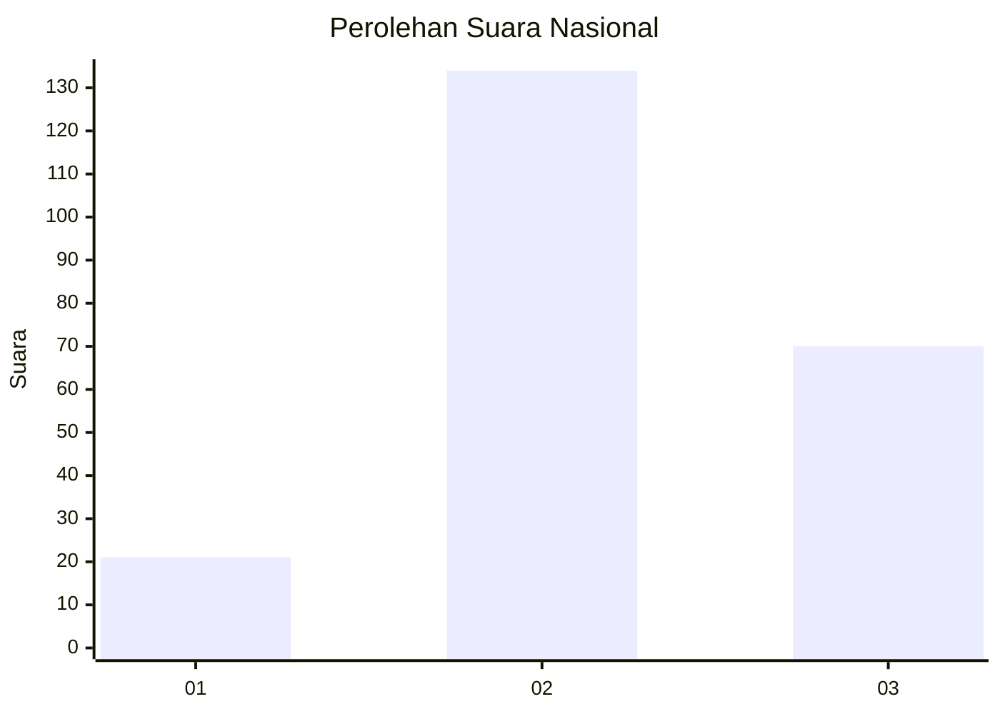
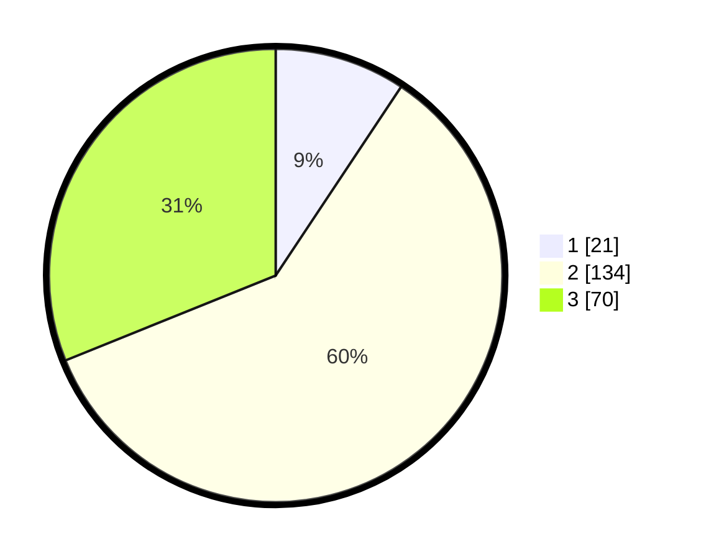

# Hasil

## Grafik

## Tabel

| No. | Nama Paslon    | Suara | Suara (raw) | Persentase |
|:--- |:-------------- | -----:| -----------:| ----------:|
| 1   | ANIES MUHAIMIN | 21    | [21][p-1]   | 9,33       |
| 2   | PRABOWO GIBRAN | 134   | [134][p-2]  | 59,56      |
| 3   | GANJAR MAHFUD  | 70    | [70][p-3]   | 31,11      |

[p-1]: https://github.com/gigit-pemilu/pemilu-2024/blob/main/pilpres/hitung-suara/sub/34-di-yogyakarta/sub/04-sleman/sub/10-kalasan/sub/2003-tamanmartani/sub/006-tps/sub/paslon-1.txt
[p-2]: https://github.com/gigit-pemilu/pemilu-2024/blob/main/pilpres/hitung-suara/sub/34-di-yogyakarta/sub/04-sleman/sub/10-kalasan/sub/2003-tamanmartani/sub/006-tps/sub/paslon-2.txt
[p-3]: https://github.com/gigit-pemilu/pemilu-2024/blob/main/pilpres/hitung-suara/sub/34-di-yogyakarta/sub/04-sleman/sub/10-kalasan/sub/2003-tamanmartani/sub/006-tps/sub/paslon-3.txt

## Foto C Plano

https://sirekap-obj-formc.kpu.go.id/498f/pemilu/ppwp/34/04/10/20/03/3404102003006-20240214-141339--b0a3befe-7754-49a0-b557-9aabbca37c7f.jpg

https://sirekap-obj-formc.kpu.go.id/498f/pemilu/ppwp/34/04/10/20/03/3404102003006-20240214-141450--59a3e181-818e-4e2a-ae43-ba687c3873ce.jpg

https://sirekap-obj-formc.kpu.go.id/498f/pemilu/ppwp/34/04/10/20/03/3404102003006-20240214-141549--1b1c0a16-5786-444c-8013-1a15fa9c89fa.jpg

## Metadata

| Key        | Value               |
| ---------- | ------------------- |
| Time Stamp | 2024-02-15 21:30:27 |

